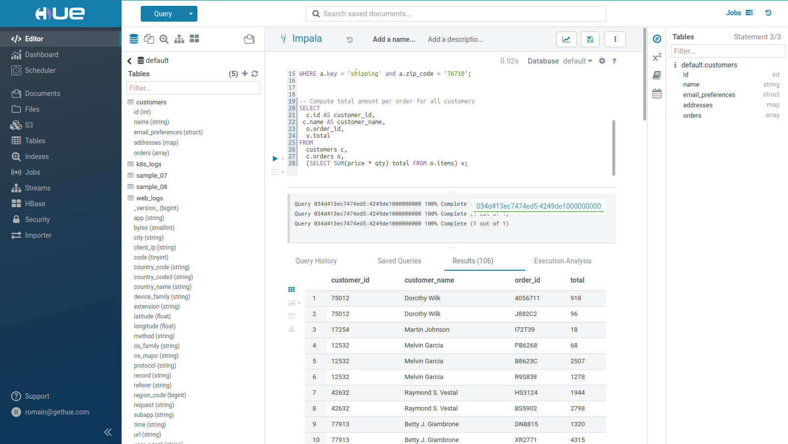

[](https://circleci.com/gh/cloudera/hue/tree/master)
[](https://registry.hub.docker.com/u/gethue/hue/)


Query. Explore. Share.
----------------------

Hue is an open source SQL Assistant for querying, visualizing and sharing data in Databases & Data Warehouses: [gethue.com](http://gethue.com)

It features:

   * [Editors](http://gethue.com/new-sql-editor/) to query with SQL [any database](https://docs.gethue.com/administrator/configuration/connectors/) and submit jobs
   * [Dashboards](http://gethue.com/search-dashboards/) to dynamically interact and visualize data
   * [Scheduler](http://gethue.com/scheduling/) of jobs and workflows
   * [Catalog](http://gethue.com/browsers/) for browsing data storages and metadata





Who is using Hue
----------------
Thousands of companies and organizations use Hue to open-up their data and provide self service querying. Hue is heavily used by:

* 1000+ paying customers
* top Fortune 500

who are executing 100s of 1000s of queries daily. It also ships in Amazon AWS and its open source version is used by hundred of companies.

Hue is also ideal for building your own [Cloud SQL Editor](https://docs.gethue.com/developer/parsers/) and any [contributions](CONTRIBUTING.md) are welcome.

Getting Started
---------------
The [Forum](https://discourse.gethue.com/) is here in case you are looking for help.

First, add the development packages, build and get the development server running:
```
git clone https://github.com/cloudera/hue.git
cd hue
make apps
build/env/bin/hue runserver
```
Now Hue should be running on [http://localhost:8000](http://localhost:8000) ! The configuration in development mode is `desktop/conf/pseudo-distributed.ini`. Read more in the [installation documentation](https://docs.gethue.com/administrator/installation/).


Docker
------
Start Hue in a single click with the [Docker Guide](https://github.com/cloudera/hue/tree/master/tools/docker/hue) or the
[video blog post](http://gethue.com/getting-started-with-hue-in-2-minutes-with-docker/).

    docker run -it -p 8888:8888 gethue/hue:latest


Kubernetes
----------

    helm repo add gethue https://helm.gethue.com
    helm repo update
    helm install gethue/hue

Read more about configurations at [``tools/kubernetes``](tools/kubernetes/).


Community
-----------
   * How to [contribute](CONTRIBUTING.md)
   * Help Forum: https://discourse.gethue.com/
   * High level [roadmap](docs/ROADMAP.md)
   * Jira: https://issues.cloudera.org/browse/HUE


License
-----------
[Apache License, Version 2.0](http://www.apache.org/licenses/LICENSE-2.0)
