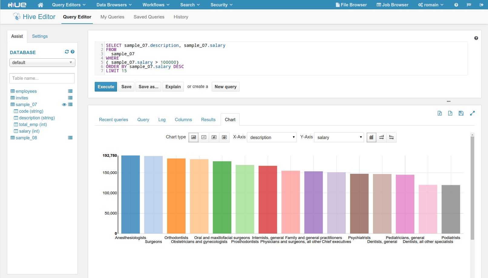

Welcome to the repository for Hue
=================================

`Hue
<http://gethue.com>`_ is an open source Web UI for doing big data with Hadoop.

It features:

      * File Browser for accessing HDFS
      * Hive Editor for developing and running Hive queries
      * Search App for querying, exploring, visualizing data and dashboards with Solr
      * Impala App for executing interactive SQL queries
      * Spark Editor and Dashboard
      * Pig Editor for submitting Pig scripts
      * Oozie Editor and Dashboard for submitting and monitoring workflows, coordinators and bundles
      * HBase Browser for visualizing, querying and modifying HBase tables
      * Metastore Browser for accessing Hive metadata and HCatalog
      * Job Browser for accessing MapReduce jobs (MR1/MR2-YARN)
      * Job Designer for creating MapReduce/Streaming/Java jobs
      * A Sqoop 2 Editor and Dashboard
      * A ZooKeeper Browser and Editor
      * A DB Query Editor for MySql, PostGres, Sqlite and Oracle

On top of that, a SDK is available for creating new apps integrated with Hadoop.

More user and developer documentation is available at http://gethue.com.

Getting Started
===============
To build and get the development server running::

    $ git clone http://github.com/cloudera/hue.git
    $ cd hue
    $ make apps
    $ build/env/bin/hue runserver

Now Hue should be running on http://localhost:8000 !

The configuration in development mode is ``desktop/conf/pseudo-distributed.ini``.

Note: to start the production server (but lose the automatic reloading after source modification)::

   $ build/env/bin/supervisor

To run the tests::

   Install the mini cluster (only once):
   $ ./tools/jenkins/jenkins.sh slow

   Run all the tests:
   $ build/env/bin/hue test all

   Or just some parts of the tests, e.g.:
   $ build/env/bin/hue test specific impala
   $ build/env/bin/hue test specific impala.tests:TestMockedImpala
   $ build/env/bin/hue test specific impala.tests:TestMockedImpala.test_basic_flow

Development Prerequisites
===========================
You'll need these library development packages and tools installed on
your system:

    Ubuntu:
      * ant
      * gcc
      * g++
      * libkrb5-dev
      * libmysqlclient-dev
      * libssl-dev
      * libsasl2-dev
      * libsasl2-modules-gssapi-mit
      * libsqlite3-dev
      * libtidy-0.99-0 (for unit tests only)
      * libxml2-dev
      * libxslt-dev
      * mvn (from ``maven2`` package or tarball)
      * openldap-dev / libldap2-dev
      * python-dev
      * python-simplejson
      * python-setuptools

    CentOS:
      * ant
      * asciidoc
      * cyrus-sasl-devel
      * cyrus-sasl-gssapi
      * gcc
      * gcc-c++
      * krb5-devel
      * libtidy (for unit tests only)
      * libxml2-devel
      * libxslt-devel
      * mvn (from ``maven2`` package or tarball)
      * mysql
      * mysql-devel
      * openldap-devel
      * python-devel
      * python-simplejson
      * sqlite-devel

    MacOS (mac port):
      * liblxml
      * libxml2
      * libxslt
      * mysql5-devel
      * simplejson (easy_install)
      * sqlite3

File Layout
===========
The Hue "framework" is in ``desktop``. ``/core/`` contains the Web components and
``desktop/libs/`` the API for talking to Hadoop.
The installable apps live in ``apps/``.  Please place third-party dependencies in the app's ext-py/
directory.

The typical directory structure for inside an application includes:

  src/
    for Python/Django code
      models.py
      urls.py
      views.py
      forms.py
      settings.py

  conf/
    for configuration (``.ini``) files to be installed

  static/
    for static HTML/js resources and help doc

  templates/
    for data to be put through a template engine

  locales/
    for localizations in multiple languages

For the URLs within your application, you should make your own ``urls.py``
which will be automatically rooted at ``/yourappname/`` in the global
namespace.  See ``apps/about/src/about/urls.py`` for an example.

Main Stack
==========
Hue would not be possible without:

   * Python 2.6 - 2.7
   * Django 1.4 (https://docs.djangoproject.com/en/1.4/)
   * Knockout.js (http://knockoutjs.com/)
   * jQuery (http://jquery.com/)
   * Bootstrap (http://getbootstrap.com/)

Community
=========
   * User group: http://groups.google.com/a/cloudera.org/group/hue-user
   * Jira: https://issues.cloudera.org/browse/HUE
   * Reviews: https://review.cloudera.org/dashboard/?view=to-group&group=hue (repo 'hue-rw')

License
=======
Apache License, Version 2.0
http://www.apache.org/licenses/LICENSE-2.0

