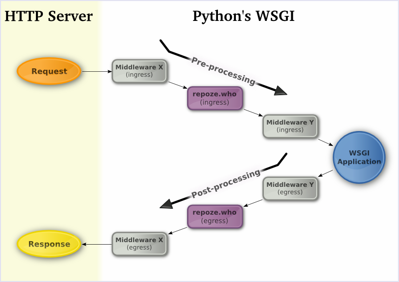
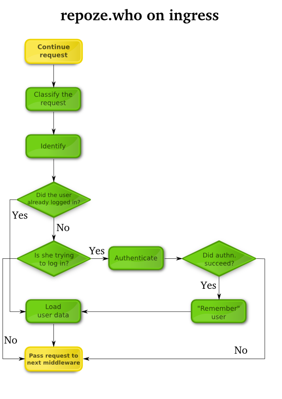

.. _using_middleware:

Using :mod:`repoze.who` Middleware
==================================

.. _middleware_responsibilities:

Middleware Responsibilities
---------------------------

:mod:`repoze.who` as middleware has one major function on ingress: it
conditionally places identification and authentication information
(including a ``REMOTE_USER`` value) into the WSGI environment and
allows the request to continue to a downstream WSGI application.

:mod:`repoze.who` as middleware has one major function on egress: it
examines the headers set by the downstream application, the WSGI
environment, or headers supplied by other plugins and conditionally
challenges for credentials.

.. _request_lifecycle:

Lifecycle of a Request
----------------------

:mod:`repoze.who` performs duties both on middleware "ingress" and on
middleware "egress". The following graphic outlines where it sits in the context
of the request and its response:

.. _ingress_stages:

Request (Ingress) Stages
++++++++++++++++++++++++

:mod:`repoze.who` performs the following operations in the following
order during middleware ingress:

#.  Environment Setup

    The middleware adds a number of keys to the WSGI environment:

    ``repoze.who.plugins``
       A reference to the configured plugin set.

    ``repoze.who.logger``
       A reference to the logger configured into the middleware.

    ``repoze.who.application``
       A refererence to the "right-hand" application.  The plugins
       consulted during request classification / identification /
       authentication may replace this application with another
       WSGI application, which will be used for the remainer of the
       current request.

#.  Request Classification

    The middleware hands the WSGI environment to the configured ``classifier``
    plugin, which is responsible for classifying the request into a single
    "type".  This plugin must return a single string value classifying the
    request, e.g., "browser", "xml-rpc", "webdav", etc.

    This classification may serve to filter out plugins consulted later in
    the request.  For instance, a plugin which issued a challenge as an
    HTML form would be inappropriate for use in requests from an XML-RPC
    or WebDAV client.

#.  Identification

    Each plugin configured as an identifier for a particular class of
    request is called to extract identity data ("credentials") from the
    WSGI environment.
 
    For example, a basic auth identifier might use
    the ``HTTP_AUTHORIZATION`` header to find login and password
    information.  Each configured identifier plugin is consulted in turn,
    and any non-None identities returned are collected into a list to be
    authenticated.
    
    Identifiers are also responsible for providing header information used
    to set and remove authentication information in the response during
    egress (to "remember" or "forget" the currently-authenticated user).

#.  Authentication

    The middlware consults each plugin configured as an authenticators for 
    a particular class of request, to compare credentials extracted by the
    identification plugins to a given policy, or set of valid credentials.
    
    For example, an htpasswd authenticator might look in a file for a user
    record matching any of the extracted credentials.  If it finds one, and
    if the password listed in the record matches the password in the
    identity, the userid of the user would be returned (which would
    be the same as the login name).  Successfully-authenticated ndenties are
    "weighted", with the highest weight identity governing the remainder of
    the request.

#.  Metadata Assignment

    After identifying and authenticating a user, :mod:`repoze.who` consults
    plugins configured as metadata providers, which may augmented the
    authenticated identity with arbitrary metadata.

    For example, a metadata provider plugin might add the user's first,
    middle and last names to the identity.  A more specialized metadata
    provider might augment the identity with a list of role or group names
    assigned to the user.

.. _egress_stages:

Response (Egress) Stages
++++++++++++++++++++++++

:mod:`repoze.who` performs the following operations in the following
order during middleware egress:

#.  Challenge Decision

    The middleare examines the WSGI environment and the status and headers
    returned by the downstream application to determine whether a
    challenge is required.  Typically, only the status is used:  if it
    starts with ``401``, a challenge is required, and the challenge
    decider returns True.
    
    This behavior can be replaced by configuring a different
    ``challenge_decider`` plugin for the middleware.
    
    If a challenge is required, the challenge decider returns True; otherwise,
    it returns False.

#.  Credentials reset, AKA "forgetting"

    If the challenge decider returns True, the middleware first delegates
    to the identifier plugin which provided the currently-authenticated
    identity to "forget" the identity, by adding response headers (e.g., to
    expire a cookie).

#.  Challenge
    
    The plugin then consults each of the set of plugins configured as
    challengers for the current request classification:  the first plugin
    which returns a non-None WSGI application will be used perform a
    challenge.
    
    Challenger plugins may use application-returned headers, the WSGI
    environment, and other items to determine what sort of operation
    should be performed to actuate the challenge.

#.  Remember

    The identifier plugin that the "best" set of credentials came from
    (if any) will be consulted to "remember" these credentials if the
    challenge decider returns False.
