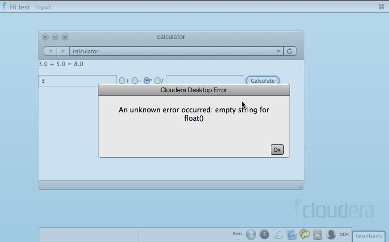

<link rel="stylesheet" href="docbook.css" type="text/css" media="screen" title="no title" charset="utf-8"></link>

Hue SDK Documentation
=====================

[TOC]

Introduction and Overview
=========================

Hue leverages the browser to provide users with an environment for exploring
and analyzing data.

Build on top of the Hue SDK to enable your application to interact efficiently with
Hadoop and the other Hue services.

By building on top of Hue SDK, you get, out of the box:

+ Configuration Management
+ Hadoop interoperability
+ Supervision of subprocesses
+ A collaborative UI
+ Basic user administration and authorization

This document will orient you with the general structure of Hue
and will walk you through adding a new application using the SDK.

NOTE: Hue began its life as "Cloudera Desktop," so you may find
references to "Desktop" in a few places.

From 30,000 feet
----------------

Hue, as a "container" web application, sits in between your Hadoop installation
and the browser.  It hosts all the Hue Apps, including the built-in ones, and
ones that you may write yourself.

The Hue Server
--------------

Hue is a web application built on the Django python web framework.
Django, running on the WSGI container/web server (typically CherryPy), manages
the url dispatch, executes application logic code, and puts together the views
from their templates.  Django uses a database (typically sqlite)
to manage session data, and Hue applications can use it as well
for their "models".  (For example, the JobDesigner application stores
job designs in the database.)

In addition to the web server, some Hue applications run
daemon processes "on the side".  For example, Beeswax runs a daemon
("beeswax_server") that keeps track of query states.  Running
a separate process for applications is the preferred
way to manage long-running tasks that you may wish
to co-exist with web page rendering.  The web "views"
typically communicate with these side daemons
by using Thrift (e.g., for Beeswax query execution) or by exchanging state
through the database.

Interacting with Hadoop
-----------------------

Hue provides some APIs for interacting with Hadoop.
Most noticeably, there are python file-object-like APIs for
interacting with HDFS.  These APIs work by making REST API or Thrift calls
the Hadoop daemons. The Hadoop administrator must enable these interfaces from
Hadoop.

On the Front-End
----------------

Hue provides a front-end framework based on
[Bootstrap](http://twitter.github.com/bootstrap/) and
[jQuery](http://jquery.com/).

If you are used to the Hue 1.x front-end, this is a major difference. All
application pages are full screen requests from the browser. The HTML generated
by your application's template is directly rendered. You do not need to
worry about interference from another application. And you have more freedom to
customize the front-end behavior of your application.

An Architectural View
---------------------

A Hue application may span three tiers: (1) the UI
and user interaction in the client's browser, (2) the
core application logic in the Hue web
server, and (3) external services with which applications
may interact.

The absolute minimum that you must implement (besides
boilerplate), is a
"Django [view](https://docs.djangoproject.com/en/1.2/topics/http/views/)"
function that processes the request and the associated template
to render the response into HTML.

Many apps will evolve to have a bit of custom JavaScript and
CSS styles.  Apps that need to talk to an external service
will pull in the code necessary to talk to that service.

Pre-requisites
==============

Software
--------

Developing for the Hue SDK has similar requirements to running
Hue itself.  We require python (2.4 to 2.7), Django (1.2 included
with our distribution), Hadoop (Cloudera's Distribution including Apache Hadoop,
at least version 4), Java (Sun Java 1.6), and Firefox (at least 3.0).

Recommended Reading / Important Technologies
--------------------------------------------

The following are core technologies used inside of Hue.

* Python.  <a href="http://diveintopython.net/">Dive Into Python</a> is one of
  several excellent books on python.
* Django.  Start with [The Django Tutorial](http://docs.djangoproject.com/en/1.2/intro/tutorial01/).
* [Thrift](http://incubator.apache.org/thrift/) is used for communication
  between daemons.
* [Mako](http://www.makotemplates.org/) is the preferred templating language.

Fast-Guide to Creating a New Hue Application
============================================

Now that we have a high-level overview of what's going on,
let's go ahead and create a new installation.

Download, Unpack, Build Distro
------------------------------

The Hue SDK is available from [Github](http://github.com/cloudera/hue). Releases
can be found on the [download page](https://github.com/cloudera/hue/downloads).
Releases are missing a few dependencies that could not be included because of
licencing issues (e.g. the werkzeug module). So if you prefer to have an
environment ready from scratch, it is preferable to checkout a particular
release tag instead.

    $ cd hue
    ## Build
    $ make apps
    ## Run
    $ build/env/bin/hue runserver_plus
    $ build/env/bin/hue beeswax_server
    ## Alternative run
    $ build/env/bin/hue supervisor
    ## Visit http://localhost:8000/ with your web browser.

  Why <code>runserver_plus</code>?   <code>runserver_plus</code>
  enables the <a href="http://werkzeug.pocoo.org/">Werkzeug</a> debugger,
  which is very handy.

Run "create_desktop_app" to Set up a New Source Tree
--------------------------------------------

    $ ./build/env/bin/hue create_desktop_app calculator
    $ find calculator -type f
    calculator/setup.py                                 # distutils setup file
    calculator/src/calculator/__init__.py               # main src module
    calculator/src/calculator/forms.py
    calculator/src/calculator/models.py
    calculator/src/calculator/settings.py               # app metadata setting
    calculator/src/calculator/urls.py                   # url mapping
    calculator/src/calculator/views.py                  # app business logic
    calculator/src/calculator/templates/index.mako
    calculator/src/calculator/templates/shared_components.mako

    # Static resources
    calculator/src/calculator/static/art/calculator.png # logo
    calculator/src/calculator/static/css/calculator.css
    calculator/src/calculator/static/js/calculator.js

Install SDK Application
-----------------------

As you'll discover if you look at calculator's <tt>setup.py</tt>,
Hue uses a distutils <tt>entrypoint</tt> to
register applications.  By installing the calculator
package into Hue's python virtual environment,
you'll install a new app.  The "app_reg.py" tool manages
the applications that are installed. Note that in the following example, the value after the
"--install" option is the path to the root directory of the application you want to install. In this
example, it is a relative path to "/Users/philip/src/hue/calculator".

        $ ./build/env/bin/python tools/app_reg/app_reg.py --install calculator
        === Installing app at calculator
        Updating registry with calculator (version 0.1)
        --- Making egg-info for calculator

        $ ./build/env/bin/python tools/app_reg/app_reg.py --list 2>&1 | grep calculator
        calculator           0.1     /Users/philip/src/hue/calculator

  If you'd like to customize the build process, you can modify (or even complete
  rewrite) your own `Makefile`, as long as it supports the set of required
  targets. Please see `Makefile.sdk` for the required targets and their
  semantics.

Congrats, you've added a new app!

  What was that all about?
  <a href="http://pypi.python.org/pypi/virtualenv">virtualenv</a>
  is a way to isolate python environments in your system, and isolate
  incompatible versions of dependencies.  Hue uses the system python, and
  that's about all.  It installs its own versions of dependencies.

  <a href="http://peak.telecommunity.com/DevCenter/PkgResources#entry-points">Entry Points</a>
  are a way for packages to optionally hook up with other packages.

You can now browse the new application.

    # If you haven't killed the old process, do so now.
    $ build/env/bin/hue runserver_plus

And then visit <a href="http://localhost:8000">http://localhost:8000/</a> to check it out!
You should see the app (with a boring "SDK" icon) in the dock, and clicking it
will bring up a boring screen:

Customizing Views and Templates
-------------------------------

Now that your app has been installed, you'll want to customize it.
As you may have guessed, we're going to build a small calculator
application.  Edit `calculator/src/calculator/templates/index.mako`
to include a simple form:

    <%!from desktop.views import commonheader, commonfooter %>
    <%namespace name="shared" file="shared_components.mako" />

    ${commonheader("Calculator", "calculator", "100px")}

    ## Main body

    

      % if op:
      ${a} ${op} ${b} = ${result}
      % endif
      <form action=${url("calculator.views.index")} method=POST>
        <input name="a">
        <input type="radio" name="op" value="add">+</input>
        <input type="radio" name="op" value="subtract">-</input>
        <input type="radio" name="op" value="multiply">*</input>
        <input type="radio" name="op" value="divide">/</input>
        <input name="b">
        <input type="submit" value="Calculate">
      </form>
    

    ${commonfooter(messages)}

The template language here is <a href="http://www.makotemplates.org/docs/">Mako</a>,
which is flexible and powerful.  If you use the "`.html`" extension, Hue
will render your page using
<a href="http://docs.djangoproject.com/en/1.2/topics/templates/#topics-templates">Django templates</a>
instead.

Note that we used the `url()` function to generate the URL to the calculator
view.  This trick protects you a bit from changing URLs.

Let's edit `calculator/src/calculator/views.py` to process that form:

    #!/usr/bin/env python

    from desktop.lib.django_util import render
    import operator

    OPS=dict(add=operator.add, subtract=operator.sub, multiply=operator.mul, divide=operator.truediv)
    OP_STRING=dict(add="+", subtract="-", multiply="*", divide="/")

    def index(request):
      if "op" not in request.REQUEST:
        return render('index.mako', request, dict())
      a = float(request.REQUEST["a"])
      b = float(request.REQUEST["b"])
      op = request.REQUEST["op"]
      result = OPS[op](a, b)
      return render('index.mako', request,
        dict(a=a, b=b, op=OP_STRING[op], result=result))

For more complicated forms, you may want to use Django Forms and
avoid explicitly using `request.REQUEST`, but this is shorter.

You can now go and try the calculator.  If you set everything up right, you
should see something like:

Debugging Django
----------------

If you enter a number only in the first text box and hit "Calculate", you'll
hit an error. If you're using `runserver_plus`, you'll get a handy debugging
page. You can click on any stack frame to get a debugging console:

Great! Now that we've added a single application, we're going to
delve further into the back-end.

A Look at Three Existing Apps
===========================

Help
----

The Help application is as minimal as they get.  Take a look at it!
The core logic is in the "views.py" file.  The central function
there takes `(app, path)` (which are mapped from the request URL
by the regular expression in `urls.py`).  The view function
finds the data file that needs to be rendered, renders it through
the markdown module, if necessary, and then displays it through
a simple template.

You'll note that the "Help Index" is presented in a "split view".
No JavaScript was written to make this happen!  Instead, the template
applied certain CSS classes to the relevant `div`'s, and JFrame
did the rest.

Proxy
-----

### Setup

You need to have Hue running:

    $ ./build/env/bin/hue runserver

Then if you want to access localhost/50030/jobtracker.jsp you just do:

    http://127.0.0.1:8000/proxy/localhost/50030/jobtracker.jsp

and the page will be displayed within Hue.

You can configure it in ``desktop/conf/pseudo-distributed.ini``

    [proxy]
    whitelist="(localhost|127\.0\.0\.1)50030|50070|50060|50075)",
    #Comma-separated list of regular expressions, which match 'host:port' of requested proxy target.

    blacklist=""
    #Comma-separated list of regular expressions, which match any prefix of 'host:port/path' of requested proxy target.
    # This does not support matching GET parameters.

### Usage

You can create a new app (or modify a current one for testing).

Then in order to display the proxied page in your app, you could add in the template of a view of the new app a
snippet of Javacript similar to this for loading the JobTracker page:

    

or alternatively get the page in the view (better solution) with the Hue
[REST API](https://github.com/cloudera/hue/tree/master/desktop/core/src/desktop/lib/rest). Example of use of
this API can be found in the [HDFS lib](https://github.com/cloudera/hue/blob/master/desktop/libs/hadoop/src/hadoop/fs/webhdfs.py).

If you need to browse through the proxied page, using an iframe might be a better solution.

Beeswax
-------

Beeswax is on the opposite end of the complexity scale from Help.
In addition to many views (in `views.py`), Beeswax uses
Django Forms for server-side form validation (the forms are in `forms.py`),
several features of the Mako templating engine (especially includes and
functions), a separate server (implemented in Java), and significant
JavaScript for user interaction.

Backend Development
===================

This section goes into greater detail on useful features within
the Hue environment.

User Management
---------------

Except for static content, `request.user` is always populated.  It is a
standard Django `models.User` object.  If you were to set a breakpoint at the
`index()` function in our calculator app, you will find:

    >>> request.user
    <User: test>

  "Under the covers:" Django uses a notion called
  <a href="https://docs.djangoproject.com/en/1.2/topics/http/middleware/">middleware</a>
  that's called in between the request coming in and the view being executed.
  That's how <code>request.user</code> gets populated.  There's also a
  middleware for Hue that makes sure that no pages are displayed unless the
  user is authenticated.

Configuration
-------------

### Configuration File

Hue uses a typed configuration system that reads configuration files (in an
ini-style format).  By default, Hue loads all `*.ini` files in the `build/desktop/conf`
directory.  The configuration files have the following format:

    # This is a comment
    [ app_name ]          # Same as your app's name
    app_property = "Pink Floyd"

    [[ section_a ]]         # The double brackets start a section under [ app_name ]
    a_weight = 80         # that is useful for grouping
    a_height = 180

    [[ filesystems ]]       # Sections are also useful for making a list
    [[[ cluster_1 ]]]       # All list members are sub-sections of the same type
    namenode_host = localhost
    # User may define more:
    # [[[ cluster_2 ]]]
    # namenode_host = 10.0.0.1

### Configuration Variables

Your application's `conf.py` is special. It provides access to the configuration file (and even
default configurations not specified in the file). Using the above example, your `conf.py` should
define the following:

* A `desktop.lib.conf.Config` object for `app_property`, such as:
<pre>
  MY_PROPERTY = Config(key='app_property', default='Beatles', help='blah')
</pre>
  You can access its value by `MY_PROPERTY.get()`.

* A `desktop.lib.conf.ConfigSection` object for `section_a`, such as:
<pre>
  SECTION_A = ConfigSection(key='section_a',
        help='blah',
        members=dict(
          AWEIGHT=Config(key='a_weight', type=int, default=0),
          AHEIGHT=Config(key='a_height', type=int, default=0)))
</pre>
  You can access the values by `SECTION_A.AWEIGHT.get()`.

* A `desktop.lib.conf.UnspecifiedConfigSection` object for `filesystems`, such as:
<pre>
  FS = UnspecifiedConfigSection(
      key='filesystems',
      each=ConfigSection(members=dict(
          nn_host=Config(key='namenode_host', required=True))
</pre>
  An `UnspecifiedConfigSection` is useful when the children of the section are not known.
  When Hue loads your application's configuration, it binds all sub-sections. You can
  access the values by:
<pre>
  cluster1_val = FS['cluster_1'].nn_host.get()
  all_clusters = FS.keys()
  for cluster in all_clusters:
      val = FS[cluster].nn_host.get()
</pre>

Your Hue application can automatically detect configuration problems and alert
the admin. To take advantage of this feature, create a `config_validator`
function in your `conf.py`:

<pre>
  def config_validator():
    """
    config_validator() -> [(config_variable, error_msg)] or None
    Called by core check_config() view.
    """
    res = [ ]
    if not REQUIRED_PROPERTY.get():
      res.append((REQUIRED_PROPERTY, "This variable must be set"))
    if MY_INT_PROPERTY.get() < 0:
      res.append((MY_INT_PROPERTY, "This must be a non-negative number"))
    return res
</pre>

  You should specify the <code>help="..."</code> argument to all configuration
  related objects in your <code>conf.py</code>. The examples omit some for the
  sake of space. But you and your application's users can view all the
  configuration variables by doing:
  <pre>
    $ build/env/bin/hue config_help
  </pre>

Running "Helper Processes"
--------------------------

Some Hue applications need to run separate daemon processes on the side.
For example, `BeeswaxServer` is responsible for managing Hive query states.
The Hue "views" communicate with it through Thrift and shared states in the
Django database.

Suppose your application needs a helper `my_daemon.py`. You need to register it by:

* In `setup.py`, add to `entry_points`:
<pre>
    entry_points = {
      'desktop.sdk.application': 'my_app = my_app',
      'desktop.supervisor.specs': [ 'my_daemon = my_app:SUPERVISOR_SPEC' ] }
</pre>

* In `src/my_app/__init__.py`, tell Hue what to run by adding:
<pre>
    SUPERVISOR_SPEC = dict(django_command="my_daemon")
</pre>

* Then in `src/my_app/management/commands`, create `__init__.py` and `my_daemon.py`. Your
  daemon program has only one requirement: it must define a class called `Command` that
  extends `django.core.management.base.BaseCommand`. Please see `kt_renewer.py` for an example.

The next time Hue restarts, your `my_daemon` will start automatically.
If your daemon program dies (exits with a non-zero exit code), Hue will
restart it.

"Under the covers:" Threading.  Hue, by default, runs a Spawning web server. It
can also be configured to run under a CherryPy WSGI server.
This server is multi-threaded, so you can use python
threading support (such as it is).  The "runserver_plus" version
is single-threaded.  If Hue is configured (and it may be, in the future)
to use mod_wsgi under Apache httpd, then there would be multiple python
processes serving the backend.  This means that your Django application
code should avoid depending on shared process state.  Instead, place
the stored state in a database or run a separate server.

<!-- "Wheel reinvention" Supervisor is following the Erlang model. -->

Walk-through of a Django View
-----------------------------

Django is an MVC framework, except that the controller is called a
"[view](https://docs.djangoproject.com/en/1.2/topics/http/views/)" and
the "view" is called a "template".  For an application developer, the essential
flow to understand is how the "urls.py" file provides a mapping between URLs (expressed as a
regular expression, optionally with captured parameters) and view functions.
These view functions typically use their arguments (for example, the captured parameters) and
their request object (which has, for example, the POST and GET parameters) to
prepare dynamic content to be rendered using a template.

Templates: Django and Mako
--------------------------

In Hue, the typical pattern for rendering data through a template
is:

    from desktop.lib.django_util import render

    def view_function(request):
      return render('view_function.mako', request, dict(greeting="hello"))

The `render()` function chooses a template engine (either Django or Mako) based on the
extension of the template file (".html" or ".mako").  Mako templates are more powerful,
in that they allow you to run arbitrary code blocks quite easily, and are more strict (some
would say finicky); Django templates are simpler, but are less expressive.

Django Models
-------------

[Django Models](http://docs.djangoproject.com/en/1.2/topics/db/models/#topics-db-models)
are Django's Object-Relational Mapping framework.  If your application
needs to store data (history, for example), models are a good way to do it.

From an abstraction perspective, it's common to imagine external services
as "models".  For example, the Job Browser treats the Hadoop JobTracker
as a "model", even though there's no database involved.

Accessing Hadoop
----------------

It is common for applications to need to access the underlying HDFS.
The `request.fs` object is a "file system" object that exposes
operations that manipulate HDFS.  It is pre-configured to access
HDFS as the user that's currently logged in.  Operations available
on `request.fs` are similar to the file operations typically
available in python.  See `webhdfs.py` for details; the list
of functions available is as follows:
`chmod`,
`chown`,
`exists`,
`isdir`,
`isfile`,
`listdir` (and `listdir_stats`),
`mkdir`,
`open` (which exposes a file-like object with `read()`, `write()`, `seek()`, and `tell()` methods),
`remove`,
`rmdir`,
`rmtree`, and
`stats`.

Making Your Views Thread-safe
-----------------------------

Hue works in any WSGI-compliant container web server.
The current recommended deployment server is the built-in CherryPy server.
The CherryPy server, which is multi-threaded, is invoked by `runcpserver`
and is configured to start when Hue's `supervisor` script is used.
Meanwhile, `runserver` and `runserver_plus` start a single-threaded
testing server.

Because multiple threads may be accessing your views
concurrently, your views should not use shared state.
An exception is that it is acceptable to initialize
some state when the module is first imported.
If you must use shared state, use Python's `threading.Lock`.

Note that any module initialization may happen multiple times.
Some WSGI containers (namely, Apache), will start multiple
Unix processes, each with multiple threads.  So, while
you have to use locks to protect state within the process,
there still may be multiple copies of this state.

For persistent global state, it is common to place the state
in the database.  If the state needs to be managed with application code,
a common pattern to push state into a "helper process".  For example, in the Job Designer,
a helper process keeps track of the processes that have been launched.  The Django views
themselves are stateless, but they talk to this stateful helper process for
updates.  A similar approach is taken with updating metrics for
the Beeswax application.

Authentication Backends
-----------------------

Hue exposes a configuration flag ("auth") to configure
a custom authentication backend.  See
See http://docs.djangoproject.com/en/dev/topics/auth/#writing-an-authentication-backend
for writing such a backend.

In addition to that, backends may support a `manages_passwords_externally()` method, returning
True or False, to tell the user manager application whether or not changing
passwords within Hue is possible.

Authorization
-------------

Applications may define permission sets for different actions. Administrators
can assign permissions to user groups in the UserAdmin application. To define
custom permission sets, modify your app's `settings.py` to create a list of
`(identifier, description)` tuples:

    PERMISSION_ACTIONS = [
      ("delete", "Delete really important data"),
      ("email", "Send email to the entire company"),
      ("identifier", "Description of the permission")
    ]

Then you can use this decorator on your view functions to enforce permission:

    @desktop.decorators.hue_permission_required("delete", "my_app_name")
    def delete_financial_report(request):
      ...

Using and Installing Thrift
---------------------------
Right now, we check in the generated thrift code.
To generate the code, you'll need the thrift binary version 0.9.0.
Please download from http://thrift.apache.org/.

The modules using ``Thrift`` have some helper scripts like ``regenerate_thrift.sh``
for regenerating the code from the interfaces.

Profiling Hue Apps
------------------
Hue has a profiling system built in, which can be used to analyze server-side
performance of applications.  To enable profiling::

    $ build/env/bin/hue runprofileserver

Then, access the page that you want to profile.  This will create files like
/tmp/useradmin.users.000072ms.2011-02-21T13:03:39.745851.prof.  The format for
the file names is /tmp/<app_module>.<page_url>.<time_taken>.<timestamp>.prof.

Hue uses the hotshot profiling library for instrumentation.  The documentation
for this library is located at: http://docs.python.org/library/hotshot.html.

You can use kcachegrind to view the profiled data graphically::

    $ hotshot2calltree /tmp/xyz.prof > /tmp/xyz.trace
    $ kcachegrind /tmp/xyz.trace

More generally, you can programmatically inspect a trace::

    #!/usr/bin/python
    import hotshot.stats
    import sys

    stats = hotshot.stats.load(sys.argv[1])
    stats.sort_stats('cumulative', 'calls')
    stats.print_stats(100)

This script takes in a .prof file, and orders function calls by the cumulative
time spent in that function, followed by the number of times the function was
called, and then prints out the top 100 time-wasters.  For information on the
other stats available, take a look at this website:
http://docs.python.org/library/profile.html#pstats.Stats

<!--
## Django Models

## Caution: upgrade path
-->

Front-end Development
=====================

Developing applications for Hue requires a minimal amount of CSS
(and potentially JavaScript) to use existing functionality. As covered above,
creating an application for the Hue is a matter of creating a standard HTML
application.

In a nutshell, front-end development in Hue is using
[Bootstrap](http://twitter.github.com/bootstrap/) and
[jQuery](http://jquery.com/) to layout your app and script the custom
interactions.

CSS Styles
----------

Hue uses [Bootstrap](http://twitter.github.com/bootstrap/) version 2.0 CSS
styles and layouts. They are highly reusable and flexible. Your app doesn't
have to use these styles, but if you do, it'll save you some time and make your
app look at home in Hue.

On top of the standard Bootstrap styles, Hue defines a small set of custom
styles in *desktop/core/static/css/jhue.css*.

Defining Styles for Your Application
------------------------------------

When you create your application it will provision a CSS file for you in the
*static/css* directory. For organization purposes, your styles should go here
(and any images you have should go in *static/art*). Your app's name will be a
class that is assigned to the root of your app in the DOM. So if you created an
app called "calculator" then every window you create for your app will have the
class "calculator".  Every style you define should be prefixed with this to
prevent you from accidentally colliding with the framework style. Examples:

    /* the right way: */
    .calculator p {
      /* all my paragraphs should have a margin of 8px */
      margin: 8px;
      /* and a background from my art directory */
      background: url(../art/paragraph.gif);
    }
    /* the wrong way: */
    p {
      /* woops; we're styling all the paragraphs on the page, affecting
         the common header! */
      margin: 8px;
      background: url(../art/paragraph.gif);
    }

Icons
-----

You should create an icon for your application that is a transparent png sized
55px by 55px. Your `settings.py` file should point to your icon via the `ICON`
variable. The `create_desktop_app` command creates a default icon for you.

  If you do not define an application icon, your application will not show up
  in the navigation bar.

Hue includes a selection of around 1,500 small 16px by 16px icons that can be
useful when making links that perform actions. These are open source icons that
you can use in your own applications as you like. You can find these in
*desktop/core/static/art/icons/* and *desktop/core/static/art/led-icons/* and
you can style your elements to use them like this (in your css file):

    /* show an add icon next to the text of the link: */
    .calculator a.add {
      background: url(/static/art/icons/add.png) no-repeat 1px 0px;
      display: block;
      height: 18px;
      padding-left: 22px;
    }
    /* or hide the link text and show only the icon: */
    .calculator a.add {
      background: url(/static/art/icons/add.png) no-repeat 1px 0px;
      display: block;
      height: 16px;
      width: 16px
      text-indent: -200px; /* this pushes the text out of view, leaving only the icon */
      overflow: hidden;
    }

Adding Interactive Elements to Your UI
--------------------------------------

Hue by default loads these JavaScript components:

* jQuery 1.8.1
* jQuery.dataTables 1.8.2
* Bootstrap 2.1.1

These are used by some Hue applications, but not loaded by default:

* Knockout 2.1.0 (`desktop/core/static/ext/js/knockout-2.1.0.js`)
* DataTables pagination using the Bootstrap style (`desktop/core/static/ext/js/datatables-paging-0.1.js`)
* jQuery UI autocomplete 1.8.18 (`desktop/core/static/ext/js/jquery/plugins/jquery-ui-autocomplete-1.8.18.min.js`)

These standard components have their own online documentation, which we will
not repeat here. They let you write interactive behaviors with little or no
JavaScript.

## Key Differences from Hue 1.x

Here are the key differences between the Hue 1.x front-end SDK and the later
versions. In Hue 2.0 and beyond:

* Since each page view only loads one application, you can declare HTML
  elements by ID, you can declare and load your JavaScripts anywhere, and
  are in full control of all the UI interactions.
* You can use standard HTML links to other applications.
* You do not need to register your application with the front-end, or declare
  any dependencies using YAML.
* The navigation bar is not pluggable in Hue 2.0.
* The old "accordion" behavior can be replaced by
  [Bootstrap collapse](http://twitter.github.com/bootstrap/javascript.html#collapse).
* The old "art buttons" pattern can be replaced by [Bootstrap
  buttons](http://twitter.github.com/bootstrap/base-css.html#buttons), and
  [button
  groups](http://twitter.github.com/bootstrap/components.html#buttonGroups).
* The old "art inputs" pattern can be replaced by [Bootstrap
  form inputs](http://twitter.github.com/bootstrap/base-css.html#forms).
* The old "autocomplete" behavior can be replaced by [jQuery
  autocomplete](http://jqueryui.com/demos/autocomplete/) or [Bootstrap
  typeahead](http://twitter.github.com/bootstrap/javascript.html#typeahead).
* The old "collapser" behavior can be replaced by
  [Bootstrap collapse](http://twitter.github.com/bootstrap/javascript.html#collapse).
* The old "context menu" behavior can be replaced by [Bootstrap button
  dropdowns](http://twitter.github.com/bootstrap/components.html#buttonDropdowns).
* The old "fittext" behavior is no longer supported.
* The old "flash message" behavior is no longer supported.
* The old "html table" behavior can be replaced by
  [DataTables](http://datatables.net/).
* The old "overtext" behavior can be replaced by [Bootstrap form
  placeholder](http://twitter.github.com/bootstrap/base-css.html#forms).
* The old "popup" behavior can be replaced by
  [Bootstrap modals](http://twitter.github.com/bootstrap/javascript.html#modals).
* The old "side-by-side select" pattern is no longer supported.
* The old "splitview" layout is no longer supported.
* The old "tabs" layout can be replaced by [Bootstrap
  tabs](http://twitter.github.com/bootstrap/javascript.html#tabs).
* The old "tool tips" behavior can be replaced by [Bootstrap
  tooltips](http://twitter.github.com/bootstrap/javascript.html#tooltips).

Including Other JavaScript Frameworks
-------------------------------------

It is possible to include other JavaScript frameworks to do your development.
Simply include them to your application's pages.  MooTools, Dojo, YUI, etc are
all fine. Including them represents an additional burden for your users to
download, and they also make it harder for us to support you, but it is your
call.

<!-- ## Adding dynamic data to the nav bar -->

<!-- ## Knockout, jQuery -->

<!-- ## Lost: Keyboard shortcuts -->

Internationalization
====================
How to update all the messages and compile them::

    $ make locales

How to update and compile the messages of one app::

    $ cd apps/beeswax
    $ make compile-locale

How to create a new locale for an app::

    $ cd $APP_ROOT/src/$APP_NAME/locale
    $ $HUE_ROOT/build/env/bin/pybabel init -D django -i en_US.pot -d . -l fr

Debugging Tips and Tricks
=========================

* Set `DESKTOP_DEBUG=1` as an environment variable if you want logs to go to stderr
  as well as to the respective log files.
* Use runserver_plus.  If you want to set a CLI breakpoint, just insert
  `__import__("ipdb").set_trace()`
  into your code.  If you want to inspect variables, you can simply insert
  `raise None`, and visit the URL of the view you're interested in, activating
  the Werkzeug debugger.
* Django tends to restart its server whenever it notices a file changes.  For
  certain things (like configuration changes), this is not sufficient.  Restart
  the server whole-heartedly.
* If you find yourself writing a lot of JavaScript, you'll want to disable the
  JavaScript caching that the server does. At startup Hue reads all your
  dependencies and JS files into memory to make things faster. You can disable
  this by executing the runserver_plus command with an environment variable
  set. Hue will be a little slower, but your JS will always represent what's on
  the disk. Here's what that looks like:

    `$ DESKTOP_DEPENDER_DEBUG=1 build/env/bin/hue runserver_plus`

* We highly recommend developing with the [Firebug](http://getfirebug.com)
  debugging plugin for Firefox. With it enabled, you can use a utility called
  [dbug](http://www.clientcide.com/docs/Core/dbug) which wraps Firebug
  commands. This allows you to leave debug statements in your code and display
  them on demand. In particular, typing in `dbug.cookie()` in Firebug will set
  a cookie in your browser that will turn these statements on until you type
  that command again to toggle them off. You'll see some of our own debugging
  statements and you can add your own. In the future, entering this state may
  also provide access to additional debugging features.
* When the dbug state is enabled in the browser, right clicking on elements is
  re-enabled which makes element inspection a little easier in Firebug.

<!--

## runserver_plus

## testing with windmill

## Testing with django

# Packaging your app for installation elsewhere

# Advanced Issues

## Modifying the Hadoop plug-ins

Build system:
- How to add external dependencies
- Plugging into the status_bar.
- Password_protecting and not password protecting.

-->
