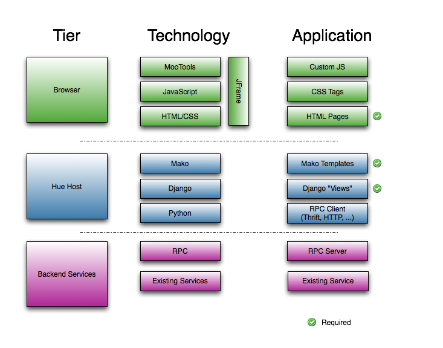

<link rel="stylesheet" href="../css/bootplus.css" type="text/css" media="screen" title="no title" charset="utf-8"></link>
<link rel="stylesheet" href="../css/font-awesome.min.css" type="text/css" media="screen" title="no title" charset="utf-8"></link>
<link rel="stylesheet" href="../css/docbook.css" type="text/css" media="screen" title="no title" charset="utf-8"></link>


<div class="row-fluid doc-title">
  <h1><a href=../index.html>Doc</a> > Hue SDK Documentation</h1>
</div>


<div class="row-fluid">
  <div class="span3">

[TOC]

   </div>
   <div class="span9">

# Concept

Hue service integration is generic and lets you integrate with other analytics systems. Here is a list of the main APIs:

* Connect or create SQL connectors to any Database
* List any files from any filesytem
* List any job or query list
* Integrate with a Data Catalog

REST APIs are not all public yet but this is work in progress in [HUE-1450](https://issues.cloudera.org/browse/HUE-1450).
Upcoming APIs: how to add new vizualizations, new SQL grammar and highlighting, workflow systems.
In addition, whole new apps can also be created in order to provide end to end solutions.

# Editor / Notebook

They provide SQL integration with any database via several connectors (native, JDBC, SQL Alchemy...).

Other modes like MapReduce, Java, Shell, Sqoop are also available. Here is a list of the [existing connectors](https://github.com/cloudera/hue/tree/master/desktop/libs/notebook/src/notebook/connectors).

Connectors are pluggable and can new engines can be supported. Feel free to comment on the [Hue list](https://groups.google.com/a/cloudera.org/forum/#!forum/hue-user) of [github](https://github.com/cloudera/hue/issues) about it.

## SQL

The [SQL Editor page](http://gethue.com/custom-sql-query-editors/) also describes the configuration steps.

Close to 100% of [Hive and Impala grammar](desktop/core/src/desktop/static/desktop/js/autocomplete/jison) is supported which makes the
autocomplete extremly powerful. Other languages defaults to a generic SQL grammar.

### HiveServer2 API
Hive, Impala, SparkSQL

### SQL Alchemy
SQL Alchemy supports comes with [HUE-8740](https://issues.cloudera.org/browse/HUE-8740).

### Python Connectors
MySQL, Oracle, PostgreSQL, Phoenix, Presto, Kylin, Redshift, BigQuery, Drill

### JDBC
Use the query editor with any [JDBC](http://gethue.com/custom-sql-query-editors/) or Django-compatible database.
View the [JDBC connector](https://github.com/cloudera/hue/blob/master/desktop/libs/notebook/src/notebook/connectors/jdbc.py).

### Solr SQL
[Solr connector](https://github.com/cloudera/hue/blob/master/desktop/libs/notebook/src/notebook/connectors/solr.py)

### Others

## Jobs

### Oozie
MapReduce, Pig, Java, Shell, Sqoop, DistCp [Oozie connector](https://github.com/cloudera/hue/blob/master/desktop/libs/notebook/src/notebook/connectors/oozie_batch.py)

### Spark / Livy

Based on the [Livy REST API](https://livy.incubator.apache.org/docs/latest/rest-api.html)

* [Notebook connector](https://github.com/cloudera/hue/blob/master/desktop/libs/notebook/src/notebook/connectors/spark_shell.py)
  * PySpark
  * Scala
  * Spark SQL
* [Batch connector](https://github.com/cloudera/hue/blob/master/desktop/libs/notebook/src/notebook/connectors/spark_batch.py)

# Dashboard

Dashboards are generic and support [Solr and any SQL](http://gethue.com/search-dashboards):

The API was influenced by Solr but is now generic:

[Dashboard API](https://github.com/cloudera/hue/blob/master/desktop/libs/dashboard/src/dashboard/dashboard_api.py)

## SQL

[SQL API](https://github.com/cloudera/hue/blob/master/desktop/libs/notebook/src/notebook/dashboard_api.py)

Implementations:

* [Impala API](https://github.com/cloudera/hue/blob/master/apps/impala/src/impala/dashboard_api.py)
* [Hive API](https://github.com/cloudera/hue/blob/master/apps/beeswax/src/beeswax/dashboard_api.py)

When HS2, RDBMS, and JDBC Are Not Enough

If the built-in HiveServer2 (Hive, Impala, Spark SQL), RDBMS (MySQL, PostgreSQL, Oracle, SQLite), and JDBC interfaces don’t meet your needs, you can implement your own connector to the notebook app: [Notebook Connectors](https://github.com/cloudera/hue/tree/master/desktop/libs/notebook/src/notebook/connectors). Each connector API subclasses the [Base API](https://github.com/cloudera/hue/blob/master/desktop/libs/notebook/src/notebook/connectors/base.py) and must implement the methods defined within; refer to the [JdbcApi](https://github.com/cloudera/hue/blob/master/desktop/libs/notebook/src/notebook/connectors/jdbc.py) or [RdbmsApi](https://github.com/cloudera/hue/blob/master/desktop/libs/notebook/src/notebook/connectors/rdbms.py) for representative examples.

## Search

### Solr

[Solr Dashboard API](https://github.com/cloudera/hue/blob/master/apps/search/src/search/dashboard_api.py)

### Elastic Search

A similar backend to Solr would need to be developed: [HUE-7828](https://issues.cloudera.org/browse/HUE-7828)


# Browsers
## Jobs

Here is an example on how the Job Browser can list:

* [Livy jobs and sessions](https://issues.cloudera.org/browse/HUE-6908)
* [Impala queries](https://issues.cloudera.org/browse/HUE-7420)


## Files
Here is an example on how the File Browser can list HDFS, S3 files and now [ADLS](https://issues.cloudera.org/browse/HUE-7248).


# Hue CLI

* [Hue API: Execute some builtin or shell commands](http://gethue.com/hue-api-execute-some-builtin-commands/).
* [How to manage the Hue database with the shell](http://gethue.com/how-to-manage-the-hue-database-with-the-shell/).


# Backend Development


This section goes into greater detail on useful features within
the Hue environment.

## User Management

Except for static content, `request.user` is always populated.  It is a
standard Django `models.User` object.  If you were to set a breakpoint at the
`index()` function in our calculator app, you will find:

    >>> request.user
    <User: test>

<div class="note">
  "Under the covers:" Django uses a notion called
  <a href="https://docs.djangoproject.com/en/1.2/topics/http/middleware/">middleware</a>
  that's called in between the request coming in and the view being executed.
  That's how <code>request.user</code> gets populated.  There's also a
  middleware for Hue that makes sure that no pages are displayed unless the
  user is authenticated.
</div>

## Configuration

### Configuration File

Hue uses a typed configuration system that reads configuration files (in an
ini-style format).  By default, Hue loads all `*.ini` files in the `build/desktop/conf`
directory.  The configuration files have the following format:

    # This is a comment
    [ app_name ]          # Same as your app's name
    app_property = "Pink Floyd"

    [[ section_a ]]         # The double brackets start a section under [ app_name ]
    a_weight = 80         # that is useful for grouping
    a_height = 180

    [[ filesystems ]]       # Sections are also useful for making a list
    [[[ cluster_1 ]]]       # All list members are sub-sections of the same type
    namenode_host = localhost
    # User may define more:
    # [[[ cluster_2 ]]]
    # namenode_host = 10.0.0.1


### Configuration Variables

Your application's `conf.py` is special. It provides access to the configuration file (and even
default configurations not specified in the file). Using the above example, your `conf.py` should
define the following:

* A `desktop.lib.conf.Config` object for `app_property`, such as:
<pre>
  MY_PROPERTY = Config(key='app_property', default='Beatles', help='blah')
</pre>
  You can access its value by `MY_PROPERTY.get()`.

* A `desktop.lib.conf.ConfigSection` object for `section_a`, such as:
<pre>
  SECTION_A = ConfigSection(key='section_a',
        help='blah',
        members=dict(
          AWEIGHT=Config(key='a_weight', type=int, default=0),
          AHEIGHT=Config(key='a_height', type=int, default=0)))
</pre>
  You can access the values by `SECTION_A.AWEIGHT.get()`.

* A `desktop.lib.conf.UnspecifiedConfigSection` object for `filesystems`, such as:
<pre>
  FS = UnspecifiedConfigSection(
      key='filesystems',
      each=ConfigSection(members=dict(
          nn_host=Config(key='namenode_host', required=True))
</pre>
  An `UnspecifiedConfigSection` is useful when the children of the section are not known.
  When Hue loads your application's configuration, it binds all sub-sections. You can
  access the values by:
<pre>
  cluster1_val = FS['cluster_1'].nn_host.get()
  all_clusters = FS.keys()
  for cluster in all_clusters:
      val = FS[cluster].nn_host.get()
</pre>

Your Hue application can automatically detect configuration problems and alert
the admin. To take advantage of this feature, create a `config_validator`
function in your `conf.py`:

<pre>
  def config_validator(user):
    """
    config_validator(user) -> [(config_variable, error_msg)] or None
    Called by core check_config() view.
    """
    res = [ ]
    if not REQUIRED_PROPERTY.get():
      res.append((REQUIRED_PROPERTY, "This variable must be set"))
    if MY_INT_PROPERTY.get() < 0:
      res.append((MY_INT_PROPERTY, "This must be a non-negative number"))
    return res
</pre>


<div class="note">
  You should specify the <code>help="..."</code> argument to all configuration
  related objects in your <code>conf.py</code>. The examples omit some for the
  sake of space. But you and your application's users can view all the
  configuration variables by doing:
  <pre>
    $ build/env/bin/hue config_help
  </pre>
</div>


### Running "Helper Processes"

Some Hue applications need to run separate daemon processes on the side.

Suppose your application needs a helper `my_daemon.py`. You need to register it by:

* In `setup.py`, add to `entry_points`:
<pre>
    entry_points = {
      'desktop.sdk.application': 'my_app = my_app',
      'desktop.supervisor.specs': [ 'my_daemon = my_app:SUPERVISOR_SPEC' ] }
</pre>

* In `src/my_app/__init__.py`, tell Hue what to run by adding:
<pre>
    SUPERVISOR_SPEC = dict(django_command="my_daemon")
</pre>

* Then in `src/my_app/management/commands`, create `__init__.py` and `my_daemon.py`. Your
  daemon program has only one requirement: it must define a class called `Command` that
  extends `django.core.management.base.BaseCommand`. Please see `kt_renewer.py` for an example.

The next time Hue restarts, your `my_daemon` will start automatically.
If your daemon program dies (exits with a non-zero exit code), Hue will
restart it.

"Under the covers:" Threading.  Hue, by default, runs CherryPy web server.
If Hue is configured (and it may be, in the future)
to use mod_wsgi under Apache httpd, then there would be multiple python
processes serving the backend.  This means that your Django application
code should avoid depending on shared process state.  Instead, place
the stored state in a database or run a separate server.

## Walk-through of a Django View


Django is an MVC framework, except that the controller is called a
"[view](https://docs.djangoproject.com/en/1.11/#the-view-layer)" and
the "view" is called a "template".  For an application developer, the essential
flow to understand is how the "urls.py" file provides a mapping between URLs (expressed as a
regular expression, optionally with captured parameters) and view functions.
These view functions typically use their arguments (for example, the captured parameters) and
their request object (which has, for example, the POST and GET parameters) to
prepare dynamic content to be rendered using a template.

## Templates: Django and Mako

In Hue, the typical pattern for rendering data through a template
is:

    from desktop.lib.django_util import render

    def view_function(request):
      return render('view_function.mako', request, dict(greeting="hello"))

The `render()` function chooses a template engine (either Django or Mako) based on the
extension of the template file (".html" or ".mako"). Mako templates are more powerful,
in that they allow you to run arbitrary code blocks quite easily, and are more strict (some
would say finicky); Django templates are simpler, but are less expressive.

## Django Models

[Django Models](https://docs.djangoproject.com/en/1.11/#the-model-layer)
are Django's Object-Relational Mapping framework. If your application
needs to store data (history, for example), models are a good way to do it.

From an abstraction perspective, it's common to imagine external services
as "models".  For example, the Job Browser treats the Hadoop JobTracker
as a "model", even though there's no database involved.

## Accessing Hadoop

It is common for applications to need to access the underlying HDFS.
The `request.fs` object is a "file system" object that exposes
operations that manipulate HDFS.  It is pre-configured to access
HDFS as the user that's currently logged in.  Operations available
on `request.fs` are similar to the file operations typically
available in python.  See `webhdfs.py` for details; the list
of functions available is as follows:
`chmod`,
`chown`,
`exists`,
`isdir`,
`isfile`,
`listdir` (and `listdir_stats`),
`mkdir`,
`open` (which exposes a file-like object with `read()`, `write()`, `seek()`, and `tell()` methods),
`remove`,
`rmdir`,
`rmtree`, and
`stats`.


## Making Your Views Thread-safe

Hue works in any WSGI-compliant container web server.
The current recommended deployment server is the built-in CherryPy server.
The CherryPy server, which is multi-threaded, is invoked by `runcpserver`
and is configured to start when Hue's `supervisor` script is used.
Meanwhile, `runserver` start a single-threaded
testing server.

Because multiple threads may be accessing your views
concurrently, your views should not use shared state.
An exception is that it is acceptable to initialize
some state when the module is first imported.
If you must use shared state, use Python's `threading.Lock`.

Note that any module initialization may happen multiple times.
Some WSGI containers (namely, Apache), will start multiple
Unix processes, each with multiple threads. So, while
you have to use locks to protect state within the process,
there still may be multiple copies of this state.

For persistent global state, it is common to place the state
in the database or on the Browser local storage.

## Authentication Backends

Hue exposes a configuration flag ("auth") to configure
a custom authentication backend.  See
See http://docs.djangoproject.com/en/dev/topics/auth/#writing-an-authentication-backend
for writing such a backend.

In addition to that, backends may support a `manages_passwords_externally()` method, returning
True or False, to tell the user manager application whether or not changing
passwords within Hue is possible.

## Authorization

Applications may define permission sets for different actions. Administrators
can assign permissions to user groups in the UserAdmin application. To define
custom permission sets, modify your app's `settings.py` to create a list of
`(identifier, description)` tuples:

    PERMISSION_ACTIONS = [
      ("delete", "Delete really important data"),
      ("email", "Send email to the entire company"),
      ("identifier", "Description of the permission")
    ]

Then you can use this decorator on your view functions to enforce permission:

    @desktop.decorators.hue_permission_required("delete", "my_app_name")
    def delete_financial_report(request):
      ...

## Using and Installing Thrift

Right now, we check in the generated thrift code.
To generate the code, you'll need the thrift binary version 0.9.0.
Please download from http://thrift.apache.org/.

The modules using ``Thrift`` have some helper scripts like ``regenerate_thrift.sh``
for regenerating the code from the interfaces.

## Profiling Hue Apps

Hue has a profiling system built in, which can be used to analyze server-side
performance of applications.  To enable profiling::

    build/env/bin/hue runprofileserver

Then, access the page that you want to profile.  This will create files like
/tmp/useradmin.users.000072ms.2011-02-21T13:03:39.745851.prof.  The format for
the file names is /tmp/<app_module>.<page_url>.<time_taken>.<timestamp>.prof.

Hue uses the hotshot profiling library for instrumentation.  The documentation
for this library is located at: http://docs.python.org/library/hotshot.html.

You can use kcachegrind to view the profiled data graphically::

    $ hotshot2calltree /tmp/xyz.prof > /tmp/xyz.trace
    $ kcachegrind /tmp/xyz.trace

More generally, you can programmatically inspect a trace::

    #!/usr/bin/python
    import hotshot.stats
    import sys

    stats = hotshot.stats.load(sys.argv[1])
    stats.sort_stats('cumulative', 'calls')
    stats.print_stats(100)

This script takes in a .prof file, and orders function calls by the cumulative
time spent in that function, followed by the number of times the function was
called, and then prints out the top 100 time-wasters.  For information on the
other stats available, take a look at this website:
http://docs.python.org/library/profile.html#pstats.Stats


## Django Models

Each app used to have its own model to store its data (e.g. a SQL query, a workflow). In Hue 3
a unification of all the models happened and any app now uses a single Document2 model:
``desktop/core/src/desktop/models.py``. This enables to avoid simply re-use document
creation, sharing, saving etc...

## REST
Hue is Ajax based and has a REST API used by the browser to communicate (e.g. submit a query or workflow,
list some S3 files, export a document...). Currently this API is private and subject to change but
can be easily reused. You would need to GET ``/accounts/login`` to get the CSRF token
and POST it back along ``username`` and ``password`` and reuse the ``sessionid`` cookie in next
communication calls.

** With Python Request **

Hue is based on the Django Web Framework. Django comes with user authentication system. Django uses sessions and middleware to hook the authentication system into request object. HUE uses stock auth form which uses “username” and “password” and “csrftoken” form variables to authenticate.

In this code snippet, we will use well-known python “requests” library. we will first acquire “csrftoken” by GET “login_url”. We will create python dictionary of form data which contains “username”, “password” and “csrftoken” and the “next_url” and another python dictionary for header which contains the “Referer” url and empty python dictionary for the cookies. After POST request to “login_url” we will get status. Check the r.status_code. If r.status_code!=200 then you have problem in username and/or password.

Once the request is successful then capture headers and cookies for subsequent requests. Subsequent request.session calls can be made by providing cookies=session.cookies and headers=session.headers.

<pre>
import requests

def login_djangosite():
 next_url = "/"
 login_url = "http://localhost:8888/accounts/login?next=/"

 session = requests.Session()
 r = session.get(login_url)
 form_data = dict(username="[your hue username]",password="[your hue password]",
                  csrfmiddlewaretoken=session.cookies['csrftoken'],next=next_url)
 r = session.post(login_url, data=form_data, cookies=dict(), headers=dict(Referer=login_url))

 # check if request executed successfully?
 print r.status_code

 cookies = session.cookies
 headers = session.headers

 r=session.get('http://localhost:8888/metastore/databases/default/metadata',
 cookies=session.cookies, headers=session.headers)
 print r.status_code

 # check metadata output
 print r.text
</pre>

[Read more about it here](http://gethue.com/login-into-hue-using-the-python-request-library/).

<div class="note">
  http://issues.cloudera.org/browse/HUE-1450 is tracking a more official public API.
</div>


## Upgrade path

After upgrading the version of Hue, running these two commands will make sure the
database has the correct tables and fields.

    ./build/env/bin/hue syncdb
    ./build/env/bin/hue migrate

# Front-end Development

Developing applications for Hue requires a minimal amount of CSS
(and potentially JavaScript) to use existing functionality. As covered above,
creating an application for the Hue is a matter of creating a standard HTML
application.

In a nutshell, front-end development in Hue is using
[Bootstrap](http://twitter.github.com/bootstrap/) and
[Knockout js](http://knockoutjs.com/) to layout your app and script the custom
interactions.


## CSS Styles

Hue uses [Bootstrap](http://twitter.github.com/bootstrap/) version 2.0 CSS
styles and layouts. They are highly reusable and flexible. Your app doesn't
have to use these styles, but if you do, it'll save you some time and make your
app look at home in Hue.

On top of the standard Bootstrap styles, Hue defines a small set of custom
styles in *desktop/core/static/css/jhue.css*.

## Defining Styles for Your Application

When you create your application it will provision a CSS file for you in the
*static/css* directory. For organization purposes, your styles should go here
(and any images you have should go in *static/art*). Your app's name will be a
class that is assigned to the root of your app in the DOM. So if you created an
app called "calculator" then every window you create for your app will have the
class "calculator".  Every style you define should be prefixed with this to
prevent you from accidentally colliding with the framework style. Examples:

    /* the right way: */
    .calculator p {
      /* all my paragraphs should have a margin of 8px */
      margin: 8px;
      /* and a background from my art directory */
      background: url(../art/paragraph.gif);
    }
    /* the wrong way: */
    p {
      /* woops; we're styling all the paragraphs on the page, affecting
         the common header! */
      margin: 8px;
      background: url(../art/paragraph.gif);
    }

## Icons

You should create an icon for your application that is a transparent png sized
24px by 24px. Your `settings.py` file should point to your icon via the `ICON`
variable. The `create_desktop_app` command creates a default icon for you.

<div class="note">
  If you do not define an application icon, your application will not show up
  in the navigation bar.
</div>

Hue ships with Twitter Bootstrap and Font Awesome 3 (http://fortawesome.github.io/Font-Awesome/)
so you have plenty of scalable icons to choose from. You can style your elements to use them
like this (in your mako template):

    <!-- show a trash icon in a link -->
    <a href="#something"><i class="icon-trash"></i> Trash</a>

## Static files

For better performances, Hue uses the Django staticfiles app. If in production mode, if you edit
some static files, you would need to run this command or `make apps`. No actions are needed in
development mode.
```
./build/env/bin/hue collectstatic
```

## Adding Interactive Elements to Your UI

Hue by default loads these JavaScript components:

* Ko js
* jQuery
* Bootstrap

These are used by some Hue applications, but not loaded by default:

* Knockout js (`desktop/core/static/ext/js/knockout-min.js`)
* jQuery UI (`desktop/core/static/ext/js/jquery/plugins/jquery-ui-autocomplete-1.8.18.min.js`)

These standard components have their own online documentation, which we will
not repeat here. They let you write interactive behaviors with little or no
JavaScript.


## Debugging Tips and Tricks

* Set `DESKTOP_DEBUG=1` as an environment variable if you want logs to go to stderr
  as well as to the respective log files.
* Use runserver.  If you want to set a CLI breakpoint, just insert
  `__import__("ipdb").set_trace()`
  into your code.
* Django tends to restart its server whenever it notices a file changes.  For
  certain things (like configuration changes), this is not sufficient.  Restart
  the server whole-heartedly.
* We recommend developing with the Chrome console.

## Building

### Documentation

Building with

    make docs

### Javascript

The javascript files are currently being migrated to webpack bundles, during this process some files will live under src/desktop/static/ and some will live under src/dekstop/js

#### For changes to the files under src/desktop/js the following applies:

First make sure all third-party dependencies defined in package.json are installed into node_modules/

    npm install

Also run this after making changes to package.json, adding new third-party dependencies etc.

To generate the js bundles run:

    npm run webpack
    npm run webpack-workers
    npm run webpack-login

During development the bundles can be autogenerated when it detects changes to the .js files, for this run:

    npm run dev

Before sending a review with changes to the bundles run:

    npm run lint-fix

and possibly fix any issues it might report.

### CSS / LESS

After changing the CSS in a .less file, rebuilding with:

    make css

### SQL Autocomplete

Install a patched jison:

    git clone https://github.com/JohanAhlen/jison
    cd jison
    npm install -g .

Then run:

    make sql-all-parsers

### Ace Editor

After modifying files under tools/ace-editor run the following to build ace.js

    npm install
    make ace

### Internationalization

How to update all the messages and compile them:

    make locales

How to update and compile the messages of one app:

    cd apps/beeswax
    make compile-locale

How to create a new locale for an app:

    cd $APP_ROOT/src/$APP_NAME/locale
    $HUE_ROOT/build/env/bin/pybabel init -D django -i en_US.pot -d . -l fr

# API

## Metadata Catalog

The [metadata API](https://github.com/cloudera/hue/tree/master/desktop/libs/metadata) is powering [Search and Tagging here](http://gethue.com/improved-sql-exploration-in-hue-4-3/) and the [Query Assistant with Navigator Optimizer Integration](http://gethue.com/hue-4-sql-editor-improvements/).

The backends is pluggable by providing alternative [client interfaces](https://github.com/cloudera/hue/tree/master/desktop/libs/metadata/catalog):

* navigator (default)
* dummy

### Searching for entities

    $.post("/metadata/api/catalog/search_entities_interactive/", {
        query_s: ko.mapping.toJSON("*sample"),
        sources: ko.mapping.toJSON(["sql", "hdfs", "s3"]),
        field_facets: ko.mapping.toJSON([]),
        limit: 10
    }, function(data) {
        console.log(ko.mapping.toJSON(data));
    });


### Searching for entities with the dummy backend

    $.post("/metadata/api/catalog/search_entities_interactive/", {
        query_s: ko.mapping.toJSON("*sample"),
        interface: "dummy"
    }, function(data) {
        console.log(ko.mapping.toJSON(data));
    });

### Finding an entity in order to get its id

    $.get("/metadata/api/navigator/find_entity", {
        type: "table",
        database: "default",
        name: "sample_07",
        interface: "dummy"
    }, function(data) {
        console.log(ko.mapping.toJSON(data));
    });

### Adding/updating a comment with the dummy backend

    $.post("/metadata/api/catalog/update_properties/", {
        id: "22",
        properties: ko.mapping.toJSON({"description":"Adding a description"}),
        interface: "dummy"
    }, function(data) {
        console.log(ko.mapping.toJSON(data));
    });

### Adding a tag with the dummy backend

    $.post("/metadata/api/catalog/add_tags/", {
      id: "22",
      tags: ko.mapping.toJSON(["usage"]),
      interface: "dummy"
    }, function(data) {
        console.log(ko.mapping.toJSON(data));
    });

### Deleting a key/value property

    $.post("/metadata/api/catalog/delete_metadata_properties/", {
       "id": "32",
       "keys": ko.mapping.toJSON(["project", "steward"])
    }, function(data) {
       console.log(ko.mapping.toJSON(data));
    });

### Deleting a key/value property

    $.post("/metadata/api/catalog/delete_metadata_properties/", {
      "id": "32",
      "keys": ko.mapping.toJSON(["project", "steward"])
    }, function(data) {
      console.log(ko.mapping.toJSON(data));
    });


### Getting the model mapping of custom metadata

    $.get("/metadata/api/catalog/models/properties/mappings/", function(data) {
      console.log(ko.mapping.toJSON(data));
    });


### Getting a namespace

    $.post("/metadata/api/catalog/namespace/", {
      namespace: 'huecatalog'
    }, function(data) {
      console.log(ko.mapping.toJSON(data));
    });

### Creating a namespace

    $.post("/metadata/api/catalog/namespace/create/", {
      "namespace": "huecatalog",
      "description": "my desc"
    }, function(data) {
      console.log(ko.mapping.toJSON(data));
    });


### Creating a namespace property

    $.post("/metadata/api/catalog/namespace/property/create/", {
      "namespace": "huecatalog",
      "properties": ko.mapping.toJSON({
        "name" : "relatedEntities2",
        "displayName" : "Related objects",
        "description" : "My desc",
        "multiValued" : true,
        "maxLength" : 50,
        "pattern" : ".*",
        "enumValues" : null,
        "type" : "TEXT"
      })
    }, function(data) {
      console.log(ko.mapping.toJSON(data));
    });


### Map a namespace property to a class entity

    $.post("/metadata/api/catalog/namespace/property/map/", {
      "class": "hv_view",
      "properties": ko.mapping.toJSON([{
          namespace: "huecatalog",
          name: "relatedQueries"
      }])
    }, function(data) {
      console.log(ko.mapping.toJSON(data));
    });

# New application

Building a brand new application is more work but is ideal for creating a custom solution.

## Introduction and Overview

Hue leverages the browser to provide users with an environment for exploring
and analyzing data.

Build on top of the Hue SDK to enable your application to interact efficiently with
Hadoop and the other Hue services.

By building on top of Hue SDK, you get, out of the box:

+ Configuration Management
+ Hadoop interoperability
+ Supervision of subprocesses
+ A collaborative UI
+ Basic user administration and authorization

This document will orient you with the general structure of Hue
and will walk you through adding a new application using the SDK.


### From 30,000 feet


Hue, as a "container" web application, sits in between your Hadoop installation
and the browser.  It hosts all the Hue Apps, including the built-in ones, and
ones that you may write yourself.

### The Hue Server


Hue is a web application built on the Django python web framework.
Django, running on the WSGI container/web server (typically CherryPy), manages
the url dispatch, executes application logic code, and puts together the views
from their templates.  Django uses a database (typically sqlite)
to manage session data, and Hue applications can use it as well
for their "models".  (For example, the saved Editor stores
saved queries in the database.)

In addition to the web server, some Hue applications run
daemon processes "on the side". Some examples are the `Celery Task Server`, `Celery Beat`.

### Interacting with Hadoop


Hue provides some APIs for interacting with Hadoop.
Most noticeably, there are python file-object-like APIs for
interacting with HDFS.  These APIs work by making REST API or Thrift calls
the Hadoop daemons. The Hadoop administrator must enable these interfaces from
Hadoop.

### On the Front-End

Hue provides a front-end framework based on
[Bootstrap](http://twitter.github.com/bootstrap/) and
[Knockout js](http://knockoutjs.com/).


### An Architectural View



A Hue application may span three tiers: (1) the UI
and user interaction in the client's browser, (2) the
core application logic in the Hue web
server, and (3) external services with which applications
may interact.

The absolute minimum that you must implement (besides
boilerplate), is a
"Django [view](https://docs.djangoproject.com/en/1.11/#the-view-layer/)"
function that processes the request and the associated template
to render the response into HTML.

Many apps will evolve to have a bit of custom JavaScript and
CSS styles. Apps that need to talk to an external service
will pull in the code necessary to talk to that service.

### File Layout

The Hue "framework" is in ``desktop/core/`` and contains the Web components.
``desktop/libs/`` is the API for talking to various Hadoop services.
The installable apps live in ``apps/``.  Please place third-party dependencies in the app's ext-py/
directory.

The typical directory structure for inside an application includes:
```
  src/
    for Python/Django code
      models.py
      urls.py
      views.py
      forms.py
      settings.py

  conf/
    for configuration (``.ini``) files to be installed

  static/
    for static HTML/js resources and help doc

  templates/
    for data to be put through a template engine

  locales/
    for localizations in multiple languages
```

For the URLs within your application, you should make your own ``urls.py``
which will be automatically rooted at ``/yourappname/`` in the global
namespace. See ``apps/about/src/about/urls.py`` for an example.


## Pre-requisites


### Dependencies

* The OS specific dependencies listed [here](http://cloudera.github.io/hue/latest/admin-manual/manual.html)
* Python 2.7
* Django (1.11 included with our distribution)
* Hadoop (Apache Hadoop 2+)
* Java (Java 1.8)
* npm (6.4+)

### Recommended Reading / Important Technologies

The following are core technologies used inside of Hue.

* Python.  <a href="http://diveintopython.net/">Dive Into Python</a> is one of
  several excellent books on python.
* Django.  Start with [The Django Tutorial](https://docs.djangoproject.com/en/1.11/intro/).
* [Thrift](http://incubator.apache.org/thrift/) is used for communication
  between daemons.
* [Mako](http://www.makotemplates.org/) is the preferred templating language.

## Fast-Guide to Creating a New Hue Application

Now that we have a high-level overview of what's going on,
let's go ahead and create a new installation.

### Download, Unpack, Build Distro

The Hue SDK is available from [Github](http://github.com/cloudera/hue). Releases
can be found on the [download page](http://gethue.com/category/release/).
Releases are missing a few dependencies that could not be included because of
licencing issues. So if you prefer to have an environment ready from scratch,
it is preferable to checkout a particular release tag instead.

    cd hue
    ## Build
    make apps
    ## Run
    build/env/bin/hue runserver
    ## Alternative run
    build/env/bin/hue supervisor
    ## Visit http://localhost:8000/ with your web browser.


### Run "create_desktop_app" to Set up a New Source Tree

    ./build/env/bin/hue create_desktop_app calculator
    find calculator -type f
    calculator/setup.py                                 # distutils setup file
    calculator/src/calculator/__init__.py               # main src module
    calculator/src/calculator/forms.py
    calculator/src/calculator/models.py
    calculator/src/calculator/settings.py               # app metadata setting
    calculator/src/calculator/urls.py                   # url mapping
    calculator/src/calculator/views.py                  # app business logic
    calculator/src/calculator/templates/index.mako
    calculator/src/calculator/templates/shared_components.mako

    # Static resources
    calculator/src/static/calculator/art/calculator.png # logo
    calculator/src/static/calculator/css/calculator.css
    calculator/src/static/calculator/js/calculator.js


<div class="note">
  Some apps are blacklisted on certain versions of CDH (such as the 'Spark' app) due to
  certain incompatibilities, which prevent them loading from in Hue.
  Check the hue.ini 'app_blacklist' parameter for details.
</div>

### Install SDK Application

As you'll discover if you look at calculator's <tt>setup.py</tt>,
Hue uses a distutils <tt>entrypoint</tt> to
register applications.  By installing the calculator
package into Hue's python virtual environment,
you'll install a new app.  The "app_reg.py" tool manages
the applications that are installed. Note that in the following example, the value after the
"--install" option is the path to the root directory of the application you want to install. In this
example, it is a relative path to "/Users/philip/src/hue/calculator".

        ./build/env/bin/python tools/app_reg/app_reg.py --install calculator --relative-paths
        === Installing app at calculator
        Updating registry with calculator (version 0.1)
        --- Making egg-info for calculator


<div class="note">
  If you'd like to customize the build process, you can modify (or even complete
  rewrite) your own `Makefile`, as long as it supports the set of required
  targets. Please see `Makefile.sdk` for the required targets and their
  semantics.
</div>

Congrats, you've added a new app!

<div class="note">
  What was that all about?
  <a href="http://pypi.python.org/pypi/virtualenv">virtualenv</a>
  is a way to isolate python environments in your system, and isolate
  incompatible versions of dependencies.  Hue uses the system python, and
  that's about all.  It installs its own versions of dependencies.

  <a href="http://peak.telecommunity.com/DevCenter/PkgResources#entry-points">Entry Points</a>
  are a way for packages to optionally hook up with other packages.
</div>

You can now browse the new application.

    # If you haven't killed the old process, do so now.
    build/env/bin/hue runserver

And then visit <a href="http://localhost:8000">http://localhost:8000/</a> to check it out!
You should see the app in the left menu.


### Customizing Views and Templates

Now that your app has been installed, you'll want to customize it.
As you may have guessed, we're going to build a small calculator
application.  Edit `calculator/src/calculator/templates/index.mako`
to include a simple form and a Knockout viewmodel:


    <%!from desktop.views import commonheader, commonfooter %>
    <%namespace name="shared" file="shared_components.mako" />

    %if not is_embeddable:
    ${commonheader("Calculator", "calculator", user, "100px") | n,unicode}
    %endif

    ## Main body
    <div class="container-fluid calculator-components">
      <div class="row">
        <div class="span6 offset3 margin-top-30 text-center">
          <form class="form-inline">
            <input type="text" class="input-mini margin-right-10" placeholder="A" data-bind="value: a">
            <!-- ko foreach: operations -->
            <label class="radio margin-left-5">
              <input type="radio" name="op" data-bind="checkedValue: $data, checked: $parent.chosenOperation" /><span data-bind="text: $data"></span>
            </label>
            <!-- /ko -->
            <input type="text" class="input-mini margin-left-10" placeholder="B" data-bind="value: b">
            <button class="btn" data-bind="click: calculate">Calculate</button>
          </form>

          <h2 data-bind="visible: result() !== null">The result is <strong data-bind="text: result"></strong></h2>
        </div>
      </div>
    </div>

    <script>
      (function() {
        var CalculatorViewModel = function () {
          var self = this;

          self.operations = ko.observableArray(['+', '-', '*', '/']);

          self.a = ko.observable();
          self.b = ko.observable();
          self.chosenOperation = ko.observable('+');
          self.result = ko.observable(null);

          self.calculate = function () {
            var a = parseFloat(self.a());
            var b = parseFloat(self.b());
            var result = null;
            switch (self.chosenOperation()) {
              case '+':
                result = a + b;
                break;
              case '-':
                result = a - b;
                break;
              case '*':
                result = a * b;
                break;
              case '/':
                result = a / b;
            }
            self.result(result);
          }
        };
        $(document).ready(function () {
          ko.applyBindings(new CalculatorViewModel(), $('.calculator-components')[0]);
        });
      })();
    </script>

    %if not is_embeddable:
    ${commonfooter(messages) | n,unicode}
    %endif

The template language here is <a href="http://www.makotemplates.org/docs/">Mako</a>,
which is flexible and powerful.  If you use the "`.html`" extension, Hue
will render your page using
<a href="https://docs.djangoproject.com/en/1.11/#the-template-layer">Django templates</a>
instead.

Note that we use Knockout.js to do the heavy lifting of this app.

Let's edit `calculator/src/calculator/views.py` to simply render the page:

    #!/usr/bin/env python

    from desktop.lib.django_util import render

    def index(request):
      return render('index.mako', request, {
        'is_embeddable': request.GET.get('is_embeddable', False),
      })


You can now go and try the calculator.


# Testing

## The short story

Install the mini cluster (only once):

    ./tools/jenkins/jenkins.sh slow

Run all the tests:

    build/env/bin/hue test all

Or just some parts of the tests, e.g.:

    build/env/bin/hue test specific impala
    build/env/bin/hue test specific impala.tests:TestMockedImpala
    build/env/bin/hue test specific impala.tests:TestMockedImpala.test_basic_flow

Jasmine tests:

    npm run test


## Longer story

The ``test`` management command prepares the arguments (test app names)
and passes them to nose (django_nose.nose_runner). Nose will then magically
find all the tests to run.

Tests themselves should be named *_test.py.  These will be found
as long as they're in packages covered by django.  You can use the
unittest frameworks, or you can just name your method with
the word "test" at a word boundary, and nose will find it.
See apps/hello/src/hello/hello_test.py for an example.


### Helpful command-line tricks

To run tests that do not depend on Hadoop, use:

    build/env/bin/hue test fast

To run all tests, use:

    build/env/bin/hue test all

To run only tests of a particular app, use:

    build/env/bin/hue test specific <app>

E.g.
  build/env/bin/hue test specific filebrowser

To run a specific test, use:

    build/env/bin/hue test specific <test_func>

E.g.
  build/env/bin/hue test specific useradmin.tests:test_user_admin

Start up pdb on test failures:

    build/env/bin/hue test <args> --pdb --pdb-failure -s

Point to an Impalad and trigger the Impala tests:

    build/env/bin/hue test impala impalad-01.gethue.com


### Create and run the Jasmine tests

Add them in a "spec" subfolder relative to the file under test and the filename of the test has to end with "Spec.js".

    someFile.js              <- File under test
    ├── spec/
    │   ├── someFileSpec.js  <- File containing tests

Run all the tests once with:

    npm run test

Optionally to use Karma and headless chrome for the tests you can run

    npm run test-karma

See ```desktop/core/src/desktop/js/spec/karma.config.js``` for various options


### Special environment variables

    DESKTOP_LOGLEVEL=<level>
      level can be DEBUG, INFO, WARN, ERROR, or CRITICAL

      When specified, the console logger is set to the given log level. A console
      logger is created if one is not defined.

    DESKTOP_DEBUG
      A shorthand for DESKTOP_LOG_LEVEL=DEBUG. Also turns on output HTML
      validation.

    DESKTOP_PROFILE
      Turn on Python profiling. The profile data is saved in a file. See the
      console output for the location of the file.

    DESKTOP_LOG_DIR=$dir
      Specify the HUE log directory. Defaults to ./log.

    DESKTOP_DB_CONFIG=$db engine:db name:test db name:username:password:host:port
      Specify alternate DB connection parameters for HUE to use. Useful for
      testing your changes against, for example, MySQL instead of sqlite. String
      is a colon-delimited list.

    TEST_IMPALAD_HOST=impalad-01.gethue.com
      Point to an Impalad and trigger the Impala tests.


### Writing tests that depend on Hadoop

Use pseudo_hdfs4.py!  You should tag such tests with "requires_hadoop", as follows:

    from nose.plugins.attrib import attr

    @attr('requires_hadoop')
    def your_test():
      ...


### Jenkins Configuration

Because building Hadoop (for the tests that require it) is slow, we've
separated the Jenkins builds into "fast" and "slow".  Both are run
via scripts/jenkins.sh, which should be kept updated with the latest
and greatest in build technologies.

   <br/>
   <br/>
   </div>
</div>


<div class="row-fluid footer">
  Documentation improvements? Feel free to <a href="https://github.com/cloudera/hue/blob/master/docs/user-guide/user-guide.md">edit this page on GitHu
  </a> and send a pull request!
</div>


<script src="../js/jquery.min.js"></script>
<script src="../js/jquery.treed.js"></script>
<script src="../js/jquery.highlight.js"></script>
<script src="../js/hue-docs.js"></script>


<script async src="https://www.googletagmanager.com/gtag/js?id=UA-37637545-1"></script>
<script>
  window.dataLayer = window.dataLayer || [];
  function gtag(){dataLayer.push(arguments);}
  gtag('js', new Date());

  gtag('config', 'UA-37637545-1');
</script>
