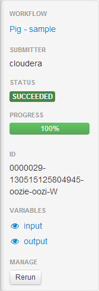

<link rel="stylesheet" href="docbook.css" type="text/css" media="screen" title="no title" charset="utf-8"></link>
<link rel="stylesheet" href="bootplus.css" type="text/css" media="screen" title="no title" charset="utf-8"></link>

<h1><a href=../index.html>Doc</a> > Hue User Guide</h1>

  

[TOC]

   

   

# Concept
Hue consists in 4 apps in a single page interface that allow the users to perform its data
analyzes without losing any context.

Each app of Hue can be extended to support your own languages or apps.

## Interface
### Top search
### Left assist
### Right assist
### Sample popup
### Charting
The SDK will be clarified in the upcoming charting revamp.

## Importer

### Importing Data

If you want to import your own data instead of installing the sample
tables, follow the procedure in [Creating Tables](#createTables).

Selecting a Database
--------------------

1.  In the pane on the left, select the database from the DATABASE
    drop-down list.

Creating a Database
-------------------

1.  Click .
2.  Click **Create a new database**.
    1.  Specify a database name and optional description. Database names
        are not case-sensitive. Click **Next**.
    2.  Do one of the following:
        -   Keep the default location in the Hive warehouse folder.
        -   Specify an external location within HDFS:
            1.  Uncheck the **Location** checkbox.
            2.  In the External location field, type a path to a folder
                on HDFS or click  to browse
                to a folder and click **Select this folder**.

    3.  Click the **Create Database** button.
    

Dropping Databases
------------------

1.  Click .
2.  In the list of databases, check the checkbox next to one or more
    databases.
3.  Click the  Drop button.
4.  Confirm whether you want to delete the databases.

Creating Tables
---------------

Although you can create tables by executing the appropriate Hive HQL DDL
query commands, it is easier to create a table using the Metastore
Manager table creation wizard.

There are two ways to create a table: from a file or manually. If you
create a table from a file, the format of the data in the file will
determine some of the properties of the table, such as the record and
file formats. The data from the file you specify is imported
automatically upon table creation. When you create a file manually, you
specify all the properties of the table, and then execute the resulting
query to actually create the table. You then import data into the table
as an additional step.

**From a File**

1.  In the ACTIONS pane in the Metastore Manager window, click **Create
    a new table from a file**. The table creation wizard starts.
2.  Follow the instructions in the wizard to create the table. The basic
    steps are:
    -   Choose your input file. The input file you specify must exist.
        Note that you can choose to have Beeswax create the table
        definition only based on the import file you select, without
        actually importing data from that file.
    -   Specify the column delimiter.
    -   Define your columns, providing a name and selecting the type.

3.  Click **Create Table** to create the table. The new table's metadata
    displays on the right side of the **Table Metadata** window. At this
    point, you can view the metadata or a sample of the data in the
    table. From the ACTIONS pane you can import new data into the table,
    browse the table, drop it, or go to the File Browser to see the
    location of the data.

**Manually**

1.  In the ACTIONS pane in the Metastore Manager window, click **Create
    a new table manually**. The table creation wizard starts.
2.  Follow the instructions in the wizard to create the table. The basic
    steps are:
    -   Name the table.
    -   Choose the record format.
    -   Configure record serialization by specifying delimiters for
        columns, collections, and map keys.
    -   Choose the file format.
    -   Specify the location for your table's data.
    -   Specify the columns, providing a name and selecting the type for
        each column.
    -   Specify partition columns, providing a name and selecting the
        type for each column.

3.  Click **Create table**. The Table Metadata window displays.

### Tables
### Indexes
### DBMS

## Documents
### Sharing
### Import / Export

# Editors
The goal of Hue’s Editor is to make data querying easy and productive.

It focuses on SQL but also supports job submissions. It comes with an intelligent autocomplete, search & tagging of data and query assistance.

## Languages
### Hive
### Impala

The Hive Editor enables you to perform queries on Apache Hive, a
data warehousing system designed to work with Hadoop. For information
about Hive. You can
create Hive databases, tables and partitions, load data, create, run,
and manage queries, and download the results in a Microsoft Office Excel
worksheet file or a comma-separated values file.

Hive Editor is installed and configured as part of Hue. For information
about installing and configuring Hue, see the Hue Installation
manual.

Hive Editor assumes an existing Hive installation. The Hue installation
instructions include the configuration necessary for hive to access
Hive. You can view the current Hive configuration from the **Settings**
tab in the Hive Editor.

By default, a Hive Editor user can see the saved queries for all users -
both his/her own queries and those of other Hive Editor users. To restrict
viewing saved queries to the query owner and Hue administrators, set the
share\_saved\_queries property under the [beeswax] section in the Hue
configuration file to false.

 **Note**: The Hive Editor used to be known as Beeswax.

### Running Queries

 **Note**: To run a query, you must be logged
in to Hue as a user that also has a Unix user account on the remote
server.

1.  To execute a portion of the query, highlight one or more query
    statements.
2.  Click **Execute**. The Query Results window appears with the results
    of your query.
    -   To view a log of the query execution, toggle the **Log** caret on the
        left of the progress bar. You can use the information in this tab
        to debug your query.
    -   To view the columns of the query, expand the **Columns** icon. Clicking
        on the column label will scroll to the column.
    -   To expand a row, double click on it or click on the row number.
    -   To lock a row, click on the lock icon in the row number column.

3.  If there are multiple statements in the query, click Next in the
    Multi-statement query pane to execute the remaining statements.

 **Note**: Under the logs panel, you can view any
MapReduce or Impala jobs that the query generated.

### Downloading and Saving Query Results

 **Important**:

-   You can only save results to a file when the results were generated
    by a MapReduce job.
-   This is the preferred way to save when the result is large (for
    example \> 1M rows).

1.  Do any of the following to download or save the query results:
    -   Click **Download as CSV** to download the results in a
        comma-separated values file suitable for use in other
        applications.
    -   Click **Download as XLS** to download the results in a Microsoft
        Office Excel worksheet file.
    -   Click **Save** to save the results in a table or HDFS file.
        -   To save the results in a new table, select **In a new
            table**, enter a table name, and then click **Save**.
        -   To save the results in an HDFS file, select **In an HDFS
            directory**, enter a path and then click **Save**. You can
            then download the file with [File Browser](../filebrowser.html).

### Advanced Query Settings

The pane to the left of the Query Editor lets you specify the following
options:

<table>
<tr><td>DATABASE</td><td>The database containing the table definitions.</td></tr>
<tr><td>SETTINGS</td><td>Override the Hive and Hadoop default settings. To configure a new
setting:

<ol>
<li> Click Add.
<li> For Key, enter a Hive or Hadoop configuration variable name.
<li> For Value, enter the value you want to use for the variable.

For example, to override the directory where structured Hive query logs
are created, you would enter hive.querylog.location for Key, and a
path for Value.
</ol>

To view the default settings, click the Settings tab at the top of
the page. For information about Hive configuration variables, see:
[http://wiki.apache.org/hadoop/Hive/AdminManual/Configuration](http://wiki.apache.org/hadoop/Hive/AdminManual/Configuration).
For information about Hadoop configuration variables, see:
[http://hadoop.apache.org/docs/current/hadoop-mapreduce-client/hadoop-mapreduce-client-core/mapred-default.xml](http://hadoop.apache.org/docs/current/hadoop-mapreduce-client/hadoop-mapreduce-client-core/mapred-default.xml).</td></tr>
<tr><td>FILE RESOURCES</td><td>Make files locally accessible at query execution time available on the
Hadoop cluster. Hive uses the Hadoop Distributed Cache to distribute the
added files to all machines in the cluster at query execution time.

<ol>
<li>  Click Add to configure a new setting.
<li>   From the Type drop-down menu, choose one of the following:
<ul>
   <li>jar - Adds the specified resources to the Java classpath.
   <li>archive - Unarchives the specified resources when
        distributing them.
    <li>file - Adds the specified resources to the distributed
        cache. Typically, this might be a transform script (or similar)
        to be executed.

<li>   For Path, enter the path to the file or click
     to browse and select the file.
</ol>

 Note: It is not necessary to specify files
used in a transform script if the files are available in the same path
on all machines in the Hadoop cluster.</td></tr>
<tr><td>USER-DEFINED FUNCTIONS</td><td>Specify user-defined functions. Click Add to configure a new
setting. Specify the function name in the Name field, and specify
the class name for Classname.

You *must* specify a JAR file for the user-defined functions in FILE RESOURCES.

To include a user-defined function in a query, add a $ (dollar sign)
before the function name in the query. For example, if MyTable is a
user-defined function name in the query, you would type: SELECT $MyTable
</td></tr>
<tr><td>PARAMETERIZATION</td><td>Indicate that a dialog box should display to enter parameter values when
a query containing the string $parametername is executed. Enabled by
default.</td></tr>
</table>

## Autocomplete
## Syntax checker
## Query Assist
## Risk Alerts
## Presentation

### Jobs

The Editor application enables you to create and submit jobs to
the cluster. You can include variables with your jobs to enable
you and other users to enter values for the variables when they run your
job.

Most job design types support all the settings listed in the following
table. For job type specific settings, see:
[MapReduce](#mapreduce),
[Streaming](#streaming),
[Java](#java),
[Pig](#pig),
[Hive](#hive),
[Sqoop](#sqoop),
[Shell](#shell),
[Ssh](#ssh),
[DistCp](#distcp),
[Fs](#fs), and
[Email](#email).

All job design settings except Name and Description support the use of
variables of the form $variable\_name. When you run the job, a dialog
box will appear to enable you to specify the values of the variables.

<table>
<tr><td>Name</td><td>Identifies the job and its collection of properties and parameters.</td></tr>
<tr><td>Description</td><td>A description of the job. The description is displayed in the dialog box
that appears if you specify variables for the job.</td></tr>
<tr><td>Advanced</td><td>Advanced settings:<ul><li>Is shared- Indicate whether to share the action with all users.<li>Oozie parameters - parameters to pass to Oozie</td></tr>
<tr><td>Prepare</td><td>Specifies paths to create or delete before starting the workflow job.</td></tr>
<tr><td>Params</td>Parameters to pass to a script or command. The parameters are expressed
using the [JSP 2.0 Specification (JSP.2.3) Expression
Language](http://jcp.org/aboutJava/communityprocess/final/jsr152/),
allowing variables, functions, and complex expressions as parameters.<td></td></tr>
<tr><td>Job Properties</td><td>Job properties. To set a property value, click <b>Add Property</b>.<ol><li>Property name -  a configuration property name. This field provides autocompletion, so you can type the first few characters of a property name and then select the one you want from the drop-down
    list.<li>Valuethe property value.</td></tr>
<tr><td>Files</td><td>Files to pass to the job. Equivalent to the Hadoop -files option.</td></tr>
<tr><td>Archives</td><td>Files to pass to the job. Archives to pass to the job. Equivalent to the Hadoop -archives option.</td></tr></table>

#### MapReduce Job Design

A MapReduce job design consists of MapReduce functions written in Java.
You can create a MapReduce job design from existing mapper and reducer
classes without having to write a main Java class. You must specify the
mapper and reducer classes as well as other MapReduce properties in the
Job Properties setting.

<table>
<tr><td>Jar path</td><td>The fully-qualified path to a JAR file containing the classes that
implement the Mapper and Reducer functions.</td></tr>
</table>

#### Streaming Job Design

Hadoop streaming jobs enable you to create MapReduce functions in any
non-Java language that reads standard Unix input and writes standard
Unix output. For more information about Hadoop streaming jobs, see
[Hadoop
Streaming](http://archive.cloudera.com/cdh/3/hadoop-0.20.2+320/streaming.html).

<table>
<tr><td>Mapper</td><td>The path to the mapper script or class. If the mapper file is not on the
machines on the cluster, use the Files option to pass it as a part
of job submission. Equivalent to the Hadoop -mapper option.</td></tr>
<tr><td>Reducer</td><td>The path to the reducer script or class. If the reducer file is not on
the machines on the cluster, use the Files option to pass it as a
part of job submission. Equivalent to the Hadoop -reducer option.</td></tr>
</table>

#### Java Job Design

A Java job design consists of a main class written in Java.

<table>
<tr><td>Jar path</td><td>The fully-qualified path to a JAR file containing the main class.</td></tr>
<tr><td>Main class</td><td>The main class to invoke the program.</td></tr>
<tr><td>Args</td><td>The arguments to pass to the main class.</td></tr>
<tr><td>Java opts</td><td>The options to pass to the JVM.</td></tr>
</table>

#### Pig Job Design

A Pig job design consists of a Pig script.

<table>
<tr><td>Script name</td><td>Script name or path to the Pig script.</td></tr>
</table>

#### Hive Job Design

A Hive job design consists of a Hive script.

<table>
<tr><td>Script name</td><td>Script name or path to the Hive script.</td></tr>
</table>

#### Sqoop Job Design

A Sqoop job design consists of a Sqoop command.

<table>
<tr><td>Command</td><td>The Sqoop command.</td></tr>
</table>

#### Shell Job Design

A Shell job design consists of a shell command.

<table>
<tr><td>Command</td><td>The shell command.</td></tr>
<tr><td></td>Capture output<td>Indicate whether to capture the output of the command.</td></tr>
</table>

#### Ssh Job Design

A Ssh job design consists of an ssh command.

<table>
<tr><td>User</td><td>The name of the user to run the command as.</td></tr>
<tr><td>Host</td><td>The name of the host to run the command on.</td></tr>
<tr><td>Command</td><td>The ssh command.</td></tr>
<tr><td></td>Capture output<td>Indicate whether to capture the output of the command.</td></tr>
</table>

#### DistCp Job Design

A DistCp job design consists of a DistCp command.

#### Fs Job Design

A Fs job design consists of a command that operates on HDFS.

<table>
<tr><td>Delete path</td><td>The path to delete. If it is a directory, it deletes recursively all its
content and then deletes the directory.</td></tr>
<tr><td></td>Create directory<td>The path of a directory to create.</td></tr>
<tr><td>Move file</td><td>The source and destination paths to the file to be moved.</td></tr>
<tr><td>Change permissions</td><td>The path whose permissions are to be changed, the permissions, and an
indicator of whether to change permission recursively.</td></tr></table>

#### Email Job Design

A Email job design consists of an email message.

<table>
<tr><td>To addresses</td><td>The recipient of the email message.</td></tr>
<tr><td>CC addresses (optional)</td><td>The cc recipients of the email message.</td></tr>
<tr><td>Subject</td><td>The subject of the email message.</td></tr>
<tr><td>Body</td><td>The body of the email message.</td></tr>
</table>

### Spark

#### Batch

This is a quick way to submit any Jar or Python jar/script to a cluster via the Scheduler or Editor.

#### Interactive

Hue relies on Livy (http://livy.io/) for the interactive Scala, Python and R snippets.

Livy got initially developed in the Hue project but got a lot of traction and was moved to its own project on livy.io. Here is a tutorial on how to use a notebook to perform some Bike Data analysis.

Make sure that the Notebook and interpreters are set in the hue.ini, and Livy is up and running:

<pre>
[spark]
  # Host address of the Livy Server.
  livy_server_host=localhost
 
[notebook]
 
 ## Show the notebook menu or not
 show_notebooks=true
 
[[interpreters]]
    # Define the name and how to connect and execute the language.
 
    [[[hive]]]
      # The name of the snippet.
      name=Hive
      # The backend connection to use to communicate with the server.
      interface=hiveserver2
       
   [[[spark]]]
     name=Scala
     interface=livy
 
    [[[pyspark]]]
      name=PySpark
      interface=livy
</pre>

## SDK

# Dashboards
Dashboards are an interactive way to explore your data quickly and easily. No programming is required and the analysis is done by drag & drops and clicks.

### SDK

# Browsers
Hue’s Browsers powers your Data Catalog. They let you easily search, glance and perform actions on data or jobs in Cloud or on premise clusters.

## Tables

The Table Browser enables you to manage the databases,
tables, and partitions of the metastore shared by
the ([Beeswax](../beeswax.html) and [Cloudera Impala Query
UI](../impala.html)) applications. You can use Metastore
Manager to perform the following operations:

-   Databases
    -   [Select a database](#selectDatabase)
    -   [Create a database](#createDatabase)
    -   [Drop databases](#dropDatabase)

-   Tables
    -   [Create tables](#createTables)
    -   [Browse tables](#browseTables)
    -   [Import data into a table](#importDataIntoTables)
    -   [Drop tables](#dropTables)
    -   [View the location of a table](#viewTableLocation)

Metastore Manager Installation and Configuration
------------------------------------------------

Metastore Manager is one of the applications installed as part of Hue.

Browsing Tables
---------------

**To browse table data:**

In the Table List window, check the checkbox next to a table name and
click **Browse Data**. The table's data displays in the Query Results
window.

**To browse table metadata:**

Do one of the following:

-   In the Table List window, click a table name.
-   Check the checkbox next to a table name and click **View**.

-   The table's metadata displays in the **Columns** tab. You can view
    the table data by selecting the **Sample** tab.
-   If the table is partitioned, you can view the partition columns by
    clicking the **Partition Columns** tab and display the partitions by
    clicking **Show Partitions(n)**, where n is the number of partitions
    in the ACTIONS pane on the left.

Importing Data into a Table
---------------------------

When importing data, you can choose to append or overwrite the table's
data with data from a file.

1.  In the Table List window, click the table name. The Table Metadata
    window displays.
2.  In the ACTIONS pane, click **Import Data**.
3.  For **Path**, enter the path to the file that contains the data you
    want to import.
4.  Check **Overwrite existing data** to replace the data in the
    selected table with the imported data. Leave unchecked to append to
    the table.
5.  Click **Submit**.

Dropping Tables
---------------

1.  In the Table List window, click the table name. The Table Metadata
    window displays.
2.  In the ACTIONS pane, click **Drop Table**.
3.  Click **Yes** to confirm the deletion.

Viewing a Table's Location
--------------------------

1.  In the Table List window, click the table name. The Table Metadata
    window displays.
2.  Click **View File Location**. The file location of the selected
    table displays in its directory in the File Browser window.

## File Browser

The File Browser application lets you browse and manipulate files and
directories in the Hadoop Distributed File System (HDFS), S3 or ADLS.
With File Browser, you can:

-   Create files and directories, upload and download files, upload zip
    archives, and rename, move, and delete files and directories. You
    can also change a file's or directory's owner, group, and
    permissions. See [Files and Directories](#filesAndDirectories).
-   Search for files, directories, owners, and groups. See [Searching
    for Files and Directories](#searching).
-   View and edit files as text or binary. See [Viewing and Editing
    Files](#viewAndEdit).

### File systems
#### HDFS
#### S3
#### ADLS

File Browser Installation and Configuration
-------------------------------------------

File Browser is one of the applications installed as part of Hue. For
information about installing and configuring Hue, see the Hue Installation
manual.

Starting File Browser
---------------------

Files and Directories
---------------------

You can use File Browser to view the input and output files of your
MapReduce jobs. Typically, you can save your output files in /tmp or in
your home directory if your system administrator set one up for you. You
must have the proper permissions to manipulate other user's files.

### Creating Directories

1.  In the File Browser window, select **New > Directory**.
2.  In the **Create Directory** dialog box, enter a directory name and
    then click **Submit**.

### Changing Directories

-   Click the directory name or parent directory dots in the **File
    Browser** window.
-   Click the  icon, type a directory name, and
    press **Enter**.

To change to your home directory, click **Home** in the path field at
the top of the **File Browser** window.

 **Note**:

The **Home** button is disabled if you do not have a home directory. Ask
a Hue administrator to create a home directory for you.

### Creating Files

1.  In the File Browser window, select **New > File**.
2.  In the **Create File** dialog box, enter a file name and then click
    **Submit**.

### Uploading Files

You can upload text and binary files to the HDFS.

1.  In the **File Browser** window, browse to the directory where you
    want to upload the file.
2.  Select **Upload \> Files**.
3.  In the box that opens, click **Upload a File** to browse to and
    select the file(s) you want to upload, and then click **Open**.

### Copying a File

1.  In the **File Browser** window, check the checkbox next to the file
    you want to copy.
2.  Click the  Copy button.

### Downloading Files

You can download text and binary files to the HDFS.

1.  In the **File Browser** window, check the checkbox next to the file
    you want to download.
2.  Click the **Download** button.

### Uploading Zip Archives

You can upload zip archives to the HDFS. The archive is uploaded and
extracted to a directory named archivename.

1.  In the **File Browser** window, browse to the directory where you
    want to upload the archive.
2.  Select **Upload > Zip file**.
3.  In the box that opens, click **Upload a zip file** to browse to and
    select the archive you want to upload, and then click **Open**.

### Trash Folder

File Browser supports the HDFS trash folder (*home directory*/.Trash) to
contain files and directories before they are permanently deleted. Files
in the folder have the full path of the deleted files (in order to be
able to restore them if needed) and checkpoints. The length of time a
file or directory stays in the trash depends on HDFS properties.

**Open**

1.  In the **File Browser** window, click .

**Move Files and Directories To**

1.  In the **File Browser** window, check the checkbox next to one or
    more files and directories.
2.  Select **Delete > Move to trash**.

**Empty**

1.  In the **File Browser** window, click .
2.  Click **Empty**.

### Renaming, Moving, Deleting, and Restoring Files and Directories

**Rename**

1.  In the **File Browser** window, check the checkbox next to the file
    or directory you want to rename.
2.  Click the **Rename** button.
3.  Enter the new name and then click **Submit**.

**Move**

1.  In the **File Browser** window, check the checkbox next to the file
    or directory you want to move.
2.  Click the **Move** button.
3.  In the **Move** dialog box, browse to or type the new directory, and
    then click **Submit**.

**Delete**

1.  In the **File Browser** window, check the checkbox next to the file
    or directory you want to delete. If you select a directory, all of
    the files and subdirectories contained within that directory are
    also deleted.
2.  Choose one of the following:
    -   **Delete > Move to trash**
    -   **Delete > Delete forever**

3.  Click **Yes** to confirm. When you move a file to trash it is stored
    in the .Trash folder in your home directory.

**Restore**

1.  In the **File Browser** window, open the .Trash folder.
2.  Navigate to the folder containing the file you want to restore.
3.  Check the checkbox next to the file.
4.  Click **Restore**.

### Changing a File's or Directory's Owner, Group, or Permissions

 **Note**:

Only the Hadoop superuser can change a file's or directory's owner,
group, or permissions. The user who starts Hadoop is the Hadoop
superuser. The Hadoop superuser account is not necessarily the same as a
Hue superuser account. If you create a Hue user (in User Admin) with the
same user name and password as the Hadoop superuser, then that Hue user
can change a file's or directory's owner, group, or permissions.

**Owner or Group**

1.  In the **File Browser** window, check the checkbox next to the
    select the file or directory whose owner or group you want to
    change.
2.  Choose **Change Owner/Group** from the Options menu.
3.  In the **Change Owner/Group** dialog box:
    -   Choose the new user from the **User** drop-down menu.
    -   Choose the new group from the **Group** drop-down menu.
    -   Check the **Recursive** checkbox to propagate the change.

4.  Click **Submit** to make the changes.

**Permissions**

1.  In the **File Browser** window, check the checkbox next to the file
    or directory whose permissions you want to change.
2.  Click the **Change Permissions** button.
3.  In the **Change Permissions** dialog box, select the permissions you
    want to assign and then click **Submit**.
    
    

Searching for Files and Directories
-----------------------------------

To search for files or directories by name using the query search box,
enter the name of the file or directory in the query search box. File
Browser lists the files or directories matching the search criteria.

Viewing and Editing Files
-------------------------

You can view and edit files as text or binary.

**View**

1.  In the **File Browser** window, click the file you want to view.
    File Browser displays the first 4,096 bytes of the file in the
    **File Viewer** window.
    -   If the file is larger than 4,096 bytes, use the Block navigation
        buttons (First Block, Previous Block, Next Block, Last Block) to
        scroll through the file block by block. The **Viewing Bytes**
        fields show the range of bytes you are currently viewing.
    -   To switch the view from text to binary, click **View as Binary**
        to view a hex dump.
    -   To switch the view from binary to text, click **View as Text**.

**Edit**

1.  If you are viewing a text file, click **Edit File**. File Browser
    displays the contents of the file in the **File Editor** window.
2.  Edit the file and then click **Save** or **Save As** to save the
    file.

**View Location in HDFS**

Click **View File Location**. File Browser displays the file's location
in the **File Browser** window.

Job Browser
===========

The Job Browser application lets you to examine the Hadoop MapReduce
jobs running on your Hadoop cluster. Job Browser presents the job and
tasks in layers. The top layer is a list of jobs, and you can link to a
list of that job's tasks. You can then view a task's attempts and the
properties of each attempt, such as state, start and end time, and
output size. To troubleshoot failed jobs, you can also view the logs of
each attempt.

Job Browser Installation and Configuration
------------------------------------------

Job Browser is one of the applications installed as part of Hue. For
information about installing and configuring Hue, see the Hue Installation
manual.

Job Browser can display both MRv1 and MRv2 jobs, but must be configured
to display one type at a time. 

Starting Job Browser
--------------------

Click the **Job Browser** icon ()
in the navigation bar at the top of the Hue web page.

If there are no jobs that have been run, the **Welcome to the Job
Browser** page opens, with links to the Job Designer and Beeswax.

If there are jobs running, then the Job Browser list appears.

Filtering the Job Browser List
------------------------------

-   To filter the jobs by their state (such as **Running** or
    **Completed**), choose a state from the **Job status** drop-down
    menu.
-   To filter by a user who ran the jobs, enter the user's name in the
    **User Name** query box.
-   To filter by job name, enter the name in the **Text** query box.
-   To clear the filters, choose **All States** from the **Job status**
    drop-down menu and delete any text in the **User Name** and **Text**
    query boxes.
-   To display retired jobs, check the **Show retired jobs** checkbox.
    Retired jobs show somewhat limited information – for example,
    information on maps and reduces and job duration is not available.
    Jobs are designated as Retired by the JobTracker based on the value
    of mapred.jobtracker.retirejob.interval. The retired jobs no longer
    display after the JobTracker is restarted.

Viewing Job Information and Logs
--------------------------------

 **Note**: At any level you can view the log
for an object by clicking the  icon in the Logs
column.

**To view job information for an individual job:**

1.  In the **Job Browser** window, click **View** at the right of the
    job you want to view. This shows the **Job** page for the job, with
    the recent tasks associated with the job are displayed in the
    **Tasks** tab.
2.  Click the **Metadata** tab to view the metadata for this job.
3.  Click the **Counters** tab to view the counter metrics for the job.

**To view details about the tasks associated with the job:**

1.  In the **Job** window, click the **View All Tasks** link at the
    right just above the **Recent Tasks** list. This lists all the tasks
    associated with the job.
2.  Click **Attempts** to the right of a task to view the attempts for
    that task.

**To view information about an individual task:**

1.  In the **Job** window, click the **View** link to the right of the
    task. The attempts associated with the task are displayed.
2.  Click the **Metadata** tab to view metadata for this task. The
    metadata associated with the task is displayed.
3.  To view the Hadoop counters for a task, click the **Counters** tab.
    The counters associated with the task are displayed.
4.  To return to the **Job** window for this job, click the job number
    in the status panel at the left of the window.

**To view details about a task attempt:**

1.  In the **Job Task** window, click the **View** link to the right of
    the task attempt. The metadata associated with the attempt is
    displayed under the **Metadata** tab.
2.  To view the Hadoop counters for the task attempt, click the
    **Counters** tab. The counters associated with the attempt are
    displayed.
3.  To view the logs associated with the task attempt, click the
    **Logs** tab. The logs associated with the task attempt are
    displayed.
4.  To return to the list of tasks for the current job, click the task
    number in the status panel at the left of the window.

### Scheduler
The application lets you build workflows and then schedule them to run regularly automatically. A monitoring interface shows the progress, logs and allow actions like pausing or stopping jobs.

The Oozie Editor/Dashboard application allows you to define Oozie
workflow, coordinator, and bundle applications, run workflow,
coordinator, and bundle jobs, and view the status of jobs. For
information about Oozie, see [Oozie
Documentation](http://archive.cloudera.com/cdh4/cdh/4/oozie/).

A workflow application is a collection of actions arranged in a directed
acyclic graph (DAG). It includes two types of nodes:

-   Control flow - start, end, fork, join, decision, and kill
-   Action - [MapReduce](../jobdesigner.html#mapreduce),
[Streaming](../jobdesigner.html#streaming),
[Java](../jobdesigner.html#java),
[Pig](../jobdesigner.html#pig),
[Hive](../jobdesigner.html#hive),
[Sqoop](../jobdesigner.html#sqoop),
[Shell](../jobdesigner.html#shell),
[Ssh](../jobdesigner.html#ssh),
[DistCp](../jobdesigner.html#distcp),
[Fs](../jobdesigner.html#fs), and
[Email](../jobdesigner.html#email).
    In order to run DistCp, Streaming, Pig, Sqoop, and Hive jobs, Oozie
    must be configured to use the Oozie ShareLib. See the Oozie Installation
   manual.

A coordinator application allows you to define and execute recurrent and
interdependent workflow jobs. The coordinator application defines the
conditions under which the execution of workflows can occur.

A bundle application allows you to batch a set of coordinator
applications.

Oozie Editor/Dashboard Installation and Configuration
-----------------------------------------------------

Oozie Editor/Dashboard is one of the applications installed as part of
Hue. For information about installing and configuring Hue, see the Hue Installation
manual.

Starting Oozie Editor/Dashboard
-------------------------------

Click the **Oozie Editor/Dashboard** icon
() in the navigation bar at the top of
the Hue browser page. **Oozie Editor/Dashboard** opens with the
following screens:

-   [Dashboard](#dashboard) - shows the running and completed workflow,
    coordinator, and bundle jobs and information about Oozie
    instrumentation and configuration. The screen is selected and opened
    to the Workflows page.
-   [Workflow Manager](#workflowManager) - shows available workflows and
    allows you to create and import workflows.
-   [Coordinator Manager](#coordinatorManager) - shows available coordinators and
    allows you to create coordinators.
-   [Bundle Manager](#bundleManager) - shows available bundles and
    allows you to create bundles.

Filtering Lists in Oozie Editor/Dashboard
-----------------------------------------

Many screens contain lists. When you type in the Filter field on
screens, the lists are dynamically filtered to display only those rows
containing text that matches the specified substring.

Permissions in Oozie Editor/Dashboard
-------------------------------------

In the Dashboard workflows, coordinators, and bundles can only be
viewed, submitted, and modified by their owner or a superuser.

Editor permissions for performing actions on workflows, coordinators,
and bundles are summarized in the following table:

<table>
<th><td>Action</td><td>Superuser or Owner</td><td>All</td></th>
<tr><td>View</td><td>Y.</td><td>Only if "Is shared" is set</td></tr>
<tr><td>Submit</td><td>Y.</td><td>Only if "Is shared" is set</td></tr>
<tr><td>Modify</td><td>Y.</td><td>N</td></tr>
</table>

Dashboard
---------

The Dashboard shows a summary of the running and completed workflow,
coordinator, and bundle jobs.

You can view jobs for a period up to the last 30 days.

You can filter the list by date (1, 7, 15, or 30 days) or status
(Succeeded, Running, or Killed). The date and status buttons are
toggles.

### Workflows

Click the **Workflows** tab to view the running and completed workflow
jobs for the filters you have specified.

Click a workflow row in the Running or Completed table to view detailed
information about that workflow job.

In the left pane contains a link to the workflow and the variable values
specified.

For the selected job, the following information is available in the
right area.

-   **Graph** tab shows the workflow DAG.
-   **Actions** tab shows you details about the actions that make up the
    workflow.
    -   Click the **Id** link to see additional details about the
        action.
    -   Click the **External Id** link to view the job in the Job
        Browser.

-   **Details** tab shows job statistics including start and end times.
-   **Configuration** tab shows selected job configuration settings.
-   **Logs** tab shows log output generated by the workflow job.
-   **Definition** tab shows the Oozie workflow definition, as it
    appears in the workflow.xml file (also linked under the application
    path properties in the **Details** tab and the **Configuration**
    tab).

For each action in the workflow you can:

-   Click the  icon to view the action screen,
    which contains:
    -   **Details** tab shows job statistics including start and end
        times.
    -   **Configuration** tab shows the action configuration settings.
    -   **Child Jobs** tab lists jobs generated by the action.

-   Click the  icon to view the log in the Job
    Browser.

### Coordinators

Click the **Coordinators** tab to view the running and completed
coordinator jobs for the filters you have specified.

For the selected job, the following information is available.

-   The **Calendar** tab shows the timestamp of the job. Click the
    timestamp to open the workflow DAG.
-   The **Actions** tab shows you details about the actions that make up
    the coordinator.
    -   Click the **Id** link to see additional details about the
        action.
    -   Click the **External Id** link to view the job in the Job
        Browser.

-   The **Configuration** tab shows selected job configuration settings.
-   The **Logs** tab shows log output generated by the coordinator.
-   The **Definition** tab shows the Oozie coordinator definition, as it
    appears in the coordinator.xml file (also linked under the
    oozie.coord.application.path property in the **Configuration** tab).

### Editing a Workflow

In the Workflow Editor you can easily perform operations on Oozie action
and control nodes.

#### Action Nodes

The Workflow Editor supports dragging and dropping action nodes. As you
move the action over other actions and forks, highlights indicate active
areas. If there are actions in the workflow, the active areas are the
actions themselves and the areas above and below the actions. If you
drop an action on an existing action, a fork and join is added to the
workflow.

-   Add actions to the workflow by clicking an action
     button and drop the action on the
    workflow. The Edit Node screen displays.
    1.  Set the action properties and click **Done**. Each action in a
        workflow must have a unique name.

-   Copy an action by clicking the  **Copy**
    button.

1.  The action is opened in the Edit Node screen.
2.  Edit the action properties and click **Done**. The action is added
    to the end of the workflow.

-   Delete an action by clicking the  button.
-   Edit an action by clicking the  button.
-   Change the position of an action by left-clicking and dragging an
    action to a new location.

#### Control Nodes

-   Create a fork and join by dropping an action on top of another
    action.
-   Remove a fork and join by dragging a forked action and dropping it
    above the fork.
-   Convert a fork to a decision by clicking the
     button.
-   To edit a decision:
    1.  Click the  button.
    2.  Fill in the predicates that determine which action to perform
        and select the default action from the drop-down list.
    3.  Click **Done**.

### Uploading Workflow Files

In the Workflow Editor, click the **Upload** button.

The workspace of the workflow is opened in the File Browser application.
Follow the procedure in [Uploading
Files](../filebrowser.html#uploadingFiles) to upload the files. You must
put JAR files in a lib directory in the workspace.

### Editing Workflow Properties

1.  In the Workflow Editor, click the link under the Name or Description
    fields in the left pane.
2.  To share the workflow with all users, check the **Is shared**
    checkbox.
3.  To set advanced execution options, click **advanced** and edit the
    deployment directory, add parameters and job properties, or specify
    a job.xml file.
4.  Click **Save**.

Coordinator Manager
-------------------

In Coordinator Manager you create Oozie coordinator applications and
submit them for execution.

Click the **Coordinators** tab to open the Coordinator Manager.

Each row shows a coordinator: its name, description, timestamp of its
last modification. It also shows:

-   **Workflow** - the workflow that will be run by the coordinator.
-   **Frequency** - how often the workflow referenced by the coordinator
    will be run.
-   **Status** - who can run the coordinator. **shared** means users
    other than the owner can access the workflow. **personal** means
    only the owner can modify or submit the workflow. The default is
    personal.
-   **Owner** - the user that created the coordinator.

In Coordinator Editor, you edit coordinators and the datasets required
by the coordinators. For information about defining coordinators and
datasets, see the [Coordinator
Specification](http://archive.cloudera.com/cdh4/cdh/4/oozie/CoordinatorFunctionalSpec.html).

### Editing a Coordinator

In the Coordinator Editor you specify coordinator properties and the
datasets on which the workflow scheduled by the coordinator will operate
by stepping through screens in a wizard. You can also advance to
particular steps and revisit steps by clicking the Step "tabs" above the
screens. The following instructions walk you through the wizard.

1.  Type a name, select the workflow, check the **Is shared checkbox**
    to share the job, and click **Next**. If the Coordinator Editor was
    opened after scheduling a workflow, the workflow will be set.
2.  Select how many times the coordinator will run for each specified
    unit, the start and end times of the coordinator, the timezone of
    the start and end times, and click **Next**. Times must be expressed
    as UTC times. For example, to run at 10 pm PST, specify a start time
    of 6 am UTC of the following day (+8 hours) and set the Timezone
    field to America/Los\_Angeles.
3.  Click **Add** to select an input dataset and click **Next**. If no
    datasets exist, follow the procedure in [Creating a
    Dataset](#creatingDataset).
4.  Click **Add** to select an output dataset. Click **Save
    coordinator** or click **Next** to specify advanced settings.
5.  To share the coordinator with all users, check the **Is****shared**
    checkbox.
6.  Fill in parameters to pass to Oozie, properties that determine how
    long a coordinator will wait before timing out, how many
    coordinators can run and wait concurrently, and the coordinator
    execution policy.
7.  Click **Save coordinator**.

### Creating a Dataset

1.  In the Coordinator Editor, do one of the following:
    -   Click **here** in the Inputs or Outputs pane at the top of the
        editor.
    -   In the pane at the left, click the **Create new** link. Proceed
        with [Editing a Dataset](#editingDataset).

### Displaying Datasets

1.  In the Coordinator Editor, click **Show existing** in pane at the
    left.
2.  To edit a dataset, click the dataset name in the Existing datasets
    table. Proceed with [Editing a Dataset](#editingDataset).

### Editing a Dataset

1.  Type a name for the dataset.
2.  In the Start and Frequency fields, specify when and how often the
    dataset will be available.
3.  In the URI field, specify a URI template for the location of the
    dataset. To construct URIs and URI paths containing dates and
    timestamps, you can specify the variables
    ${YEAR},${MONTH},${DAY},${HOUR},${MINUTE}. For example:
    hdfs://foo:9000/usr/app/stats/${YEAR}/${MONTH}/data.
4.  In the Instance field, click a button to choose a default, single,
    or range of data instances. For example, if frequency==DAY, a window
    of the last rolling 5 days (not including today) would be expressed
    as start: -5 and end: -1. Check the advanced checkbox to display a
    field where you can specify a coordinator [EL
    function](http://archive.cloudera.com/cdh4/cdh/4/oozie/CoordinatorFunctionalSpec.html).
5.  Specify the timezone of the start date.
6.  In the Done flag field, specify the flag that identifies when input
    datasets are no longer ready.

### Displaying the History of a Coordinator

1.  Click the **Dashboard** tab.
2.  Click the **Coordinators** tab.
3.  Click a coordinator.
4.  Click the **Actions** tab.

Bundle Manager
--------------

In Bundle Manager you create Oozie bundle applications and submit them
for execution.

Click the **Bundle** tab to open the Bundle Manager.

Each row shows a bundle: its name, description, timestamp of its last
modification. It also shows:

-   **Coordinators** - the coordinators that will be run by the bundle.
-   **Kick off** - the UTC time when the coordinators referenced by the
    bundle will be started.
-   **Status** - who can run the bundle. **shared** means users other
    than the owner can access the workflow. **personal** means only the
    owner can modify or submit the workflow. The default is personal.
-   **Owner** - the user that created the bundle.

For information about defining bundles, see the [Bundle
Specification](http://archive.cloudera.com/cdh4/cdh/4/oozie/BundleFunctionalSpec.html).

### Opening a Bundle

To open a bundle, in Bundle Manager, click the bundle. Proceed with
[Editing a Bundle](#editingBundle).

### Creating a Bundle

1.  Click the **Create** button at the top right.
2.  In the Name field, type a name.
3.  In the Kick off time field, choose a kick off time.
4.  Check the Is shared checkbox to allow all users to access the
    workflow.
5.  Click **Save**. The Bundle Editor opens. Proceed with [Editing a
    Bundle](#editingBundle).

### Submitting a Bundle

To submit a bundle for execution, check the checkbox next to the bundle
and click the **Submit** button.

### Editing a Bundle

In the Bundle Editor, you specify properties by stepping through screens
in a wizard. You can also advance to particular steps and revisit steps
by clicking the Step "tabs" above the screens. The following
instructions walk you through the wizard.

1.  Click **Add** to select a coordinator that the bundle will kick off.
2.  Choose the kick off time. The time must be expressed as a UTC time.
    For example, to run at 10 pm PST, specify a start time of 6 am UTC
    of the following day (+8 hours).
3.  To share the bundle with all users, check the **Is shared**
    checkbox.
4.  Click **Next** to specify advanced settings or click **Save
    bundle**.
5.  Fill in parameters to pass to Oozie.
6.  Click **Save bundle**.

# Contrib
Those modules are not active enough to be officially maintained in the core Hue but can still
fit your needs. Any [contribution](https://github.com/cloudera/hue/wiki) is still welcomed!

## SDK
Check the SDK guide or contact the community about how to build your own custom app.

## HBase Browser

We'll take a look at the new [HBase Browser App](http://gethue.com/the-web-ui-for-hbase-hbase-browser).

Prerequisites before using the app:

\1. Have HBase and Thrift Service 1 initiated (Thrift can be configured)

\2. Configure your list of HBase Clusters in
[hue.ini](https://github.com/cloudera/hue/blob/master/desktop/conf.dist/hue.ini#L467)
to point to your Thrift IP/Port

## SmartView

The smartview is the view that you land on when you first enter a table.
On the left hand side are the row keys and hovering over a row reveals a
list of controls on the right. Click a row to select it, and once
selected you can perform batch operations, sort columns, or do any
amount of standard database operations. To explore a row, simple scroll
to the right. By scrolling, the row should continue to lazily-load cells
until the end.

### Adding Data

To initially populate the table, you can insert a new row or bulk upload
CSV/TSV/etc. type data into your table.

On the right hand side of a row is a '+' sign that lets you insert
columns into your
row

### Mutating Data

To edit a cell, simply click to edit inline.

If you need more control or data about your cell, click “Full Editor” to
edit.

In the full editor, you can view cell history or upload binary data to
the cell. Binary data of certain MIME Types are detected, meaning you
can view and edit images, PDFs, JSON, XML, and other types directly in
your browser!

Hovering over a cell also reveals some more controls (such as the delete
button or the timestamp). Click the title to select a few and do batch
operations:

If you need some sample data to get started and explore, check out this
howto create [HBase table
tutorial](http://gethue.com/hadoop-tutorial-how-to-create-example-tables-in-hbase).

### Smart Searchbar

The "Smart Searchbar" is a sophisticated tool that helps you zero-in on
your data. The smart search supports a number of operations. The most
basic ones include finding and scanning row keys. Here I am selecting
two row keys with:

    domain.100, domain.200

Submitting this query gives me the two rows I was looking for. If I want
to fetch rows after one of these, I have to do a scan. This is as easy
as writing a '+' followed by the number of rows you want to fetch.

    domain.100, domain.200 +5

Fetches domain.100 and domain.200 followed by the next 5 rows. If you're
ever confused about your results, you can look down below and the query
bar and also click in to edit your query.

The Smart Search also supports column filtering. On any row, I can
specify the specific columns or families I want to retrieve. With:

    domain.100[column_family:]   

I can select a bare family, or mix columns from different families like
so:

    domain.100[family1:, family2:, family3:column_a]

Doing this will restrict my results from one row key to the columns I
specified. If you want to restrict column families only, the same effect
can be achieved with the filters on the right. Just click to toggle a
filter.

Finally, let's try some more complex column filters. I can query for
bare columns:

    domain.100[column_a]

This will multiply my query over all column families. I can also do
prefixes and scans:

    domain.100[family: prefix* +3]

This will fetch me all columns that start with prefix\* limited to 3
results. Finally, I can filter on range:

    domain.100[family: column1 to column100]

This will fetch me all columns in 'family:' that are lexicographically
\>= column1 but <= column100. The first column ('column1') must be a
valid column, but the second can just be any string for comparison.

The Smart Search also supports prefix filtering on rows. To select a
prefixed row, simply type the row key followed by a star \*. The prefix
should be highlighted like any other searchbar keyword. A prefix scan is
performed exactly like a regular scan, but with a prefixed row.

    domain.10* +10

Finally, as a new feature, you can also take full advantage of the
[HBase filtering](denied:about:blank)language, by typing your filter
string between curly braces. HBase Browser autocompletes your filters
for you so you don't have to look them up every time. You can apply
filters to rows or scans.

    domain.1000 {ColumnPrefixFilter('100-') AND ColumnCountGetFilter(3)}

This doc only covers a few basic features of the Smart Search. You can
take advantage of the full querying language by referring to the help
menu when using the app. These include column prefix, bare columns,
column range, etc. Remember that if you ever need help with the
searchbar, you can use the help menu that pops up while typing, which
will suggest next steps to complete your query.

## Sqoop 2 Editor

The Sqoop UI enables transfering data from a relational database
to Hadoop and vice versa. The UI lives uses Apache Sqoop to do this.
See the [Sqoop Documentation](http://sqoop.apache.org/docs/1.99.2/index.html) for more details on Sqoop.

Installation and Configuration
------------------------------

The Sqoop UI is one of the applications installed as part of
Hue. For information about installing and configuring Hue, see the Hue Installation
manual.

Starting
--------

Click the **Sqoop** icon
() in the navigation bar at the top of
the Hue browser page.

Sqoop Jobs
----------
Sqoop UI is oriented around jobs in Apache Sqoop.

### Creating a New Job

1. Click the **New job** button at the top right.
2. In the Name field, enter a name.
3. Choose the type of job: import or export.
   The proceeding form fields will change depending on which type is chosen.
4. Select a connection, or create one if it does not exist.
5. Fill in the rest of the fields for the job.
   For importing, the "Table name", "Storage type", "Output format", and "Output directory" are necessary at a minimum.
   For exporting, the "Table name" and "Input directory" are necessary at a minimum.
6. Click **save** to finish.

### Editing a Job

1. In the list of jobs, click on the name of the job.
2. Edit the desired form fields in the job.

### Copying a Job

1. In the list of jobs, click on the name of the job.
2. On the left hand side of the job editor, there should be a panel containing actions.
   Click **Copy**.

### Removing a Job

1. In the list of jobs, click on the name of the job.
2. On the left hand side of the job editor, there should be a panel containing actions.
   Click **Delete**.

### Running a Job

There's a status on each of the items in the job list indicating
the last time a job was ran. The progress of the job should dynamically
update. There's a progress bar at the bottom of each item on the job list
as well.

1. In the list of jobs, click on the name of the job.
2. On the left hand side of the job editor, there should be a panel containing actions.
   Click **Run**.

### Creating a New Connection

1. Click the **New job** button at the top right.
2. At the connection field, click the link titled **Add a new connection**.
3. Fill in the displayed fields.
4. Click **save** to finish.

### Editing a Connection

1. Click the **New job** button at the top right.
2. At the connection field, select the connection by name that should be edited.
3. Click **Edit**.
4. Edit the any of the fields.
5. Click **save** to finish.

### Removing a Connection

1. Click the **New job** button at the top right.
2. At the connection field, select the connection by name that should be deleted.
3. Click **Delete**.

NOTE: If this does not work, it's like because a job is using that connection.
      Make sure not jobs are using the connection that will be deleted.

### Filtering Sqoop Jobs

The text field in the top, left corner of the Sqoop Jobs page enables fast filtering
of sqoop jobs by name.

## ZooKeeper Browser

The main two features are:

- Listing of the ZooKeeper cluster stats and clients
- Browsing and edition of the ZNode hierarchy

ZooKeeper Browser requires the [ZooKeeper
REST](https://github.com/apache/zookeeper/tree/trunk/src/contrib/rest)
service to be running. Here is how to setup this one:

First get and build ZooKeeper:

<pre>
git clone https://github.com/apache/zookeeper
cd zookeeper
ant
Buildfile: /home/hue/Development/zookeeper/build.xml

init:
       [mkdir] Created dir: /home/hue/Development/zookeeper/build/classes
       [mkdir] Created dir: /home/hue/Development/zookeeper/build/lib
       [mkdir] Created dir: /home/hue/Development/zookeeper/build/package/lib
       [mkdir] Created dir: /home/hue/Development/zookeeper/build/test/lib

   ...
</pre>

And start the REST service:

<pre>
cd src/contrib/rest
nohup ant run&
</pre>

If ZooKeeper and the REST service are not on the same machine as Hue, go
update the [Hue
settings](https://github.com/cloudera/hue/blob/master/desktop/conf.dist/hue.ini#L581)
and specify the correct hostnames and ports:

<pre>
    [zookeeper]

      [[clusters]]

        [[[default]]]
          # Zookeeper ensemble. Comma separated list of Host/Port.
          # e.g. localhost:2181,localhost:2182,localhost:2183
          ## host_ports=localhost:2181

          # The URL of the REST contrib service
          ## rest_url=http://localhost:9998
</pre>

   

