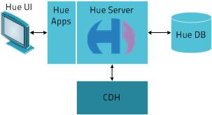

<link rel="stylesheet" href="docbook.css" type="text/css" media="screen" title="no title" charset="utf-8"></link>

Introducing Hue
===============

Hue is a set of web applications that enable you to interact with a Hadoop
cluster. Hue applications let you browse HDFS and jobs, manage a Hive metastore,
run Hive, Cloudera Impala queries and Pig scripts, browse HBase,
export data with Sqoop, submit MapReduce programs, build custom search engines
with Solr, and schedule repetitive workflows with Oozie.

Hue Architecture
----------------

Hue applications run in a Web browser and require no client
installation.

The following figure illustrates how Hue works. Hue Server is a
"container" web application that sits in between CDH and the browser. It
hosts all the Hue web applications and communicates with CDH components.

Starting Applications
---------------------

To open a Hue application, click the appropriate icon in the navigation
bar at the top of the Hue web browser window. To open a second application concurrently (or a second instance of the
same application), right-click the icon and select **Open link in new
tab**.

Displaying Help for the Hue Applications
----------------------------------------

To display the help text for a Hue application, click the **Help** (
 ) tab in the Hue navigation bar, then
click the appropriate link in the Help navigation bar at the top of the
Help window.

Logging In and Out
------------------

To log out of Hue, click **Sign Out** from the pull-down list under the
logged-in user name (at the right of the Hue navigation bar).

Notice of Misconfiguration
--------------------------

If Hue detects a misconfiguration, an indicator
 appears in the navigation bar at
the top of the page. Clicking this indicator takes you to the [Check
Configuration](../about.html) screen
which will indicate the potential misconfiguration(s) with hints about
fixing them.

Changing Your Password
----------------------

You can go directly to your own information by selecting username \>
Profile at the right of the Hue navigation bar.

If authentication is managed by Hue (that is, authentication is not
managed via some external mechanism), and you are a superuser, you can
use the [User Admin](../useradmin.html) application to
change password and personal details.

Seeking Help, Reporting Bugs, and Providing Feedback
----------------------------------------------------

The Hue team strongly values your feedback. The best way to contact us
is to send email to
[hue-user@cloudera.org](mailto:hue-user@cloudera.org).

If you're experiencing transient errors (typically an error message
saying a service is down), contact your system administrator first.
