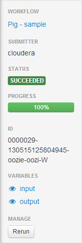

<link rel="stylesheet" href="docbook.css" type="text/css" media="screen" title="no title" charset="utf-8"></link>

Oozie Editor and Dashboard
==========================

The Oozie Editor/Dashboard application allows you to define Oozie
workflow, coordinator, and bundle applications, run workflow,
coordinator, and bundle jobs, and view the status of jobs. For
information about Oozie, see [Oozie
Documentation](http://archive.cloudera.com/cdh4/cdh/4/oozie/).

A workflow application is a collection of actions arranged in a directed
acyclic graph (DAG). It includes two types of nodes:

-   Control flow - start, end, fork, join, decision, and kill
-   Action - [MapReduce](../jobdesigner.html#mapreduce),
[Streaming](../jobdesigner.html#streaming),
[Java](../jobdesigner.html#java),
[Pig](../jobdesigner.html#pig),
[Hive](../jobdesigner.html#hive),
[Sqoop](../jobdesigner.html#sqoop),
[Shell](../jobdesigner.html#shell),
[Ssh](../jobdesigner.html#ssh),
[DistCp](../jobdesigner.html#distcp),
[Fs](../jobdesigner.html#fs), and
[Email](../jobdesigner.html#email).
    In order to run DistCp, Streaming, Pig, Sqoop, and Hive jobs, Oozie
    must be configured to use the Oozie ShareLib. See the Oozie Installation
   manual.

A coordinator application allows you to define and execute recurrent and
interdependent workflow jobs. The coordinator application defines the
conditions under which the execution of workflows can occur.

A bundle application allows you to batch a set of coordinator
applications.

Oozie Editor/Dashboard Installation and Configuration
-----------------------------------------------------

Oozie Editor/Dashboard is one of the applications installed as part of
Hue. For information about installing and configuring Hue, see the Hue Installation
manual.

Starting Oozie Editor/Dashboard
-------------------------------

Click the **Oozie Editor/Dashboard** icon
() in the navigation bar at the top of
the Hue browser page. **Oozie Editor/Dashboard** opens with the
following screens:

-   [Dashboard](#dashboard) - shows the running and completed workflow,
    coordinator, and bundle jobs and information about Oozie
    instrumentation and configuration. The screen is selected and opened
    to the Workflows page.
-   [Workflow Manager](#workflowManager) - shows available workflows and
    allows you to create and import workflows.
-   [Coordinator Manager](#coordinatorManager) - shows available coordinators and
    allows you to create coordinators.
-   [Bundle Manager](#bundleManager) - shows available bundles and
    allows you to create bundles.

Installing Oozie Editor/Dashboard Examples
------------------------------------------

 **Note**: You must be a superuser to perform
this task.

1.  Click . The Quick Start Wizard
    opens.
2.  Click **Step 2: Examples**.
3.  Click **Oozie Editor/Dashboard**.

Filtering Lists in Oozie Editor/Dashboard
-----------------------------------------

Many screens contain lists. When you type in the Filter field on
screens, the lists are dynamically filtered to display only those rows
containing text that matches the specified substring.

Permissions in Oozie Editor/Dashboard
-------------------------------------

In the Dashboard workflows, coordinators, and bundles can only be
viewed, submitted, and modified by their owner or a superuser.

Editor permissions for performing actions on workflows, coordinators,
and bundles are summarized in the following table:

<table>
<th><td>Action</td><td>Superuser or Owner</td><td>All</td></th>
<tr><td>View</td><td>Y.</td><td>Only if "Is shared" is set</td></tr>
<tr><td>Submit</td><td>Y.</td><td>Only if "Is shared" is set</td></tr>
<tr><td>Modify</td><td>Y.</td><td>N</td></tr>
</table>

Deleting and Restoring Workflows, Coordinators, and Bundles
-----------------------------------------------------------

You can move workflows, coordinators, and bundles to the trash and later
restore or permanently delete them.

### Deleting Workflows, Coordinators, and Bundles

1.  In a Manager screen, check the checkbox next to one or more
    workflows, coordinators or bundles.
2.  Choose one of the following:
    -   Delete \> Move to trash
    -   Delete \> Delete forever

### Restoring Workflows, Coordinators, and Bundles

1.  In a Manager screen, click  **Trash**.
2.  Check the checkbox next to one or more workflows, coordinators or
    bundles.
3.  Click Restore.

Dashboard
---------

The Dashboard shows a summary of the running and completed workflow,
coordinator, and bundle jobs.

You can view jobs for a period up to the last 30 days.

You can filter the list by date (1, 7, 15, or 30 days) or status
(Succeeded, Running, or Killed). The date and status buttons are
toggles.

### Workflows

Click the **Workflows** tab to view the running and completed workflow
jobs for the filters you have specified.

Click a workflow row in the Running or Completed table to view detailed
information about that workflow job.

In the left pane contains a link to the workflow and the variable values
specified.

For the selected job, the following information is available in the
right area.

-   **Graph** tab shows the workflow DAG.
-   **Actions** tab shows you details about the actions that make up the
    workflow.
    -   Click the **Id** link to see additional details about the
        action.
    -   Click the **External Id** link to view the job in the Job
        Browser.

-   **Details** tab shows job statistics including start and end times.
-   **Configuration** tab shows selected job configuration settings.
-   **Logs** tab shows log output generated by the workflow job.
-   **Definition** tab shows the Oozie workflow definition, as it
    appears in the workflow.xml file (also linked under the application
    path properties in the **Details** tab and the **Configuration**
    tab).

For each action in the workflow you can:

-   Click the  icon to view the action screen,
    which contains:
    -   **Details** tab shows job statistics including start and end
        times.
    -   **Configuration** tab shows the action configuration settings.
    -   **Child Jobs** tab lists jobs generated by the action.

-   Click the  icon to view the log in the Job
    Browser.

### Coordinators

Click the **Coordinators** tab to view the running and completed
coordinator jobs for the filters you have specified.

For the selected job, the following information is available.

-   The **Calendar** tab shows the timestamp of the job. Click the
    timestamp to open the workflow DAG.
-   The **Actions** tab shows you details about the actions that make up
    the coordinator.
    -   Click the **Id** link to see additional details about the
        action.
    -   Click the **External Id** link to view the job in the Job
        Browser.

-   The **Configuration** tab shows selected job configuration settings.
-   The **Logs** tab shows log output generated by the coordinator.
-   The **Definition** tab shows the Oozie coordinator definition, as it
    appears in the coordinator.xml file (also linked under the
    oozie.coord.application.path property in the **Configuration** tab).

### Bundles

Click the **Bundles** tab to view the running and completed bundle jobs
for the filters you have specified.

### Oozie

The Oozie tab provides subtabs that give you access to Oozie
instrumentation and configuration settings.

#### Instrumentation

For information on the instrumentation metrics supported by Oozie, see
[Oozie
Monitoring](http://oozie.apache.org/docs/3.3.0/AG_Monitoring.html).

#### Configuration

For information on the configuration properties supported by Oozie, see
[Oozie
Configuration](http://oozie.apache.org/docs/3.3.0/AG_Install.html#Oozie_Configuration).

Workflow Manager
----------------

In Workflow Manager you create Oozie workflows and submit them for
execution.

Click the **Workflows** tab to open the Workflow Manager.

Each row shows a workflow: its name, description, timestamp of its last
modification. It also shows:

-   **Steps** - the number of steps in the workflow execution path. This
    is the number of execution steps between the start and end of the
    workflow. This will not necessarily be the same as the number of
    actions in the workflow, if there are control flow nodes in the
    control path.
-   **Status** - who can run the workflow. **shared** means users other
    than the owner can access the workflow. **personal** means only the
    owner can modify or submit the workflow. The default is personal.
-   **Owner** - the user that created the workflow.

In Workflow Editor you edit workflows that include MapReduce, Streaming,
Java, Pig, Hive, Sqoop, Shell, Ssh, DistCp, Fs, Email, Sub-workflow, and
Generic actions. You can configure these actions in the Workflow Editor,
or you can import job designs from Job Designer to be used as actions in
your workflow. For information about defining workflows, see the
[Workflow
Specification](http://archive.cloudera.com/cdh4/cdh/4/oozie/WorkflowFunctionalSpec.html).

### Opening a Workflow

To open a workflow, in Workflow Manager, click the workflow. Proceed
with [Editing a Workflow](#editingWorkflow).

### Creating a Workflow

1.  Click the **Create** button at the top right.
2.  In the Name field, type a name.
3.  Check the Is shared checkbox to allow all users to access the
    workflow.
4.  Click **advanced** to specify the deployment directory or a job.xml
    file.
5.  Click **Save**. The Workflow Editor opens. Proceed with [Editing a
    Workflow](#editingWorkflow).

### Importing a Workflow

1.  Click the **Import** button at the top right.
2.  In the Name field, type a name.
3.  In the **Local workflow.xml file** field, click **Choose File** and
    select a workflow file.
4.  Click **advanced** to specify whether the workflow is shared, the
    deployment directory, or a job.xml file.
5.  Click **Save**. The Workflow Editor opens. Proceed with [Editing a
    Workflow](#editingWorkflow).

### Submitting a Workflow

To submit a workflow for execution, do one of the following:

-   In the Workflow Manager, click the radio button next to the
    workflow, and click the **Submit** button.
-   In the Workflow Editor, click the **Submit** button.

The workflow job is submitted and the Dashboard displays the workflow
job.

To view the output of the job, click  **View the
logs**.

#### Suspending a Running Job

In the pane on the left, click the **Suspend** button.

1.  Verify that you want to suspend the job.

#### Resuming a Suspended Job

In the pane on the left, click the **Resume** button.

1.  Verify that you want to resume the job.

#### Rerunning a Workflow

In the pane on the left, click the **Rerun** button.

1.  Check the checkboxes next to the actions to rerun.
2.  Specify required variables.
3.  Click **Submit**.

### Scheduling a Workflow

To schedule a workflow for recurring execution, do one of the following:

-   In the Workflow Manager, check the checkbox next to the workflow and
    click the **Schedule** button.
-   In the Workflow Editor, click the **Schedule** button.

A coordinator is created and opened in the Coordinator Editor. Proceed
with [Editing a Coordinator](#editingCoordinator).

### Editing a Workflow

In the Workflow Editor you can easily perform operations on Oozie action
and control nodes.

#### Action Nodes

The Workflow Editor supports dragging and dropping action nodes. As you
move the action over other actions and forks, highlights indicate active
areas. If there are actions in the workflow, the active areas are the
actions themselves and the areas above and below the actions. If you
drop an action on an existing action, a fork and join is added to the
workflow.

-   Add actions to the workflow by clicking an action
     button and drop the action on the
    workflow. The Edit Node screen displays.
    1.  Set the action properties and click **Done**. Each action in a
        workflow must have a unique name.

-   Copy an action by clicking the  **Copy**
    button.

1.  The action is opened in the Edit Node screen.
2.  Edit the action properties and click **Done**. The action is added
    to the end of the workflow.

-   Delete an action by clicking the  button.
-   Edit an action by clicking the  button.
-   Change the position of an action by left-clicking and dragging an
    action to a new location.

#### Control Nodes

-   Create a fork and join by dropping an action on top of another
    action.
-   Remove a fork and join by dragging a forked action and dropping it
    above the fork.
-   Convert a fork to a decision by clicking the
     button.
-   To edit a decision:
    1.  Click the  button.
    2.  Fill in the predicates that determine which action to perform
        and select the default action from the drop-down list.
    3.  Click **Done**.

### Uploading Workflow Files

In the Workflow Editor, click the **Upload** button.

The workspace of the workflow is opened in the File Browser application.
Follow the procedure in [Uploading
Files](../filebrowser.html#uploadingFiles) to upload the files. You must
put JAR files in a lib directory in the workspace.

### Editing Workflow Properties

1.  In the Workflow Editor, click the link under the Name or Description
    fields in the left pane.
2.  To share the workflow with all users, check the **Is shared**
    checkbox.
3.  To set advanced execution options, click **advanced** and edit the
    deployment directory, add parameters and job properties, or specify
    a job.xml file.
4.  Click **Save**.

### Displaying the History of a Workflow

1.  Click the **Dashboard** tab.
2.  Click the **Workflows** tab.
3.  Click a workflow.
4.  Click the **Actions** tab.

Coordinator Manager
-------------------

In Coordinator Manager you create Oozie coordinator applications and
submit them for execution.

Click the **Coordinators** tab to open the Coordinator Manager.

Each row shows a coordinator: its name, description, timestamp of its
last modification. It also shows:

-   **Workflow** - the workflow that will be run by the coordinator.
-   **Frequency** - how often the workflow referenced by the coordinator
    will be run.
-   **Status** - who can run the coordinator. **shared** means users
    other than the owner can access the workflow. **personal** means
    only the owner can modify or submit the workflow. The default is
    personal.
-   **Owner** - the user that created the coordinator.

In Coordinator Editor, you edit coordinators and the datasets required
by the coordinators. For information about defining coordinators and
datasets, see the [Coordinator
Specification](http://archive.cloudera.com/cdh4/cdh/4/oozie/CoordinatorFunctionalSpec.html).

### Opening a Coordinator

To open a coordinator, in Coordinator Manager, click the coordinator.
Proceed with [Editing a Coordinator](#editingCoordinator).

### Creating a Coordinator

To create a coordinator, in Coordinator Manager:

1.  Click the **Create** button at the top right. The Coordinator wizard
    opens. Proceed with [Editing a Coordinator](#editingCoordinator).

### Submitting a Coordinator

To submit a coordinator for execution, check the checkbox next to the
coordinator and click the **Submit** button.

### Editing a Coordinator

In the Coordinator Editor you specify coordinator properties and the
datasets on which the workflow scheduled by the coordinator will operate
by stepping through screens in a wizard. You can also advance to
particular steps and revisit steps by clicking the Step "tabs" above the
screens. The following instructions walk you through the wizard.

1.  Type a name, select the workflow, check the **Is shared checkbox**
    to share the job, and click **Next**. If the Coordinator Editor was
    opened after scheduling a workflow, the workflow will be set.
2.  Select how many times the coordinator will run for each specified
    unit, the start and end times of the coordinator, the timezone of
    the start and end times, and click **Next**. Times must be expressed
    as UTC times. For example, to run at 10 pm PST, specify a start time
    of 6 am UTC of the following day (+8 hours) and set the Timezone
    field to America/Los\_Angeles.
3.  Click **Add** to select an input dataset and click **Next**. If no
    datasets exist, follow the procedure in [Creating a
    Dataset](#creatingDataset).
4.  Click **Add** to select an output dataset. Click **Save
    coordinator** or click **Next** to specify advanced settings.
5.  To share the coordinator with all users, check the **Is****shared**
    checkbox.
6.  Fill in parameters to pass to Oozie, properties that determine how
    long a coordinator will wait before timing out, how many
    coordinators can run and wait concurrently, and the coordinator
    execution policy.
7.  Click **Save coordinator**.

### Creating a Dataset

1.  In the Coordinator Editor, do one of the following:
    -   Click **here** in the Inputs or Outputs pane at the top of the
        editor.
    -   In the pane at the left, click the **Create new** link. Proceed
        with [Editing a Dataset](#editingDataset).

### Displaying Datasets

1.  In the Coordinator Editor, click **Show existing** in pane at the
    left.
2.  To edit a dataset, click the dataset name in the Existing datasets
    table. Proceed with [Editing a Dataset](#editingDataset).

### Editing a Dataset

1.  Type a name for the dataset.
2.  In the Start and Frequency fields, specify when and how often the
    dataset will be available.
3.  In the URI field, specify a URI template for the location of the
    dataset. To construct URIs and URI paths containing dates and
    timestamps, you can specify the variables
    ${YEAR},${MONTH},${DAY},${HOUR},${MINUTE}. For example:
    hdfs://foo:9000/usr/app/stats/${YEAR}/${MONTH}/data.
4.  In the Instance field, click a button to choose a default, single,
    or range of data instances. For example, if frequency==DAY, a window
    of the last rolling 5 days (not including today) would be expressed
    as start: -5 and end: -1. Check the advanced checkbox to display a
    field where you can specify a coordinator [EL
    function](http://archive.cloudera.com/cdh4/cdh/4/oozie/CoordinatorFunctionalSpec.html).
5.  Specify the timezone of the start date.
6.  In the Done flag field, specify the flag that identifies when input
    datasets are no longer ready.

### Displaying the History of a Coordinator

1.  Click the **Dashboard** tab.
2.  Click the **Coordinators** tab.
3.  Click a coordinator.
4.  Click the **Actions** tab.

Bundle Manager
--------------

In Bundle Manager you create Oozie bundle applications and submit them
for execution.

Click the **Bundle** tab to open the Bundle Manager.

Each row shows a bundle: its name, description, timestamp of its last
modification. It also shows:

-   **Coordinators** - the coordinators that will be run by the bundle.
-   **Kick off** - the UTC time when the coordinators referenced by the
    bundle will be started.
-   **Status** - who can run the bundle. **shared** means users other
    than the owner can access the workflow. **personal** means only the
    owner can modify or submit the workflow. The default is personal.
-   **Owner** - the user that created the bundle.

For information about defining bundles, see the [Bundle
Specification](http://archive.cloudera.com/cdh4/cdh/4/oozie/BundleFunctionalSpec.html).

### Opening a Bundle

To open a bundle, in Bundle Manager, click the bundle. Proceed with
[Editing a Bundle](#editingBundle).

### Creating a Bundle

1.  Click the **Create** button at the top right.
2.  In the Name field, type a name.
3.  In the Kick off time field, choose a kick off time.
4.  Check the Is shared checkbox to allow all users to access the
    workflow.
5.  Click **Save**. The Bundle Editor opens. Proceed with [Editing a
    Bundle](#editingBundle).

### Submitting a Bundle

To submit a bundle for execution, check the checkbox next to the bundle
and click the **Submit** button.

### Editing a Bundle

In the Bundle Editor, you specify properties by stepping through screens
in a wizard. You can also advance to particular steps and revisit steps
by clicking the Step "tabs" above the screens. The following
instructions walk you through the wizard.

1.  Click **Add** to select a coordinator that the bundle will kick off.
2.  Choose the kick off time. The time must be expressed as a UTC time.
    For example, to run at 10 pm PST, specify a start time of 6 am UTC
    of the following day (+8 hours).
3.  To share the bundle with all users, check the **Is shared**
    checkbox.
4.  Click **Next** to specify advanced settings or click **Save
    bundle**.
5.  Fill in parameters to pass to Oozie.
6.  Click **Save bundle**.

Displaying the History of a Bundle
----------------------------------

1.  Click the **Dashboard** tab.
2.  Click the **Bundles** tab.
3.  Click a bundle.
4.  Click the **Actions** tab.
