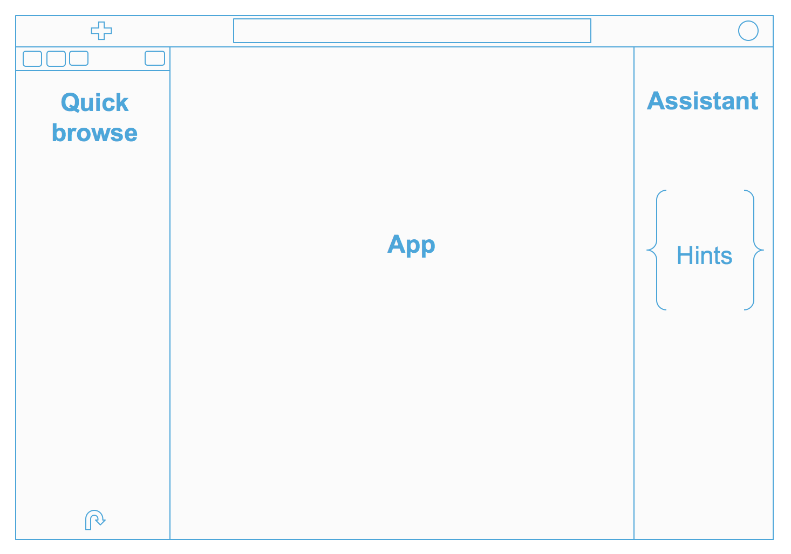

<link rel="stylesheet" href="../css/bootplus.css" type="text/css" media="screen" title="no title" charset="utf-8"></link>
<link rel="stylesheet" href="../css/font-awesome.min.css" type="text/css" media="screen" title="no title" charset="utf-8"></link>
<link rel="stylesheet" href="../css/docbook.css" type="text/css" media="screen" title="no title" charset="utf-8"></link>

  <h1><a href=../index.html>Doc</a> > Hue User Guide</h1>

  

[TOC]

  

  

# Concept
Hue consists in 4 apps in a single page interface that allow the users to perform data
analyses without losing any context. The goal is to promote self service and stay simple like Excel
so that 80% of the user can find, explore and query data and become more data driven.

**1. Find or import your data**

Use the left metadata assists to browse your existing data without losing your editor. The top search will look through your saved queries and matching tables, columns and databases. Objects can be tagged for a quick retrieval or assigning a more “humane” name. If the data does not exist yet, just drag & drop it to trigger the Create Table wizard and to import it in just two steps.

**2. Query your data**

When you found your data, the Editor's autocomplete is extremely powerful as they support 90-100% of the language syntax and will highlight any syntax or logical error. The right assistant provides quick previews of the datasets, which columns or JOINs are popular and recommendations on how to type optimized queries. After the querying, refine your results before exporting to S3/HDFS/ADLS or downloaded as CSV/Excel.

** 4 applications**

* Editor: The goal of Hue's Editor is to make data querying easy and productive. It focuses on SQL but also supports job submissions. It comes with an intelligent autocomplete, search & tagging of data and query assistance.
* Browsers: Hue's Browsers let you easily search, glance and perform actions on data or jobs in Cloud or on premise clusters.
* Dashboard: Dashboards are an interactive way to explore your data quickly and easily. No programming is required and the analysis is done by drag & drops and clicks.
* Scheduler: The application lets you build workflows and then schedule them to run regularly automatically. A monitoring interface shows the progress, logs and allow actions like pausing or stopping jobs.

Each app of Hue can be extended to support your own languages or apps as detailed in the [SDK](../sdk/sdk.html).

## Interface

The layout simplifies the interface and is now single page app, and this makes things snappier and unifies the apps together.

From top to bottom we have:

* A completely redesigned top bar, with a quick action (big blue button), a global search and a notification area on the right
* A collapsible hamburger menu that offers links to the various apps and a quick way to import data
* An extended quick browse on the left
* The main app area, where the fun is ;)
* A right Assistant panel for the current application. It's now enabled for the editors, and in case of Hive for instance, it offers you a live help, a quick browse for the used tables in your query, and much more: if your Hue instance is connected to a SQL Optimizer service like Cloudera Navigator Optimizer, it can offer suggestions on your queries!
* Various applications have been grouped into 4 main conceptual areas:

Learn more on the [The Hue 4 user interface in detail](http://gethue.com/the-hue-4-user-interface-in-detail/).

## Top search

The new search bar is always accessible on the top of screen, and it offers a document search and metadata search too if Hue is configured to access a metadata server like Cloudera Navigator.

** Embedded Search & Tagging **

Have you ever struggled to remember table names related to your project? Does it take much too long to find those columns or views? Hue now lets you easily search for any table, view, or column across all databases in the cluster. With the ability to search across tens of thousands of tables, you're able to quickly find the tables that are relevant for your needs for faster data discovery.

In addition, you can also now tag objects with names to better categorize them and group them to different projects. These tags are searchable, expediting the exploration process through easier, more intuitive discovery.

Through an integration with Cloudera Navigator, existing tags and indexed objects show up automatically in Hue, any additional tags you add appear back in Cloudera Navigator, and the familiar Cloudera Navigator search syntax is supported.

A top search bar now appears. The autocomplete offers a list of facets and prefills the top values. Pressing enter lists the available objects, which can be opened and explored further in the sample popup, the assist or directly into the table browser app.

** Granular Search **

By default, only tables and views are returned. To search for columns, partitions, databases use the ‘type:' filter.

Example of searches:

* table:customer → Find the customer table
* table:tax* tags:finance → List all the tables starting with tax and tagged with ‘finance'
* owner:admin type:field usage → List all the fields created by the admin user that matches the usage string
* parentPath:"/default/web_logs" type:FIELD  originalName:b* → List all the columns starting with `b` of the table `web_logs` in the database `default`.

Learn more on the [Search and Tagging](https://blog.cloudera.com/blog/2017/05/new-in-cloudera-enterprise-5-11-hue-data-search-and-tagging/).

## Left assist

Data where you need it when you need it

You can now find your Hue documents, HDFS and S3 files and more in the left assist panel, right-clicking items will show a list of actions, you can also drag-and-drop a file to get the path in your editor and more.

## Right assist
This assistant content depends on the context of the application selected and will display the current tables or available UDFs.

## Sample popup

This popup offers a quick way to see sample of the data and other statistics on databases, tables, and columns. You can open the popup from the SQL Assist or with a right-click on any SQL object (table, column, function…). In this release, it also opens faster and caches the data.

## Documents

Similarly to Google Document, queries, workflows... can be saved and shared with other users.

### Sharing

Sharing happens on the main page or via the top right menu of the application. Users and groups with Read or Write permissions can be selected.

### Import / Export

Via the Home page, saved documents can be exported for backups or transferring to another Hue.

## Changing the language

The language is automatically detected from the Browser or OS. English, Spanish, French, German, Korean, Japanese and Chinese are supported.

The language can be manual set by a user in the "My Profile" page. Please go to My Profile > Step2 Profile and Groups > Language Preference and choose the language you want.

# SQL Editors / Notebook
The goal of Hue's Editor is to make data querying easy and productive.

It focuses on SQL but also supports job submissions. It comes with an intelligent autocomplete, search & tagging of data and query assistance.

The [custom SQL Editor page](http://gethue.com/custom-sql-query-editors/) also describes the configuration steps. Any editor can be `starred`
next to its name so that it becomes the default editor and the landing page when logging in.

First, in your hue.ini file, you will need to add the relevant database connection information under the librdbms section:

    [librdbms]
      [[databases]]
        [[[postgresql]]]
        nice_name=PostgreSQL
        name=music
        engine=postgresql_psycopg2
        port=5432
        user=hue
        password=hue
        options={}

Secondly, we need to add a new interpreter to the notebook app. This will allow the new database type to be registered as a snippet-type in the Notebook app. For query editors that use a Django-compatible database, the name in the brackets should match the database configuration name in the librdbms section (e.g. – postgresql). The interface will be set to rdbms. This tells Hue to use the librdbms driver and corresponding connection information to connect to the database. For example, with the above postgresql connection configuration in the librdbms section, we can add a PostgreSQL interpreter with the following notebook configuration:

    [notebook]
      [[interpreters]]
        [[[postgresql]]]
        name=PostgreSQL
        interface=rdbms

## Concepts
### Running Queries

 **Note**: To run a query, you must be logged
in to Hue as a user that also has a Unix user account on the remote
server.

1.  To execute a portion of the query, highlight one or more query
    statements.
2.  Click **Execute**. The Query Results window appears with the results
    of your query.
    -   To view a log of the query execution, toggle the **Log** caret on the
        left of the progress bar. You can use the information in this tab
        to debug your query.
    -   To view the columns of the query, expand the **Columns** icon. Clicking
        on the column label will scroll to the column. Names and types can be filtered.
    -   To expand a row, double click on it or click on the row number.
    -   To lock a row, click on the lock icon in the row number column.
    -   Search either by clicking on the magnifier icon on the results tab, or pressing Ctrl/Cmd + F
    -   [See more how to refine your results](http://gethue.com/new-features-in-the-sql-results-grid-in-hive-and-impala/).

3.  If there are multiple statements in the query (separated by semi-colons), click Next in the
    Multi-statement query pane to execute the remaining statements.

When you have multiple statements it's enough to put the cursor in the statement you want to execute, the active statement is indicated with a blue gutter marking.

 **Note**: Use CTRL/Cmd + ENTER to execute queries.

 **Note**: Under the logs panel, you can view any
MapReduce or [Impala jobs](#impala-queries) that the query generated.

### Downloading and Exporting Query Results

To get things started, press the export icon, the bottom last element of the action bar to the top left of the results. There are several ways you can export results of a query.

 Two of them offer great scalability:
1.  Export to an empty folder on your cluster's file system. This exports the results using multiple files. In the export icon, choose Export and then All.
2.  Export to a table. You can choose an already existing table or a new one. In the export icon, choose Export and then Table.

 Two of them offer limited scalability:
1.  Export to a file on your cluster's file systems. This exports the results to a single file. In the export icon, choose Export and then First XXX.
2.  Download to your computer as a CSV or XLS. This exports the results to a single file in comma-separated values or Microsoft Office Excel format. In the export icon, choose Download as CSV or Download as XLS.

### Advanced Query Settings

The pane to the top of the Editor lets you specify the following
options:

<table>
<tr><td>DATABASE</td><td>The database containing the table definitions.</td></tr>
<tr><td>SETTINGS</td><td>Override the Hive and Hadoop default settings. To configure a new
setting:

<ol>
<li> Click Add.
<li> For Key, enter a Hive or Hadoop configuration variable name.
<li> For Value, enter the value you want to use for the variable.

For example, to override the directory where structured Hive query logs
are created, you would enter hive.querylog.location for Key, and a
path for Value.
</ol>

To view the default settings, click the Settings tab at the top of
the page. For information about Hive configuration variables, see:
[http://wiki.apache.org/hadoop/Hive/AdminManual/Configuration](http://wiki.apache.org/hadoop/Hive/AdminManual/Configuration).
For information about Hadoop configuration variables, see:
[http://hadoop.apache.org/docs/current/hadoop-mapreduce-client/hadoop-mapreduce-client-core/mapred-default.xml](http://hadoop.apache.org/docs/current/hadoop-mapreduce-client/hadoop-mapreduce-client-core/mapred-default.xml).</td></tr>
<tr><td>FILE RESOURCES</td><td>Make files locally accessible at query execution time available on the
Hadoop cluster. Hive uses the Hadoop Distributed Cache to distribute the
added files to all machines in the cluster at query execution time.

<ol>
<li>  Click Add to configure a new setting.
<li>   From the Type drop-down menu, choose one of the following:
<ul>
   <li>jar - Adds the specified resources to the Java classpath.
   <li>archive - Unarchives the specified resources when
        distributing them.
    <li>file - Adds the specified resources to the distributed
        cache. Typically, this might be a transform script (or similar)
        to be executed.

<li>   For Path, enter the path to the file or click
     to browse and select the file.
</ol>

 Note: It is not necessary to specify files
used in a transform script if the files are available in the same path
on all machines in the Hadoop cluster.</td></tr>
<tr><td>USER-DEFINED FUNCTIONS</td><td>Specify user-defined functions. Click Add to configure a new
setting. Specify the function name in the Name field, and specify
the class name for Classname.

You *must* specify a JAR file for the user-defined functions in FILE RESOURCES.

To include a user-defined function in a query, add a $ (dollar sign)
before the function name in the query. For example, if MyTable is a
user-defined function name in the query, you would type: SELECT $MyTable
</td></tr>
<tr><td>PARAMETERIZATION</td><td>Indicate that a dialog box should display to enter parameter values when
a query containing the string $parametername is executed. Enabled by
default.</td></tr>
</table>

### Autocomplete

To make your SQL editing experience better we've created a  new autocompleter for Hue 3.11. The old one had some limitations and was only aware of parts of the statement being edited. The new autocompleter knows all the ins and outs of the Hive and Impala SQL dialects and will suggest keywords, functions, columns, tables, databases, etc. based on the structure of the statement and the position of the cursor.

The result is improved completion throughout. We now have completion for more than just SELECT statements, it will help you with the other DDL and DML statements too, INSERT, CREATE, ALTER, DROP etc.

**Smart column suggestions**

If multiple tables appear in the FROM clause, including derived and joined tables, it will merge the columns from all the tables and add the proper prefixes where needed. It also knows about your aliases, lateral views and complex types and will include those. It will now automatically backtick any reserved words or exotic column names where needed to prevent any mistakes.

**Smart keyword completion**

The new autocompleter suggests keywords based on where the cursor is positioned in the statement. Where possible it will even suggest more than one word at at time, like in the case of IF NOT EXISTS, no one likes to type too much right? In the parts where order matters but the keywords are optional, for instance after FROM tbl, it will list the keyword suggestions in the order they are expected with the first expected one on top. So after FROM tbl the WHERE keyword is listed above GROUP BY etc.

**UDFs**

The improved autocompleter will now suggest functions, for each function suggestion an additional panel is added in the autocomplete dropdown showing the documentation and the signature of the function. The autocompleter know about the expected types for the arguments and will only suggest the columns or functions that match the argument at the cursor position in the argument list.

**Sub-queries, correlated or not**

When editing subqueries it will only make suggestions within the scope of the subquery. For correlated subqueries the outside tables are also taken into account.

**All about quality**

We've fine-tuned the live autocompletion for a better experience and we've introduced some options under the editor settings where you can turn off live autocompletion or disable the autocompleter altogether (if you're adventurous). To access these settings open the editor and focus on the code area, press CTRL + , (or on Mac CMD + ,) and the settings will appear.

The autocompleter talks to the backend to get data for tables and databases etc. by default it will timeout after 5 seconds but once it has been fetched it's cached for the next time around. The timeout can be adjusted in the Hue server configuration.

We've got an extensive test suite but not every possible statement is covered, if the autocompleter can't interpret a statement it will be silent and no drop-down will appear. If you encounter a case where you think it should suggest something but doesn't or if it gives incorrect suggestions then please let us know.

Learn more about it in [Autocompleter for Hive and Impala](http://gethue.com/brand-new-autocompleter-for-hive-and-impala/).

### Variables
Variables are used to easily configure parameters in a query. They can be of two types:

<b>Single Valued</b>
<pre>
select * from web_logs where country_code = "${country_code}"
</pre>
The variable can have a default value.
<pre>
select * from web_logs where country_code = "${country_code=US}"
</pre>
<b>Multi Valued</b>
<pre>
select * from web_logs where country_code = "${country_code=CA, FR, US}"
</pre>
In addition, the displayed text for multi valued variables can be changed.
<pre>
select * from web_logs where country_code = "${country_code=CA(Canada), FR(France), US(United States)}"
</pre>
For values that are not textual, omit the quotes.
<pre>
select * from boolean_table where boolean_column = ${boolean_column}
</pre>

### Syntax checker

A little red underline will display the incorrect syntax so that the query can be fixed before submitting. A right click offers suggestions.

### Query Assist

Read more about the [Query Assistant with Navigator Optimizer Integration
](https://blog.cloudera.com/blog/2017/08/new-in-cloudera-enterprise-5-12-hue-4-interface-and-query-assistant/).

### Charting

These visualizations are convenient for plotting chronological data or when subsets of rows have the same attribute: they will be stacked together.

* Pie
* Bar/Line with pivot
* Timeline
* Scattered plot
* Maps (Marker and Gradient)

Read more about extending [charts](../sdk/sdk.html).

### Risk Alerts

The autocompleter will suggest popular tables, columns, filters, joins, group by, order by etc. based on metadata from Navigator Optimizer. A new “Popular” tab has been added to the autocomplete result dropdown which will be shown when there are popular suggestions available.

**Risk and suggestions**

While editing, Hue will run your queries through Navigator Optimizer in the background to identify potential risks that could affect the performance of your query. If a risk is identified an exclamation mark is shown above the query editor and suggestions on how to improve it is displayed in the lower part of the right assistant panel.

### Presentation Mode

Turns a list of semi-colon separated queries into an interactive presentation. It is great for doing demos or basic reporting.

## SQL Databases

Use the query editor with any database.

### Hive
### Impala
### MySQL
### Oracle
### KSQL / Kafka SQL
### Solr SQL

With Solr 5+, query collections like we would query a regular Hive or Impala table.

[Read more about it here](http://gethue.com/sql-editor-for-solr-sql/).

As Solr SQL is pretty recent, there are some caveats, notably Solr lacks support of:

* SELECT *
* WHERE close with a LIKE
* resultset pagination

which prevents a SQL UX experience comparable to the standard other databases (but we track it in [HUE-3686](https://issues.cloudera.org/browse/HUE-3686)).

### Presto

Presto is a high performance, distributed SQL query engine for big data.

[Read more about it here](https://prestosql.io/)

### PostgreSQL
### Redshift
### BigQuery
### AWS Athena
### Spark SQL
### Phoenix
### Kylin
Apache Kylin is an open-source online analytical processing (OLAP) engine.
See how to configure the [Kylin Query Editor](http://gethue.com/using-hue-to-interact-with-apache-kylin/).

### Others
Extend with SQL Alchemy, JDBC or build your own [connectors](../sdk/sdk.html#sql).

## Jobs

The Editor application enables you to create and submit jobs to
the cluster. You can include variables with your jobs to enable
you and other users to enter values for the variables when they run your
job.

All job design settings except Name and Description support the use of
variables of the form $variable\_name. When you run the job, a dialog
box will appear to enable you to specify the values of the variables.

<table>
<tr><td>Name</td><td>Identifies the job and its collection of properties and parameters.</td></tr>
<tr><td>Description</td><td>A description of the job. The description is displayed in the dialog box
that appears if you specify variables for the job.</td></tr>
<tr><td>Advanced</td><td>Advanced settings:<ul><li>Is shared- Indicate whether to share the action with all users.<li>Oozie parameters - parameters to pass to Oozie</td></tr>
<tr><td>Prepare</td><td>Specifies paths to create or delete before starting the workflow job.</td></tr>
<tr><td>Params</td><td>Parameters to pass to a script or command. The parameters are expressed
using the <a href="http://jcp.org/aboutJava/communityprocess/final/jsr152/">JSP 2.0 Specification (JSP.2.3) Expression
Language</a>,
allowing variables, functions, and complex expressions as parameters.</td></tr>
<tr><td>Job Properties</td><td>Job properties. To set a property value, click <b>Add Property</b>.<ol><li>Property name -  a configuration property name. This field provides autocompletion, so you can type the first few characters of a property name and then select the one you want from the drop-down
    list.<li>Valuethe property value.</td></tr>
<tr><td>Files</td><td>Files to pass to the job. Equivalent to the Hadoop -files option.</td></tr>
<tr><td>Archives</td><td>Files to pass to the job. Archives to pass to the job. Equivalent to the Hadoop -archives option.</td></tr></table>

### MapReduce

A MapReduce job design consists of MapReduce functions written in Java.
You can create a MapReduce job design from existing mapper and reducer
classes without having to write a main Java class. You must specify the
mapper and reducer classes as well as other MapReduce properties in the
Job Properties setting.

<table>
<tr><td>Jar path</td><td>The fully-qualified path to a JAR file containing the classes that
implement the Mapper and Reducer functions.</td></tr>
</table>

### Java

A Java job design consists of a main class written in Java.

<table>
<tr><td>Jar path</td><td>The fully-qualified path to a JAR file containing the main class.</td></tr>
<tr><td>Main class</td><td>The main class to invoke the program.</td></tr>
<tr><td>Args</td><td>The arguments to pass to the main class.</td></tr>
<tr><td>Java opts</td><td>The options to pass to the JVM.</td></tr>
</table>

### Pig

A Pig job design consists of a Pig script.

<table>
<tr><td>Script name</td><td>Script name or path to the Pig script.</td></tr>
</table>

### Sqoop

A Sqoop job design consists of a Sqoop command.

<table>
<tr><td>Command</td><td>The Sqoop command.</td></tr>
</table>

### Shell

A Shell job design consists of a shell command.

<table>
<tr><td>Command</td><td>The shell command.</td></tr>
<tr><td>Capture output</td><td>Indicate whether to capture the output of the command.</td></tr>
</table>

[Read more about it here](http://gethue.com/use-the-shell-action-in-oozie/).

### DistCp

A DistCp job design consists of a DistCp command.

### Spark

#### Batch

This is a quick way to submit any Jar or Python jar/script to a cluster via the Scheduler or Editor.

How to run Spark jobs with Spark on YARN? This often requires trial and error in order to make it work.

Hue is leveraging Apache Oozie to submit the jobs. It focuses on the yarn-client mode, as Oozie is already running the spark-summit command in a MapReduce2 task in the cluster. You can read more about the Spark modes here.

[Here is how to get started successfully](http://gethue.com/how-to-schedule-spark-jobs-with-spark-on-yarn-and-oozie/).
And how to use the [Spark Action](http://gethue.com/use-the-spark-action-in-oozie/).

#### Interactive

Hue relies on [Livy](http://livy.io/) for the interactive Scala, Python and R snippets.

Livy got initially developed in the Hue project but got a lot of traction and was moved to its own project on livy.io. Here is a tutorial on how to use a notebook to perform some Bike Data analysis.

Read more about it:

* [How to use the Livy Spark REST Job Server API for doing some interactive Spark with curl](http://gethue.com/how-to-use-the-livy-spark-rest-job-server-for-interactive-spark-2-2/)
* [How to use the Livy Spark REST Job Server API for submitting batch jar, Python and Streaming Jobs](http://gethue.com/how-to-use-the-livy-spark-rest-job-server-api-for-submitting-batch-jar-python-and-streaming-spark-jobs/)

Make sure that the Notebook and interpreters are set in the hue.ini, and Livy is up and running:

<pre>
[spark]
  # Host address of the Livy Server.
  livy_server_host=localhost

[notebook]

 ## Show the notebook menu or not
 show_notebooks=true

[[interpreters]]
    # Define the name and how to connect and execute the language.

    [[[hive]]]
      # The name of the snippet.
      name=Hive
      # The backend connection to use to communicate with the server.
      interface=hiveserver2

   [[[spark]]]
     name=Scala
     interface=livy

    [[[pyspark]]]
      name=PySpark
      interface=livy
</pre>

# Data Importer

The goal of the importer is to allow ad hoc queries on data not yet in the clusters thereby expedite self-service analytics.

If you want to import your own data instead of installing the sample
tables, open the importer from the left menu or from the little `+` in the left assist.

If you've ever struggled with creating new SQL tables from files, you'll be happy to learn that this is now much easier. The wizard has been revamped to two simple steps and also offers more formats. Now users just need to:

1. Select a source type
2. Select the type of object for the destination

And that's it!

To learn more, watch the video on [Data Import Wizard](http://gethue.com/import-data-to-be-queried-via-the-self-service-drag-drop-create-table-wizard/).

## SQL Tables

Although you can create tables by executing the appropriate Hive HQL DDL
query commands, it is easier to create a table using the create table wizard.

**From a File**

If you've ever struggled with creating new SQL tables from files, you'll be happy to learn that this is now much easier. With the latest Hue release, you can now create these in an ad hoc way and thereby expedite self-service analytics. The wizard has been revamped to two simple steps and also offers more formats. Now users just need to:

1. In the Importer Manager selects source from a 'File'
1. Select the type of table

Files can be dragged & dropped, selected from HDFS or S3 (if configured), and their formats are automatically detected. The wizard also assists when performing advanced functionalities like table partitioning, Kudu tables, and nested types.

**Manually**

1.  In the Importer Manager selects 'Manually'
2.  Follow the instructions in the wizard to create the table. The basic
    steps are:
    -   Name the table.
    -   Choose the record format.
    -   Configure record serialization by specifying delimiters for
        columns, collections, and map keys.
    -   Choose the file format.
    -   Specify the location for your table's data.
    -   Specify the columns, providing a name and selecting the type for
        each column.
    -   Specify partition columns, providing a name and selecting the
        type for each column.

## Indexing

In the past, indexing data into Solr to then explore it with a [Dynamic Dashboard](http://gethue.com/search-dashboards/) has been quite difficult. The task involved writing a Solr schema and a Morphlines file then submitting a job to YARN to do the indexing. Often times getting this correct for non trivial imports could take a few days of work. Now with Hue's new feature you can start your YARN indexing job in minutes. This tutorial offers a step by step guide on how to do it.

[Read more about it here](http://gethue.com/easy-indexing-of-data-into-solr/).

## Traditional Databases

Read more about [ingesting data from traditional databases](http://gethue.com/importing-data-from-traditional-databases-into-hdfshive-in-just-a-few-clicks/).

# Dashboards
Dashboards are an interactive way to explore your data quickly and easily. No programming is required and the analysis is done by drag & drops and clicks.

Read more about [Dashboards](http://gethue.com/search-dashboards/).

## Concepts

Simply drag & drop widgets that are interconnected together. This is great for exploring new datasets or monitoring without having to type.

### Importing

Any CSV file can be dragged & dropped and ingested into an index in a few clicks via the Data Import Wizard [link]. The indexed data is immediately queryable and its facets/dimensions will be very fast to explore.

### Browsing

The Collection browser got polished in the last releases and provide more information on the columns. The left metadata assist of Hue 4 makes it handy to list them and peak at their content via the sample popup.

### Querying

The search box support live prefix filtering of field data and comes with a Solr syntax autocomplete in order to make the querying intuitive and quick. Any field can be inspected for its top values of statistic. This analysis happens very fast as the data is indexed.

## Databases

### Solr

#### Autocomplete

The top search bar offers a [full autocomplete](http://gethue.com/intuitively-discovering-and-exploring-a-wine-dataset-with-the-dynamic-dashboards/) on all the values of the index.

#### More Like This
The “More like This” feature lets you selected fields you would like to use to find similar records. This is a great way to find similar issues, customers, people... with regard to a list of attributes.

### SQL

## Reports

This is work in progress but dashboards will soon offer a classic reporting option.

## SDK
Read more about extending [connectors](../sdk/sdk.html#dashboard).

# Browsers
Hue's Browsers powers your Data Catalog. They let you easily search, glance and perform actions on data or jobs in Cloud or on premise clusters.

## Tables

The Table Browser enables you to manage the databases,
tables, and partitions of the metastore shared by
the Hive and Impala. You can use Metastore
Manager to perform the following operations:

-   Databases
    -   Select a database
    -   Create a database
    -   Drop databases

-   Tables
    -   Create tables
    -   Browse tables
    -   Drop tables
    -   Browse table data and metadata (columns, partitions...)
    -   Import data into a table
    -   [Filter, Sort and Browse Partitions](http://gethue.com/filter-sort-browse-hive-partitions-with-hues-metastore/)

## Files

The File Browser application lets you browse and manipulate files and
directories in the Hadoop Distributed File System (HDFS), S3 or ADLS.
With File Browser, you can:

-   Create files and directories, upload and download files, upload zip
    archives, and rename, move, and delete files and directories. You
    can also change a file's or directory's owner, group, and
    permissions. See [Files and Directories](#filesAndDirectories).
-   Search for files, directories, owners, and groups. See [Searching
    for Files and Directories](#searching).
-   View and edit files as text or binary. See [Viewing and Editing
    Files](#viewAndEdit).

### File systems
#### HDFS
#### S3

Hue can be setup to read and write to a configured S3 account, and users get autocomplete capabilities and can directly query from and save data to S3 without any intermediate moving/copying to HDFS.

[Read more about it](http://gethue.com/introducing-s3-support-in-hue/).

** Create Hive Tables Directly From S3**
Hue's Metastore Import Data Wizard can create external Hive tables directly from data directories in S3. This allows S3 data to be queried via SQL from Hive or Impala, without moving or copying the data into HDFS or the Hive Warehouse.

To create an external Hive table from S3, navigate to the Metastore app, select the desired database and then click the “Create a new table from a file” icon in the upper right.

Enter the table name and optional description, and in the “Input File or Directory” filepicker, select the S3A filesystem and navigate to the parent directory containing the desired data files and click the “Select this folder” button. The “Load Data” dropdown should automatically select the “Create External Table” option which indicates that this table will directly reference an external data directory.

Choose your input files' delimiter and column definition options and finally click “Create Table” when you're ready to create the Hive table. Once created, you should see the newly created table details in the Metastore.

**Save Query Results to S3**

Now that we have created external Hive tables created from our S3 data, we can jump into either the Hive or Impala editor and start querying the data directly from S3 seamlessly. These queries can join tables and objects that are backed either by S3, HDFS, or both. Query results can then easily be saved back to S3.

** S3 Configuration **

[Hue S3 Documentation](../admin-manual/manual.html#s3).

#### ADLS

Learn more about it on the [ADLS integration post](http://gethue.com/browsing-adls-data-querying-it-with-sql-and-exporting-the-results-back-in-hue-4-2/).

 Users gets autocomplete capabilities and more:

** Exploring ADLS in Hue's file browser **
Once Hue is successfully configured to connect to ADLS, we can view all accessible folders within the account by clicking on the ADLS root. From here, we can view the existing keys (both directories and files) and create, rename, move, copy, or delete existing directories and files. Additionally, we can directly upload files to ADLS.

** Create Hive Tables Directly From ADLS **
Hue's table browser import wizard can create external Hive tables directly from files in ADLS. This allows ADLS data to be queried via SQL from Hive or Impala, without moving or copying the data into HDFS or the Hive Warehouse. To create an external Hive table from ADLS, navigate to the table browser, select the desired database and then click the plus icon in the upper right. Select a file using the file picker and browse to a file on ADLS.

** Save Query Results to ADLS **
Now that we have created external Hive tables created from our ADLS data, we can jump into either the Hive or Impala editor and start querying the data directly from ADLS seamlessly. These queries can join tables and objects that are backed either by ADLS, HDFS, or both. Query results can then easily be saved back to ADLS.

** ADLS Configuration **

[Hue ADLS Documentation](../admin-manual/manual.html#adls).

### Files and Directories

You can use File Browser to view the input and output files of your
MapReduce jobs. Typically, you can save your output files in /tmp or in
your home directory if your system administrator set one up for you. You
must have the proper permissions to manipulate other user's files.

#### Creating Directories

1.  In the File Browser window, select **New > Directory**.
2.  In the **Create Directory** dialog box, enter a directory name and
    then click **Submit**.

#### Changing Directories

-   Click the directory name or parent directory dots in the **File
    Browser** window.
-   Click the  icon, type a directory name, and
    press **Enter**.

To change to your home directory, click **Home** in the path field at
the top of the **File Browser** window.

 **Note**:

The **Home** button is disabled if you do not have a home directory. Ask
a Hue administrator to create a home directory for you.

#### Creating Files

1.  In the File Browser window, select **New > File**.
2.  In the **Create File** dialog box, enter a file name and then click
    **Submit**.

#### Uploading Files

You can upload text and binary files to the HDFS.

1.  In the **File Browser** window, browse to the directory where you
    want to upload the file.
2.  Select **Upload \> Files**.
3.  In the box that opens, click **Upload a File** to browse to and
    select the file(s) you want to upload, and then click **Open**.

#### Downloading Files

You can download text and binary files to the HDFS.

1.  In the **File Browser** window, check the checkbox next to the file
    you want to download.
2.  Click the **Download** button.

### Uploading Zip Archives

You can extract zip archives to the HDFS. The archive is
extracted to a directory named archivename.

1.  In the **File Browser** window, browse to the directory where you
    want to upload the archive.
2.  Select **Upload > Zip file**.
3.  In the box that opens, click **Upload a zip file** to browse to and
    select the archive you want to upload, and then click **Open**.

### Trash Folder

File Browser supports the HDFS trash folder (*home directory*/.Trash) to
contain files and directories before they are permanently deleted. Files
in the folder have the full path of the deleted files (in order to be
able to restore them if needed) and checkpoints. The length of time a
file or directory stays in the trash depends on HDFS properties.

In the **File Browser** window, click .

### Changing Owner, Group, or Permissions

 **Note**:

Only the Hadoop superuser can change a file's or directory's owner,
group, or permissions. The user who starts Hadoop is the Hadoop
superuser. The Hadoop superuser account is not necessarily the same as a
Hue superuser account. If you create a Hue user (in User Admin) with the
same user name and password as the Hadoop superuser, then that Hue user
can change a file's or directory's owner, group, or permissions.

**Owner or Group**

1.  In the **File Browser** window, check the checkbox next to the
    select the file or directory whose owner or group you want to
    change.
2.  Choose **Change Owner/Group** from the Options menu.
3.  In the **Change Owner/Group** dialog box:
    -   Choose the new user from the **User** drop-down menu.
    -   Choose the new group from the **Group** drop-down menu.
    -   Check the **Recursive** checkbox to propagate the change.

4.  Click **Submit** to make the changes.

**Permissions**

1.  In the **File Browser** window, check the checkbox next to the file
    or directory whose permissions you want to change.
2.  Click the **Change Permissions** button.
3.  In the **Change Permissions** dialog box, select the permissions you
    want to assign and then click **Submit**.

### Viewing and Editing Files

You can view and edit files as text or binary.

**View**

1.  In the **File Browser** window, click the file you want to view.
    File Browser displays the first 4,096 bytes of the file in the
    **File Viewer** window.
    -   If the file is larger than 4,096 bytes, use the Block navigation
        buttons (First Block, Previous Block, Next Block, Last Block) to
        scroll through the file block by block. The **Viewing Bytes**
        fields show the range of bytes you are currently viewing.
    -   To switch the view from text to binary, click **View as Binary**
        to view a hex dump.
    -   To switch the view from binary to text, click **View as Text**.

**Edit**

1.  If you are viewing a text file, click **Edit File**. File Browser
    displays the contents of the file in the **File Editor** window.
2.  Edit the file and then click **Save** or **Save As** to save the
    file.

## Indexes / Collections

## Sentry Permissions

Sentry roles and privileges can directly be edited in the Security interface.

### SQL

[Hive UI](http://gethue.com/apache-sentry-made-easy-with-the-new-hue-security-app/).

### Solr

[Solr](http://gethue.com/ui-to-edit-sentry-privilege-of-solr-collections/) privileges can be edited directly via the interface.

For listing collections, query and creating collection:

    Admin=*->action=*
    Collection=*->action=*
    Schema=*->action=*
    Config=*->action=*

## Jobs

The Job Browser application lets you to examine multiple types of jobs
jobs running in the cluster. Job Browser presents the job and
tasks in layers. The top layer is a list of jobs, and you can link to a
list of that job's tasks. You can then view a task's attempts and the
properties of each attempt, such as state, start and end time, and
output size. To troubleshoot failed jobs, you can also view the logs of
each attempt.

If there are jobs running, then the Job Browser list appears.

### Dashboard

-   To filter the jobs by their state (such as **Running** or
    **Completed**), choose a state from the **Job status** drop-down
    menu.
-   To filter by a user who ran the jobs, enter the user's name in the
    **User Name** query box.
-   To filter by job name, enter the name in the **Text** query box.
-   To clear the filters, choose **All States** from the **Job status**
    drop-down menu and delete any text in the **User Name** and **Text**
    query boxes.

### Viewing Job Information

 **Note**: At any level you can view the log
for an object by clicking the  icon in the Logs
column.

**To view job information for an individual job:**

1.  In the **Job Browser** window, click **View** at the right of the
    job you want to view. This shows the **Job** page for the job, with
    the recent tasks associated with the job are displayed in the
    **Tasks** tab.
2.  Click the **Logs** tab to view the logs for this job.
3.  Click the **Counters** tab to view the counter metrics for the job.

### Types
#### YARN (Spark, MapReduce)
#### Impala Queries

There are three ways to access the new browser:

Best: Click on the query ID after executing a SQL query in the editor. This will open the mini job browser overlay at the current query. Having the query execution information side by side the SQL editor is especially helpful to understand the performance characteristics of your queries.
Open the mini job browser overlay and navigate to the queries tab.
Open the job browser and navigate to the queries tab.

Query capabilities

* Display the list of currently running queries on the user's current Impala coordinator and a certain number of completed queries based on your configuration (25 by default).
* Display the summary report which shows physical timing and memory information of each operation of the explain plan. You can quickly find bottlenecks in the execution of the query which you can resolve by replacing expensive operations, repartitioning, changing file format or moving data.
* Display the query plan which is a condensed version of the summary report in graphical form
* Display the memory profile which contains information about the memory usage during the execution of the query. You can use this to determine if the memory available to your query is sufficient.
* Display the profile which gives you physical execution of the query in great detail. This view is used to analyze data exchange between the various operator and the performance of the IO (disk, network, CPU). You can use this to reorganize the location of your data (on disk, in memory, different partitions or file formats).
* Manually close an opened query.

Read more about it on [Browsing Impala Query Execution within the SQL Editor
](http://gethue.com/browsing-impala-query-execution-within-the-sql-editor/).

#### Workflow / Schedules (Oozie)

List submitted workflows, schedules and bundles.

#### Livy / Spark

List Livy sessions and submitted statements.

# Scheduler
The application lets you build workflows and then schedule them to run regularly automatically.
A monitoring interface shows the progress, logs and allow actions like pausing or stopping jobs.

The Oozie Editor/Dashboard application allows you to define Oozie
workflow, coordinator, and bundle applications, run workflow,
coordinator, and bundle jobs, and view the status of jobs. For
information about Oozie, see [Oozie
Documentation](https://oozie.apache.org/docs/).

A workflow application is a collection of actions arranged in a directed
acyclic graph (DAG). It includes two types of nodes:

-   Control flow - start, end, fork, join, decision, and kill
-   Action - Jobs

A coordinator application allows you to define and execute recurrent and
interdependent workflow jobs. The coordinator application defines the
conditions under which the execution of workflows can occur.

A bundle application allows you to batch a set of coordinator
applications.

## Workflows

In the Workflow Editor you can easily perform operations on Oozie action
and control nodes.

### Action Nodes

The Workflow Editor supports dragging and dropping action nodes. As you
move the action over other actions and forks, highlights indicate active
areas. If there are actions in the workflow, the active areas are the
actions themselves and the areas above and below the actions. If you
drop an action on an existing action, a fork and join is added to the
workflow.

-   Add actions to the workflow by clicking an action
     button and drop the action on the
    workflow. The Edit Node screen displays.
    1.  Set the action properties and click **Done**. Each action in a
        workflow must have a unique name.

-   Copy an action by clicking the  **Copy**
    button.

1.  The action is opened in the Edit Node screen.
2.  Edit the action properties and click **Done**. The action is added
    to the end of the workflow.

-   Delete an action by clicking the  button.
-   Edit an action by clicking the  button.
-   Change the position of an action by left-clicking and dragging an
    action to a new location.

### Control Nodes

-   Create a fork and join by dropping an action on top of another
    action.
-   Remove a fork and join by dragging a forked action and dropping it
    above the fork.
-   Convert a fork to a decision by clicking the
     button.
-   To edit a decision:
    1.  Click the  button.
    2.  Fill in the predicates that determine which action to perform
        and select the default action from the drop-down list.
    3.  Click **Done**.

 **Note**: worfklows.xml and their job.properties
cab also directly be selected and executed via the File Browser.

## Schedules

In Coordinator Manager you create Oozie coordinator applications and
submit them for execution.

### Editing a Coordinator

In the Coordinator Editor you specify coordinator properties and the
datasets on which the workflow scheduled by the coordinator will operate
by stepping through screens in a wizard. You can also advance to
particular steps and revisit steps by clicking the Step "tabs" above the
screens. The following instructions walk you through the wizard.

1.  Type a name, select the workflow, check the **Is shared checkbox**
    to share the job, and click **Next**. If the Coordinator Editor was
    opened after scheduling a workflow, the workflow will be set.
2.  Select how many times the coordinator will run for each specified
    unit, the start and end times of the coordinator, the timezone of
    the start and end times, and click **Next**. Times must be expressed
    as UTC times. For example, to run at 10 pm PST, specify a start time
    of 6 am UTC of the following day (+8 hours) and set the Timezone
    field to America/Los\_Angeles.
3.  Click **Add** to select an input dataset and click **Next**. If no
    datasets exist, follow the procedure in [Creating a
    Dataset](#creatingDataset).
4.  Click **Add** to select an output dataset. Click **Save
    coordinator** or click **Next** to specify advanced settings.
5.  To share the coordinator with all users, check the **Is****shared**
    checkbox.
6.  Fill in parameters to pass to Oozie, properties that determine how
    long a coordinator will wait before timing out, how many
    coordinators can run and wait concurrently, and the coordinator
    execution policy.
7.  Click **Save coordinator**.

### Creating a Dataset

1.  In the Coordinator Editor, do one of the following:
    -   Click **here** in the Inputs or Outputs pane at the top of the
        editor.
    -   In the pane at the left, click the **Create new** link. Proceed
        with [Editing a Dataset](#editingDataset).

### Editing a Dataset

1.  Type a name for the dataset.
2.  In the Start and Frequency fields, specify when and how often the
    dataset will be available.
3.  In the URI field, specify a URI template for the location of the
    dataset. To construct URIs and URI paths containing dates and
    timestamps, you can specify the variables
    ${YEAR},${MONTH},${DAY},${HOUR},${MINUTE}. For example:
    hdfs://foo:9000/usr/app/stats/${YEAR}/${MONTH}/data.
4.  In the Instance field, click a button to choose a default, single,
    or range of data instances. For example, if frequency==DAY, a window
    of the last rolling 5 days (not including today) would be expressed
    as start: -5 and end: -1. Check the advanced checkbox to display a
    field where you can specify a coordinator [EL
    function](http://archive.cloudera.com/cdh4/cdh/4/oozie/CoordinatorFunctionalSpec.html).
5.  Specify the timezone of the start date.
6.  In the Done flag field, specify the flag that identifies when input
    datasets are no longer ready.

## Bundles

A bundle consists in a collection of schedules.

### Creating a Bundle

1.  Click the **Create** button at the top right.
2.  In the Name field, type a name.
3.  In the Kick off time field, choose a kick off time.
4.  Check the Is shared checkbox to allow all users to access the
    workflow.
5.  Click **Save**. The Bundle Editor opens. Proceed with [Editing a
    Bundle](#editingBundle).

### Editing a Bundle

In the Bundle Editor, you specify properties by stepping through screens
in a wizard. You can also advance to particular steps and revisit steps
by clicking the Step "tabs" above the screens. The following
instructions walk you through the wizard.

1.  Click **Add** to select a coordinator that the bundle will kick off.
2.  Choose the kick off time. The time must be expressed as a UTC time.
    For example, to run at 10 pm PST, specify a start time of 6 am UTC
    of the following day (+8 hours).
3.  To share the bundle with all users, check the **Is shared**
    checkbox.
4.  Click **Next** to specify advanced settings or click **Save
    bundle**.
5.  Fill in parameters to pass to Oozie.
6.  Click **Save bundle**.

# Contrib
Those modules are not active enough to be officially maintained in the core Hue but those
are pretty functional and should still fit your needs. Any [contribution](https://github.com/cloudera/hue/wiki) is welcomed!

## SDK
Check the [SDK guide](../sdk/sdk.html#new-application) or contact the community about how to build your own custom app.

## HBase Browser

We'll take a look at the new [HBase Browser App](http://gethue.com/the-web-ui-for-hbase-hbase-browser).

Prerequisites before using the app:

\1. Have HBase and Thrift Service 1 initiated (Thrift can be configured)

\2. Configure your list of HBase Clusters in
[hue.ini](https://github.com/cloudera/hue/blob/master/desktop/conf.dist/hue.ini#L467)
to point to your Thrift IP/Port

 **Note**: With just a few changes in the [Python API](https://github.com/cloudera/hue/blob/master/apps/hbase/src/hbase/api.py),
the HBase browser could be compatible with Apache Kudu.

### SmartView

The smartview is the view that you land on when you first enter a table.
On the left hand side are the row keys and hovering over a row reveals a
list of controls on the right. Click a row to select it, and once
selected you can perform batch operations, sort columns, or do any
amount of standard database operations. To explore a row, simple scroll
to the right. By scrolling, the row should continue to lazily-load cells
until the end.

### Adding Data

To initially populate the table, you can insert a new row or bulk upload
CSV/TSV/etc. type data into your table.

On the right hand side of a row is a '+' sign that lets you insert
columns into your
row

### Mutating Data

To edit a cell, simply click to edit inline.

If you need more control or data about your cell, click “Full Editor” to
edit.

In the full editor, you can view cell history or upload binary data to
the cell. Binary data of certain MIME Types are detected, meaning you
can view and edit images, PDFs, JSON, XML, and other types directly in
your browser!

Hovering over a cell also reveals some more controls (such as the delete
button or the timestamp). Click the title to select a few and do batch
operations:

If you need some sample data to get started and explore, check out this
howto create [HBase table
tutorial](http://gethue.com/hadoop-tutorial-how-to-create-example-tables-in-hbase).

### Smart Searchbar

The "Smart Searchbar" is a sophisticated tool that helps you zero-in on
your data. The smart search supports a number of operations. The most
basic ones include finding and scanning row keys. Here I am selecting
two row keys with:

    domain.100, domain.200

Submitting this query gives me the two rows I was looking for. If I want
to fetch rows after one of these, I have to do a scan. This is as easy
as writing a '+' followed by the number of rows you want to fetch.

    domain.100, domain.200 +5

Fetches domain.100 and domain.200 followed by the next 5 rows. If you're
ever confused about your results, you can look down below and the query
bar and also click in to edit your query.

The Smart Search also supports column filtering. On any row, I can
specify the specific columns or families I want to retrieve. With:

    domain.100[column_family:]   

I can select a bare family, or mix columns from different families like
so:

    domain.100[family1:, family2:, family3:column_a]

Doing this will restrict my results from one row key to the columns I
specified. If you want to restrict column families only, the same effect
can be achieved with the filters on the right. Just click to toggle a
filter.

Finally, let's try some more complex column filters. I can query for
bare columns:

    domain.100[column_a]

This will multiply my query over all column families. I can also do
prefixes and scans:

    domain.100[family: prefix* +3]

This will fetch me all columns that start with prefix\* limited to 3
results. Finally, I can filter on range:

    domain.100[family: column1 to column100]

This will fetch me all columns in 'family:' that are lexicographically
\>= column1 but <= column100. The first column ('column1') must be a
valid column, but the second can just be any string for comparison.

The Smart Search also supports prefix filtering on rows. To select a
prefixed row, simply type the row key followed by a star \*. The prefix
should be highlighted like any other searchbar keyword. A prefix scan is
performed exactly like a regular scan, but with a prefixed row.

    domain.10* +10

Finally, as a new feature, you can also take full advantage of the
[HBase filtering](denied:about:blank)language, by typing your filter
string between curly braces. HBase Browser autocompletes your filters
for you so you don't have to look them up every time. You can apply
filters to rows or scans.

    domain.1000 {ColumnPrefixFilter('100-') AND ColumnCountGetFilter(3)}

This doc only covers a few basic features of the Smart Search. You can
take advantage of the full querying language by referring to the help
menu when using the app. These include column prefix, bare columns,
column range, etc. Remember that if you ever need help with the
searchbar, you can use the help menu that pops up while typing, which
will suggest next steps to complete your query.

## Sqoop 1 Importer
Iport data from relational databases to HDFS file or Hive table using Apache Sqoop 1. It enables us to bring large amount of data into the cluster in just few clicks via interactive UI. This Sqoop connector was added to the existing import data wizard of Hue.

In the past, importing data using Sqoop command line interface could be a cumbersome and inefficient process. The task expected users to have a good knowledge of Sqoop . For example they would need put together a series of required parameters with specific syntax that would result in errors easy to make. Often times getting those correctly can take a few hours of work. Now with Hue's new feature you can submityour Sqoop job in minutes. The imports run on YARN and are scheduled by Oozie. This tutorial offers a step by step guide on how to do it.

Learn more about it on the [Importing data from traditional databases into HDFS/Hive in just a few clicks
](http://gethue.com/importing-data-from-traditional-databases-into-hdfshive-in-just-a-few-clicks/) post.

## Sqoop 2 Editor

The Sqoop UI enables transfering data from a relational database
to Hadoop and vice versa. The UI lives uses Apache Sqoop to do this.
See the [Sqoop Documentation](http://sqoop.apache.org/docs/1.99.2/index.html) for more details on Sqoop.

### Creating a New Job

1. Click the **New job** button at the top right.
2. In the Name field, enter a name.
3. Choose the type of job: import or export.
   The proceeding form fields will change depending on which type is chosen.
4. Select a connection, or create one if it does not exist.
5. Fill in the rest of the fields for the job.
   For importing, the "Table name", "Storage type", "Output format", and "Output directory" are necessary at a minimum.
   For exporting, the "Table name" and "Input directory" are necessary at a minimum.
6. Click **save** to finish.

### Running a Job

There's a status on each of the items in the job list indicating
the last time a job was ran. The progress of the job should dynamically
update. There's a progress bar at the bottom of each item on the job list
as well.

1. In the list of jobs, click on the name of the job.
2. On the left hand side of the job editor, there should be a panel containing actions.
   Click **Run**.

### Creating a New Connection

1. Click the **New job** button at the top right.
2. At the connection field, click the link titled **Add a new connection**.
3. Fill in the displayed fields.
4. Click **save** to finish.

### Editing a Connection

1. Click the **New job** button at the top right.
2. At the connection field, select the connection by name that should be edited.
3. Click **Edit**.
4. Edit the any of the fields.
5. Click **save** to finish.

### Removing a Connection

1. Click the **New job** button at the top right.
2. At the connection field, select the connection by name that should be deleted.
3. Click **Delete**.

NOTE: If this does not work, it's like because a job is using that connection.
      Make sure not jobs are using the connection that will be deleted.

### Filtering Sqoop Jobs

The text field in the top, left corner of the Sqoop Jobs page enables fast filtering
of sqoop jobs by name.

## ZooKeeper Browser

The main two features are:

- Listing of the ZooKeeper cluster stats and clients
- Browsing and edition of the ZNode hierarchy

ZooKeeper Browser requires the [ZooKeeper
REST](https://github.com/apache/zookeeper/tree/trunk/src/contrib/rest)
service to be running. Here is how to setup this one:

First get and build ZooKeeper:

<pre>
git clone https://github.com/apache/zookeeper
cd zookeeper
ant
Buildfile: /home/hue/Development/zookeeper/build.xml

init:
       [mkdir] Created dir: /home/hue/Development/zookeeper/build/classes
       [mkdir] Created dir: /home/hue/Development/zookeeper/build/lib
       [mkdir] Created dir: /home/hue/Development/zookeeper/build/package/lib
       [mkdir] Created dir: /home/hue/Development/zookeeper/build/test/lib

   ...
</pre>

And start the REST service:

<pre>
cd src/contrib/rest
nohup ant run&
</pre>

If ZooKeeper and the REST service are not on the same machine as Hue, go
update the [Hue
settings](https://github.com/cloudera/hue/blob/master/desktop/conf.dist/hue.ini#L581)
and specify the correct hostnames and ports:

<pre>
    [zookeeper]

      [[clusters]]

        [[[default]]]
          # Zookeeper ensemble. Comma separated list of Host/Port.
          # e.g. localhost:2181,localhost:2182,localhost:2183
          ## host_ports=localhost:2181

          # The URL of the REST contrib service
          ## rest_url=http://localhost:9998
</pre>

## Git

A basic read only version is done [HUE-951](https://issues.cloudera.org/browse/HUE-951).

   

  Documentation improvements? <a href="https://github.com/cloudera/hue/blob/master/docs/user-guide/user-guide.md">Feel free to edit this page on GitHub and send a pull request!</a>

