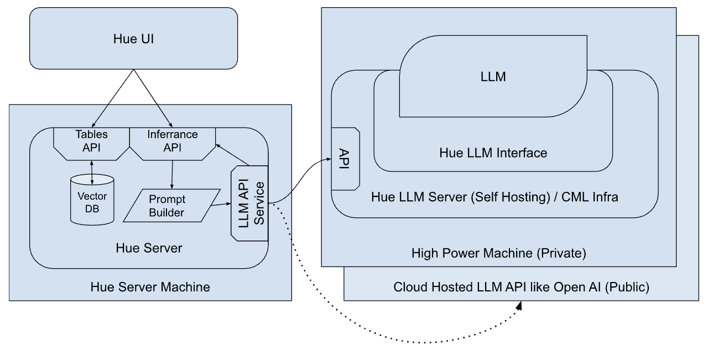

# Hue LLM Interface & Server

This project provides a wrapper around LLMs so that they can be easily used from Hue. There are two parts to it.
1. Hue LLM Interface - hue_llm_interface
1. Hue LLM Server

**Hue LLM Interface** is a python package that encapsulates the complexities of running various LLMs supported by Hue. The interface can be used on any host infra that meets the hardware requirements of the LLM to be used.

The host infra could be:
1. CM based cluster
1. CML workspace
1. Your local machine
1. or anywhere you can start a python process.

**Hue LLM Server** on the other hand is a python application built using the Hue LLM Interface. It can be configured to use an LLM of choice and it provides a set of APIs that can be accessed from Hue. It is required as the interface cannot run on its own. The server provides a way to self-host LLMs.

## Architecture

The design keeps the Hue LLM Interface separate from the actual Hue server to cater the specific hardware needs of the LLMs. As the LLMs need custom hardware, it won't be practical to expect a Hue server machine to satisfy those needs.



## Dependency

- Python 3.9 or higher

## Running Hue LLM Server

1. Download the model file into `.server/models` directory. Add the model and path to the model file in `./server/configs.json`.

Supported Models - [LLaMA](https://github.com/ggerganov/llama.cpp)

2. Activate python environment. Python 3.9 or higher should be available.
```
source ./server/activate.sh
```
This would activate a virtual python environment with the dependencies. Once the server is finished running, make sure the environment is deactivated with the following command.
```
deactivate
```

3. Start server
```
uvicorn --app-dir ./server main:app --port 8001
```
Hue LLM Server should now be available at http://localhost:8000

Start with `--log-level trace` option to get all logs

### Inferance API
- Path: /api/infer
- Method: POST
- Payload:
```
{
  "model": "<model_name>", // Eg: llama
  "prompt": "<prompt_text>"
}
```

### Additional dependencies for each model
LLaMA:
```
pip install llama-cpp-python==0.1.48
```
Environment must be re-activated after adding llama-cpp.

### Development Notes
requirements.txt should be updated after adding a new pip dependency.
```
pip freeze > requirements.txt
```
